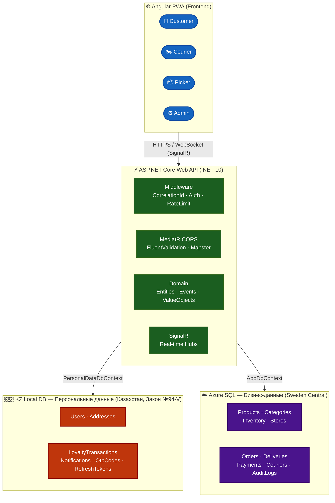

# 🛒 Dark Store — Сервис быстрой доставки продуктов

> **Q-commerce платформа для Костаная, Казахстан**  
> Доставка продуктов за 15–30 минут прямо к двери.

[](https://dotnet.microsoft.com/)
[](https://angular.dev/)
[](https://azure.microsoft.com/)
[](https://github.com/features/actions)
[](#)

---

## 📋 Содержание

- [О проекте](#-о-проекте)
- [Архитектура](#-архитектура)
- [Структура решения](#-структура-решения)
- [Технологический стек](#-технологический-стек)
- [Начало работы](#-начало-работы)
- [Конфигурация](#-конфигурация)
- [API документация](#-api-документация)
- [Тестирование](#-тестирование)
- [CI/CD и деплой](#-cicd-и-деплой)
- [Roadmap](#-roadmap)
- [Документация](#-документация)

---

## 🚀 О проекте

**Dark Store** — сервис быстрой доставки продуктов питания (q-commerce) в городе Костанай, Казахстан (население ~265 000 чел.).

### Ключевые преимущества

| Особенность | Описание |
|------------|----------|
| ⚡ **Скорость** | Доставка за 15–30 минут через собственный dark store |
| 🤖 **ИИ-агент** | Azure OpenAI — персональные рекомендации и помощь в выборе товаров |
| ⛽ **Интеграция с АЗС** | Бонусная программа совместно с сетью заправочных станций партнёра |
| 📱 **PWA** | Progressive Web App — работает как нативное приложение без App Store |
| 💳 **Kaspi Pay** | Оплата и рассрочка через популярнейший казахстанский платёжный сервис |
| 🔄 **1С интеграция** | Автоматическая синхронизация остатков и цен с 1С каждые 5 минут |

---

## 🏗 Архитектура

Проект реализован как **модульный монолит** на базе **Clean Architecture** с лёгким CQRS через MediatR.



> **⚖️ Соответствие Закону РК №94-V:** Персональные данные граждан Казахстана хранятся исключительно на серверах, физически расположенных в РК. Бизнес-данные (без ПДн) хранятся в Azure SQL. Два изолированных `DbContext` — `PersonalDataDbContext` и `AppDbContext`.

### Bounded Contexts

| Контекст | Описание |
|----------|----------|
| **Catalog** | Товары, категории, поиск, ИИ-рекомендации |
| **Ordering** | Корзина, оформление, статусы заказов |
| **Inventory** | Складской учёт, резервирование, синхронизация с 1С |
| **Delivery** | Назначение курьеров, трекинг, маршруты |
| **Loyalty** | Бонусные баллы, акции, промокоды, интеграция с АЗС |
| **Payments** | Kaspi Pay, история платежей, возвраты |

---

## 📁 Структура решения

```
DarkStore/
├── src/
│   ├── DarkStore.API/              # ASP.NET Core Web API
│   │   ├── Program.cs              # Конфигурация приложения и middleware pipeline
│   │   ├── Middleware/             # CorrelationId, GlobalExceptionHandler
│   │   ├── Services/               # CurrentUserService (JWT claims)
│   │   └── Telemetry/              # Application Insights фильтры
│   │
│   ├── DarkStore.Application/      # Application Layer (CQRS + бизнес-логика)
│   │   ├── Common/                 # Интерфейсы, поведения MediatR pipeline
│   │   └── Orders/                 # Commands, Queries, Handlers, DTOs
│   │
│   ├── DarkStore.Domain/           # Domain Layer (чистый C#, без зависимостей)
│   │   ├── Common/                 # BaseEntity, ValueObjects, IDomainEvent
│   │   ├── Orders/                 # Order, OrderItem, OrderStatus
│   │   ├── Couriers/               # Courier, CourierStatus
│   │   ├── Deliveries/             # Delivery, DeliveryStatus
│   │   └── Users/                  # User (бизнес-репрезентация)
│   │
│   └── DarkStore.Infrastructure/   # Infrastructure Layer
│       ├── Persistence/            # EF Core DbContexts, Migrations, Repositories
│       └── Configurations/         # EF Core entity конфигурации
│
├── tests/
│   └── DarkStore.UnitTests/        # xUnit + FluentAssertions + NSubstitute
│
├── docs/                           # Проектная документация
├── docker-compose.yml              # Локальная разработка (SQL Server, Redis)
├── deploy-azure1.yml               # GitHub Actions — деплой API
├── deploy-azure2.yml               # GitHub Actions — деплой Frontend
└── DarkStore.slnx                  # Solution файл
```

---

## 💻 Технологический стек

### Backend

| Компонент | Технология | Версия |
|-----------|-----------|--------|
| Язык / Рантайм | C# / .NET | 10 |
| Web Framework | ASP.NET Core Web API | 10 |
| ORM (write) | Entity Framework Core | 10 |
| ORM (read) | Dapper | 2.x |
| CQRS | MediatR | 12.x |
| Валидация | FluentValidation | 11.x |
| Маппинг | Mapster + source generators | 7.x |
| Логирование | Serilog (async sinks) | 4.x |
| ПДн-защита в логах | Destructurama.Attributed | 4.x |
| OpenAPI UI | Scalar + Microsoft.AspNetCore.OpenApi | 10.x |
| Аутентификация | JWT Bearer + OTP | — |
| Фоновые задачи | Quartz.NET (persistent, Azure SQL) | 3.x |
| Real-time | ASP.NET Core SignalR | — |
| Кэш L1 | Output Cache (in-memory) | — |
| Кэш L2 | Azure Cache for Redis | — |
| Мониторинг | Application Insights + OpenTelemetry | — |
| Секреты | Azure Key Vault | — |
| Resilience | Microsoft.Extensions.Http.Resilience (Polly v8) | — |

### Frontend

| Компонент | Технология |
|-----------|-----------|
| Фреймворк | Angular 20+ |
| Язык | TypeScript 5.x |
| Стилизация | Tailwind CSS 4.x |
| Состояние | `@ngrx/signals` (Signal Store) |
| Real-time | `@microsoft/signalr` |
| PWA | `@angular/pwa` + Service Worker |
| Карты | `@angular/google-maps` (Q2) |
| Push-уведомления | Firebase FCM (Q3) |

### Инфраструктура

| Компонент | Технология |
|-----------|-----------|
| Backend хостинг | Azure App Service (MVP) → Azure Container Apps |
| Frontend хостинг | Azure Static Web Apps |
| База данных (бизнес) | Azure SQL Database (Sweden Central) |
| База данных (ПДн) | SQL Server / PostgreSQL (KZ Local — Beeline KZ) |
| Кэш | Azure Cache for Redis |
| Поиск | Azure AI Search |
| ИИ | Azure OpenAI (GPT-4o / GPT-4o-mini) |
| CDN / Файлы | Azure Blob Storage + Azure CDN |
| CI/CD | GitHub Actions |
| Secrets | Azure Key Vault |
| Мониторинг | Azure Application Insights + Log Analytics |
| IaC | Azure Bicep (`infra/main.bicep`) |

---

## 🛠 Начало работы

### Требования

- [.NET 10 SDK](https://dotnet.microsoft.com/download)
- [Docker Desktop](https://www.docker.com/products/docker-desktop/) (для локальных зависимостей)
- [Node.js 22+](https://nodejs.org/) (для Frontend)
- [JetBrains Rider](https://www.jetbrains.com/rider/) или [Visual Studio 2022](https://visualstudio.microsoft.com/)

### Локальный запуск

**1. Клонируйте репозиторий**

```bash
git clone https://github.com/your-org/darkstore.git
cd darkstore/DarkStore
```

**2. Запустите зависимости через Docker Compose**

```bash
docker-compose up -d
```

> Запустит: SQL Server (порт 1433) и Redis (порт 6379).

**3. Настройте `appsettings.Development.json`**

```json
{
  "ConnectionStrings": {
    "AzureConnection": "Server=localhost,1433;Database=DarkStore;User Id=sa;Password=YourStrong!Passw0rd;TrustServerCertificate=True",
    "KzLocalConnection": "Server=localhost,1433;Database=DarkStorePersonal;User Id=sa;Password=YourStrong!Passw0rd;TrustServerCertificate=True",
    "Redis": "localhost:6379"
  },
  "Jwt": {
    "Authority": "https://localhost:5001",
    "Audience": "darkstore-api"
  }
}
```

**4. Примените миграции и запустите API**

```bash
# Миграции применяются автоматически при старте приложения
dotnet run --project src/DarkStore.API
```

API будет доступен по адресу: `https://localhost:7xxx`  
Scalar UI: `https://localhost:7xxx/scalar/v1`  
Health checks: `https://localhost:7xxx/health/live`

---

## ⚙️ Конфигурация

### Переменные окружения / appsettings

| Параметр | Описание | Источник (Production) |
|---------|----------|----------------------|
| `ConnectionStrings:AzureConnection` | Azure SQL (бизнес-данные) | Azure Key Vault |
| `ConnectionStrings:KzLocalConnection` | KZ Local DB (персональные данные) | Azure Key Vault |
| `ConnectionStrings:Redis` | Azure Cache for Redis | Azure Key Vault |
| `Jwt:Authority` | OIDC Authority для валидации JWT | Azure Key Vault |
| `Jwt:Audience` | Имя аудитории JWT токена | Azure Key Vault |
| `ApplicationInsights:ConnectionString` | Application Insights | Azure Key Vault |
| `AzureKeyVaultUri` | URI Azure Key Vault (для production) | Переменная среды |
| `Cors:AllowedOrigins` | Разрешённые origins для CORS | appsettings |

### Middleware pipeline (порядок важен)

```
ExceptionHandler → HSTS → HttpsRedirection → ResponseCompression
→ CORS → RateLimiter → SecurityHeaders → CorrelationId
→ SerilogRequestLogging → OutputCache → Authentication
→ Authorization → MapControllers → SignalR Hubs
```

### Rate Limiting

| Политика | Лимит | Применение |
|---------|-------|-----------|
| `otp` | 3 запроса / 1 час | `[EnableRateLimiting("otp")]` на SendOtp |
| `api` | 100 запросов / 1 мин | Общий API throttle per IP |

---

## 📖 API документация

После запуска в Development режиме доступны:

- **Scalar UI:** `https://localhost:7xxx/scalar/v1` — интерактивная документация
- **OpenAPI JSON:** `https://localhost:7xxx/openapi/v1.json` — спецификация
- **Health Live:** `GET /health/live` — liveness probe
- **Health Ready:** `GET /health/ready` — readiness probe (проверяет БД, Redis)

### Версионирование API

API версионируется через URL-сегмент: `/api/v{version}/resource`

```
/api/v1/products    ← текущая стабильная версия
/api/v1/orders
/api/v1/deliveries
```

- Устаревшие версии возвращают заголовки `Deprecation: true` и `Sunset: <date>`
- Минимальный срок поддержки deprecated версии — **6 месяцев**

---

## 🧪 Тестирование

### Запуск тестов

```bash
# Все тесты
dotnet test

# С покрытием кода
dotnet test --collect:"XPlat Code Coverage"

# Конкретный проект
dotnet test tests/DarkStore.UnitTests
```

### Стек тестирования

| Пакет | Назначение |
|-------|-----------|
| **xUnit** | Test runner |
| **FluentAssertions** | Читаемые assertions |
| **NSubstitute** | Мокирование зависимостей |
| **Bogus** | Генерация тестовых данных |
| **Testcontainers.MsSql** | Реальный SQL Server в Docker для интеграционных тестов |
| **Respawn** | Быстрый сброс БД между тестами |
| **WireMock.Net** | Mock внешних API (1С, Kaspi Pay, SMS) |
| **NetArchTest.Rules** | Проверка соблюдения Clean Architecture |

### Quality Gates (блокируют PR merge)

| Gate | Порог |
|------|-------|
| Backend line coverage | ≥ 70% |
| Vulnerable packages (`high`/`critical`) | 0 |
| Architecture tests | 100% pass |
| E2E Staging (критические пути) | 100% pass |

---

## 🚀 CI/CD и деплой

### GitHub Actions pipelines

| Workflow | Триггер | Описание |
|---------|---------|---------|
| `deploy-azure1.yml` | Push в `main` | Сборка + тесты + деплой API на Azure App Service |
| `deploy-azure2.yml` | Push в `main` | Сборка + деплой Angular PWA на Azure Static Web Apps |

### Шаги pipeline

```
Checkout → Setup .NET → Restore → Build
→ Run Tests (coverage check) → Security scan (CodeQL + dotnet list package --vulnerable)
→ dotnet format --verify-no-changes → Publish → Deploy to Azure
```

### Деплой инфраструктуры (IaC)

```bash
az deployment group create \
  --resource-group darkstore-rg \
  --template-file infra/main.bicep \
  --parameters environment=production
```

> Bicep-шаблон покрывает: App Service Plan, App Service, Azure SQL, Redis, Blob Storage, Application Insights, Static Web Apps.

---

## 🗺 Roadmap

| Период | Статус | Ключевые задачи |
|--------|--------|-----------------|
| **Q1** (Мес. 1–3) | 🔄 В работе | Инфраструктура, Clean Architecture, Каталог, Корзина, Kaspi Pay, 1С интеграция, Angular shell |
| **Q2** (Мес. 4–6) | 📋 Запланировано | Courier PWA, Picker PWA, Admin Panel, Web Push, Публичный запуск |
| **Q3** (Мес. 7–9) | 📋 Запланировано | ИИ-рекомендации, Промо-акции, Azure Container Apps, PWA offline |
| **Q4** (Мес. 10–12) | 📋 Запланировано | Полная лояльность, Масштабирование, Второй darkstore |

### Ключевые вехи

| Веха | Целевой срок |
|------|-------------|
| MVP готов (внутреннее тестирование) | Конец месяца 3 |
| Закрытое тестирование (50+ пользователей) | Конец месяца 5 |
| Публичный запуск (soft launch) | Конец месяца 6 |
| 1 000 заказов в месяц | Конец месяца 9 |
| Готовность к масштабированию | Конец месяца 12 |

---

## 📚 Документация

| Документ | Описание |
|---------|----------|
| [DARK_STORE_PROJECT_SUMMARY.md](docs/DARK_STORE_PROJECT_SUMMARY.md) | Общее описание проекта |
| [SOLUTION_COMPARISON.md](docs/SOLUTION_COMPARISON.md) | Почему выбрана собственная разработка: сравнение с готовыми платформами, реальные затраты, ставки команды, franchise-риски |
| [TECH_STACK.md](docs/TECH_STACK.md) | Подробный технологический стек и обоснование выбора |
| [ROADMAP_12_MONTHS.md](docs/ROADMAP_12_MONTHS.md) | Дорожная карта на 12 месяцев |
| [DATABASE_SCHEMA.md](docs/DATABASE_SCHEMA.md) | Схема базы данных |
| [AUTH_AND_IDENTITY.md](docs/AUTH_AND_IDENTITY.md) | Аутентификация и авторизация |
| [CONFIGURATION_GUIDE.md](docs/CONFIGURATION_GUIDE.md) | Руководство по конфигурации |
| [TESTING_STRATEGY.md](docs/TESTING_STRATEGY.md) | Стратегия тестирования |
| [LOGGING_AND_AUDIT_STRATEGY.md](docs/LOGGING_AND_AUDIT_STRATEGY.md) | Логирование и аудит |
| [INTEGRATIONS.md](docs/INTEGRATIONS.md) | Внешние интеграции (1С, Kaspi Pay, АЗС) |
| [INDEX_TECHNICAL.md](docs/INDEX_TECHNICAL.md) | Техническая документация (индексы) |
| [OPERATIONS_MANUAL.md](docs/OPERATIONS_MANUAL.md) | Операционное руководство |

---

## 🔒 Безопасность

- **Персональные данные** хранятся исключительно в KZ Local DB (соответствие Закону РК №94-V)
- **JWT токены** валидируются по подписи — без сетевых вызовов
- **Rate Limiting** защищает от брутфорса OTP и DDoS API
- **Security Headers**: `X-Content-Type-Options`, `X-Frame-Options`, `CSP`, `HSTS`
- **Secrets** хранятся в Azure Key Vault — никаких credentials в коде или appsettings (production)
- **Логи** защищены от утечки ПДн через `[NotLogged]`/`[LogMasked]` атрибуты (Destructurama)
- **CodeQL** и `dotnet list package --vulnerable` — автоматическое сканирование в каждом PR

---

## 🤝 Разработка

### Соглашения[Костанай.pdf](docs/%D0%9A%D0%BE%D1%81%D1%82%D0%B0%D0%BD%D0%B0%D0%B9.pdf)

- **Ветки:** `feature/`, `fix/`, `chore/` — PR в `main`
- **Форматирование:** `dotnet format` обязателен (CI blocker при нарушении)
- **Архитектура:** NetArchTest проверяет Clean Architecture в каждом билде
- **Миграции:** EF Core migrations, применяются автоматически при старте

### Полезные команды

```bash
# Добавить EF Core миграцию
dotnet ef migrations add <MigrationName> \
  --project src/DarkStore.Infrastructure \
  --startup-project src/DarkStore.API

# Применить миграции вручную
dotnet ef database update \
  --project src/DarkStore.Infrastructure \
  --startup-project src/DarkStore.API

# Форматирование кода
dotnet format

# Проверить уязвимые пакеты
dotnet list package --vulnerable
```

---

**Статус проекта:** Разработка MVP (Месяц 1)  
**Дата последнего обновления:** Май 2026  
**Локация:** Костанай, Казахстан 🇰🇿

