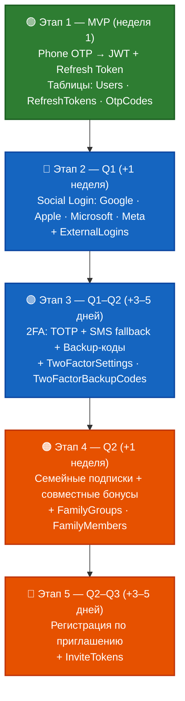
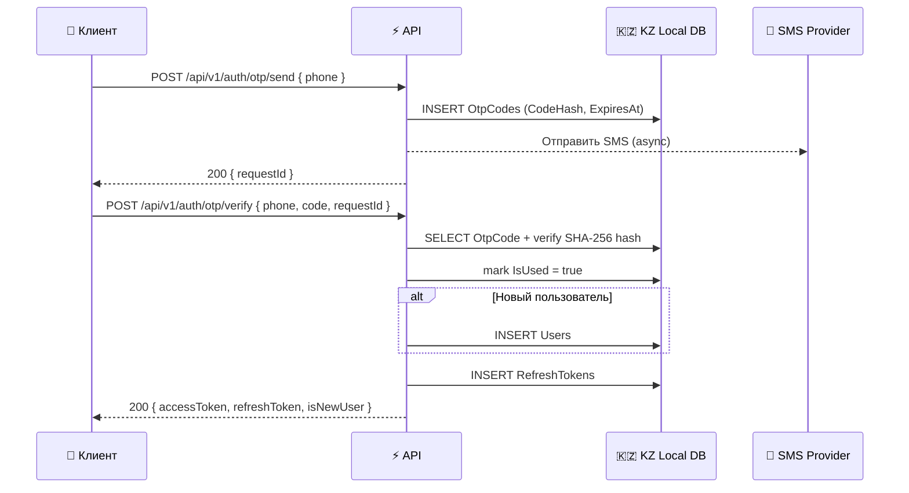
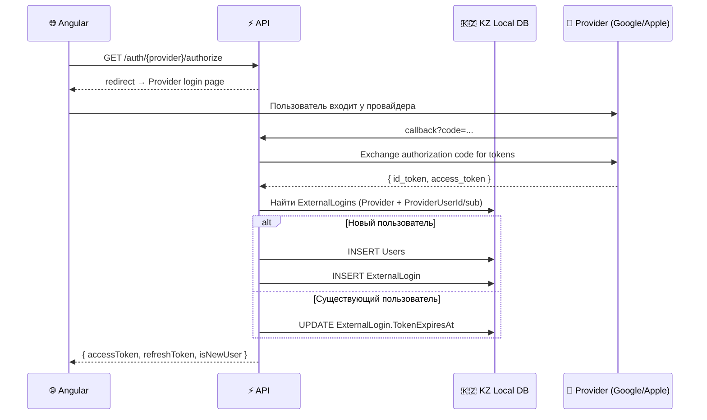
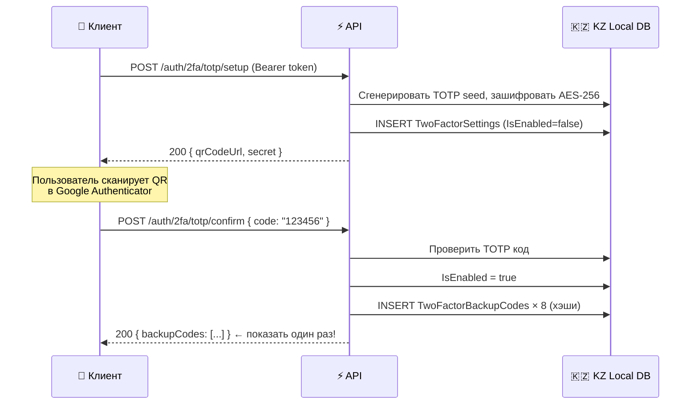
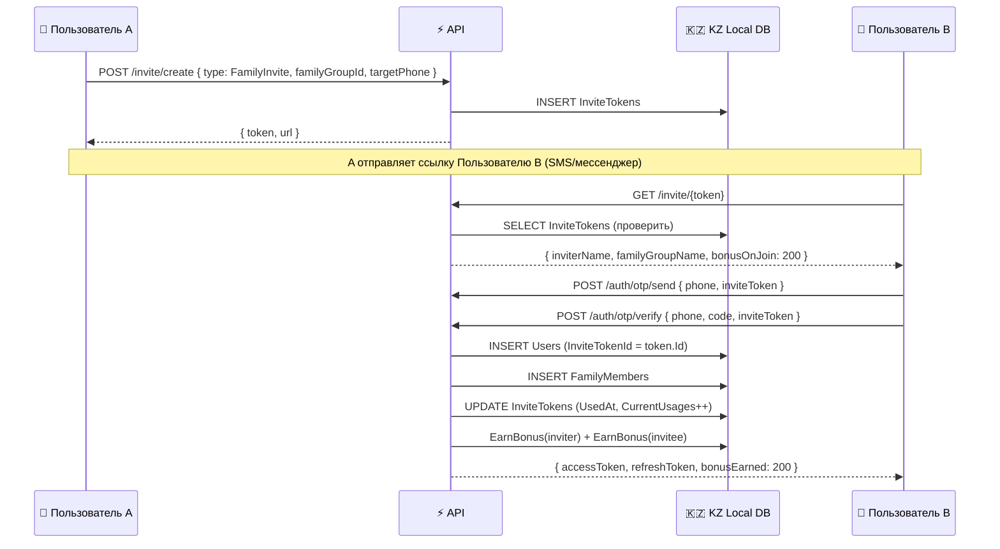
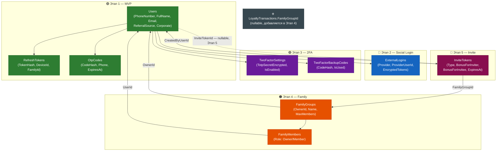

# Система аутентификации, авторизации и идентификации

**Проект:** Dark Store — быстрая доставка продуктов  
**Дата:** Май 2026  
**Принцип:** Поэтапная реализация — быстрый старт без переписывания БД

---

## Оглавление

1. [Концепция и принципы](#1-концепция-и-принципы)
2. [Обзор этапов](#2-обзор-этапов)
3. [Этап 1 (MVP) — Phone OTP + JWT](#3-этап-1-mvp--phone-otp--jwt)
4. [Этап 2 — Social Login (OAuth 2.0 / OIDC)](#4-этап-2--social-login-oauth-20--oidc)
5. [Этап 3 — Двухфакторная аутентификация (2FA)](#5-этап-3--двухфакторная-аутентификация-2fa)
6. [Этап 4 — Семейные подписки и совместные бонусы](#6-этап-4--семейные-подписки-и-совместные-бонусы)
7. [Этап 5 — Регистрация по приглашению](#7-этап-5--регистрация-по-приглашению)
8. [Схема базы данных — эволюция](#8-схема-базы-данных--эволюция)
9. [Авторизация и роли](#9-авторизация-и-роли)
10. [Поддержка платформ](#10-поддержка-платформ)
11. [Безопасность и соответствие Закону РК №94-V](#11-безопасность-и-соответствие-закону-рк-94-v)
12. [Интеграция с кодовой базой](#12-интеграция-с-кодовой-базой)

---

## 1. Концепция и принципы

### Ключевые требования

| Требование | Реализация |
|-----------|------------|
| Много провайдеров (Google, Apple, Microsoft, Meta и др.) | OAuth 2.0 / OIDC через `ExternalLogins` |
| Все платформы (Web, Mobile PWA, будущий Flutter) | JWT + Refresh Token, PKCE для мобильных |
| Семейные подписки + совместные бонусы | `FamilyGroups` + `FamilyMembers` + агрегация `LoyaltyTransactions` |
| Регистрация по приглашению | `InviteTokens` с одноразовым кодом или ссылкой |
| 2FA (мобильный и веб) | TOTP (Google Authenticator) + SMS OTP (fallback) |
| Быстрый старт → сложная система | Этапный подход: каждый этап добавляет таблицы, не ломает старые |
| Соответствие Закону РК №94-V | Все ПДн в KZ Local DB (`PersonalDataDbContext`) |

### Архитектурный принцип: аддитивные миграции

```
Этап 1 → Users + RefreshTokens + OtpCodes (уже есть)
Этап 2 → + ExternalLogins (новая таблица)
Этап 3 → + TwoFactorSettings (новая таблица)
Этап 4 → + FamilyGroups + FamilyMembers (новые таблицы)
Этап 5 → + InviteTokens (новая таблица)
```

> 🔑 **Правило:** Каждый новый этап **только добавляет** новые таблицы или **nullable-колонки** к существующим. Никаких breaking changes для уже живущих пользователей.

### Где хранятся данные

Все таблицы этой системы — **🇰🇿 KZ Local DB** (`PersonalDataDbContext`), так как содержат персональные данные:
- Email, телефон, ФИО → Закон №94-V
- OAuth-токены провайдеров (provider user ID, email от Google/Apple) → ПДн
- TOTP-секреты и резервные коды → секреты пользователя
- Семейные связи → ПДн (связка людей)

---

## 2. Обзор этапов



**Ни один из этапов не изменяет структуру таблиц предыдущего этапа.**

---

## 3. Этап 1 (MVP) — Phone OTP + JWT

> ✅ Реализация частично присутствует: `OtpCodes`, `RefreshTokens`, `Users` в схеме БД.

### Поток аутентификации



### JWT Claims

```csharp
// Минимальный набор claims для JWT (не хранить ПДн в payload — только ID)
var claims = new[]
{
    new Claim(JwtRegisteredClaimNames.Sub, user.Id.ToString()),
    new Claim(JwtRegisteredClaimNames.Jti, Guid.NewGuid().ToString()),
    new Claim("role", user.Role.ToString()),           // Customer / Courier / Admin
    new Claim("family_group", familyGroupId ?? ""),    // Этап 4
    new Claim("2fa_verified", twoFaVerified.ToString()) // Этап 3
};
```

> 🔐 **Безопасность:**
> - Access Token TTL: **15 минут** (короткий — компромисс между UX и безопасностью)
> - Refresh Token TTL: **30 дней** (хранится в HttpOnly Cookie на Web, в Secure Storage на мобильных)
> - Refresh Token Rotation: при каждом обновлении — старый токен отзывается, выдаётся новый
> - `DeviceId` в `RefreshTokens` — позволяет пользователю видеть активные сессии и отзывать их

### Endpoints этапа 1

| Метод | URL | Описание |
|-------|-----|----------|
| `POST` | `/api/v1/auth/otp/send` | Отправить OTP на телефон |
| `POST` | `/api/v1/auth/otp/verify` | Подтвердить OTP → получить токены |
| `POST` | `/api/v1/auth/refresh` | Обновить Access Token по Refresh Token |
| `POST` | `/api/v1/auth/logout` | Отозвать Refresh Token (logout) |
| `POST` | `/api/v1/auth/logout-all` | Отозвать все сессии пользователя |

### Rate Limiting (обязательно)

```csharp
// Program.cs — встроенный ASP.NET Core Rate Limiter
builder.Services.AddRateLimiter(options =>
{
    // OTP: 3 запроса с одного IP в час
    options.AddFixedWindowLimiter("otp-send", opt =>
    {
        opt.Window = TimeSpan.FromHours(1);
        opt.PermitLimit = 3;
        opt.QueueProcessingOrder = QueueProcessingOrder.OldestFirst;
    });

    // Auth verify: 10 попыток в 15 минут (защита от brute-force)
    options.AddFixedWindowLimiter("otp-verify", opt =>
    {
        opt.Window = TimeSpan.FromMinutes(15);
        opt.PermitLimit = 10;
    });
});

// Контроллер
[HttpPost("otp/send")]
[EnableRateLimiting("otp-send")]
public async Task<IActionResult> SendOtp(...)
```

---

## 4. Этап 2 — Social Login (OAuth 2.0 / OIDC)

### Поддерживаемые провайдеры

| Провайдер | Пакет / Метод | Приоритет | Примечание |
|-----------|---------------|-----------|------------|
| **Google** | `Microsoft.AspNetCore.Authentication.Google` | 🔴 Высокий | Android + Web |
| **Apple** | `AspNet.Security.OAuth.Apple` | 🔴 Высокий | iOS Safari (обязательно для App Store) |
| **Microsoft** | `Microsoft.AspNetCore.Authentication.MicrosoftAccount` | 🟡 Средний | Корпоративные пользователи |
| **Meta (Facebook)** | `Microsoft.AspNetCore.Authentication.Facebook` | 🟡 Средний | - |
| **Telegram** | Telegram Login Widget (кастомная реализация) | 🟡 Средний | Популярен в СНГ |
| **VK** | `AspNet.Security.OAuth.VKontakte` | 🟢 Низкий (Q3) | Русскоязычная аудитория |
| **Yandex** | `AspNet.Security.OAuth.Yandex` | 🟢 Низкий (Q3) | - |

### Новая таблица: ExternalLogins (🇰🇿 KZ Local DB)

```sql
-- Миграция: AddExternalLogins
CREATE TABLE ExternalLogins (
    Id          UNIQUEIDENTIFIER PRIMARY KEY DEFAULT NEWID(),
    UserId      UNIQUEIDENTIFIER NOT NULL REFERENCES Users(Id),
    Provider    NVARCHAR(50) NOT NULL,         -- "Google", "Apple", "Microsoft", ...
    ProviderUserId NVARCHAR(200) NOT NULL,     -- sub от провайдера
    ProviderEmail  NVARCHAR(255),              -- email от провайдера (может меняться)
    AccessToken    NVARCHAR(2000),             -- зашифрован (AES-256), опционально
    RefreshToken   NVARCHAR(2000),             -- зашифрован
    TokenExpiresAt DATETIMEOFFSET,
    CreatedAt   DATETIMEOFFSET NOT NULL DEFAULT SYSUTCDATETIME(),

    CONSTRAINT UQ_ExternalLogins_Provider_ProviderUserId
        UNIQUE (Provider, ProviderUserId)
);
CREATE INDEX IX_ExternalLogins_UserId ON ExternalLogins(UserId);
```

```csharp
// EF Core сущность
public class ExternalLogin
{
    public Guid Id { get; private set; }
    public Guid UserId { get; private set; }
    public string Provider { get; private set; } = string.Empty;       // "Google"
    public string ProviderUserId { get; private set; } = string.Empty; // Google "sub"
    public string? ProviderEmail { get; private set; }
    public string? EncryptedAccessToken { get; private set; }
    public string? EncryptedRefreshToken { get; private set; }
    public DateTimeOffset? TokenExpiresAt { get; private set; }
    public DateTimeOffset CreatedAt { get; private set; }

    public static ExternalLogin Create(Guid userId, string provider, string providerUserId, string? email)
        => new()
        {
            Id = Guid.NewGuid(),
            UserId = userId,
            Provider = provider,
            ProviderUserId = providerUserId,
            ProviderEmail = email,
            CreatedAt = DateTimeOffset.UtcNow
        };
}
```

### Поток Social Login (Web)



### Поток Social Login (Mobile PWA — PKCE)

На мобильных устройствах вместо обычного Authorization Code Flow используется **PKCE** (Proof Key for Code Exchange), так как мобильные приложения не могут надёжно хранить client secret.

```typescript
// Angular PWA — PKCE Flow
// src/app/auth/services/oauth-pkce.service.ts
export class OAuthPkceService {
  async initiateLogin(provider: 'google' | 'apple' | 'microsoft') {
    const codeVerifier = this.generateCodeVerifier();      // 43–128 случайных символов
    const codeChallenge = await this.sha256(codeVerifier); // S256 метод
    
    sessionStorage.setItem('pkce_verifier', codeVerifier);
    
    // Редирект на API, который перенаправит на провайдер
    window.location.href = `/api/v1/auth/${provider}/authorize?` +
      `code_challenge=${codeChallenge}&code_challenge_method=S256`;
  }

  async handleCallback(code: string) {
    const codeVerifier = sessionStorage.getItem('pkce_verifier')!;
    return this.http.post('/api/v1/auth/oauth/callback', { code, codeVerifier });
  }
}
```

### Связывание аккаунтов

Пользователь может привязать **несколько провайдеров** к одному аккаунту:

```
User [телефон +77001234567]
  ├── ExternalLogin: Google (sub: "1234...") 
  ├── ExternalLogin: Apple  (sub: "abcd...")
  └── ExternalLogin: Microsoft (sub: "xyz9...")
```

```
POST /api/v1/auth/link/{provider}   — привязать провайдер (требует авторизации)
DELETE /api/v1/auth/link/{provider} — отвязать (если есть хотя бы 1 другой способ входа)
GET /api/v1/auth/linked-providers   — список привязанных провайдеров
```

### Настройка провайдеров в Program.cs

```csharp
// DarkStore.Infrastructure/DependencyInjection.cs
builder.Services.AddAuthentication(options =>
{
    options.DefaultAuthenticateScheme = JwtBearerDefaults.AuthenticationScheme;
    options.DefaultChallengeScheme = JwtBearerDefaults.AuthenticationScheme;
})
.AddJwtBearer(options =>
{
    options.TokenValidationParameters = new TokenValidationParameters
    {
        ValidateIssuer = true,
        ValidateAudience = true,
        ValidateLifetime = true,
        ValidateIssuerSigningKey = true,
        ValidIssuer = config["Jwt:Issuer"],
        ValidAudience = config["Jwt:Audience"],
        IssuerSigningKey = new SymmetricSecurityKey(
            Encoding.UTF8.GetBytes(config["Jwt:SecretKey"]!)) // из Azure Key Vault
    };
})
.AddGoogle(options =>
{
    options.ClientId = config["OAuth:Google:ClientId"]!;        // Azure Key Vault
    options.ClientSecret = config["OAuth:Google:ClientSecret"]!;
    options.Scope.Add("email");
    options.Scope.Add("profile");
})
.AddApple(options =>
{
    options.ClientId = config["OAuth:Apple:ClientId"]!;
    options.KeyId = config["OAuth:Apple:KeyId"]!;
    options.TeamId = config["OAuth:Apple:TeamId"]!;
    options.PrivateKey = config["OAuth:Apple:PrivateKey"]!;     // P8 ключ из Key Vault
})
.AddMicrosoftAccount(options =>
{
    options.ClientId = config["OAuth:Microsoft:ClientId"]!;
    options.ClientSecret = config["OAuth:Microsoft:ClientSecret"]!;
})
.AddFacebook(options =>
{
    options.AppId = config["OAuth:Meta:AppId"]!;
    options.AppSecret = config["OAuth:Meta:AppSecret"]!;
});

// Все секреты — ТОЛЬКО из Azure Key Vault, никогда в appsettings.json
```

### Endpoints этапа 2

| Метод | URL | Описание |
|-------|-----|----------|
| `GET` | `/api/v1/auth/{provider}/authorize` | Редирект на провайдера |
| `GET` | `/api/v1/auth/{provider}/callback` | Callback от провайдера |
| `POST` | `/api/v1/auth/oauth/callback` | PKCE callback (мобильные) |
| `POST` | `/api/v1/auth/link/{provider}` | Привязать провайдер к аккаунту |
| `DELETE` | `/api/v1/auth/link/{provider}` | Отвязать провайдер |
| `GET` | `/api/v1/auth/linked-providers` | Список провайдеров пользователя |

---

## 5. Этап 3 — Двухфакторная аутентификация (2FA)

### Поддерживаемые методы 2FA

| Метод | Приоритет | Где работает | Описание |
|-------|-----------|-------------|----------|
| **TOTP** (Google Authenticator, Authy, Microsoft Authenticator) | 🔴 Основной | Web + Mobile | RFC 6238, работает офлайн, нет зависимости от SMS-провайдера |
| **SMS OTP** | 🟡 Fallback | Web + Mobile | Если у пользователя нет authenticator-приложения |
| **Backup-коды** | 🔴 Обязательно | Любая | 8 одноразовых кодов при потере устройства |

### Новая таблица: TwoFactorSettings (🇰🇿 KZ Local DB)

```sql
-- Миграция: AddTwoFactorSettings
CREATE TABLE TwoFactorSettings (
    Id              UNIQUEIDENTIFIER PRIMARY KEY DEFAULT NEWID(),
    UserId          UNIQUEIDENTIFIER NOT NULL REFERENCES Users(Id),
    Method          INT NOT NULL,               -- 0=None, 1=Totp, 2=Sms
    TotpSecretEncrypted NVARCHAR(500),          -- AES-256, base32 TOTP seed
    IsEnabled       BIT NOT NULL DEFAULT 0,
    EnabledAt       DATETIMEOFFSET,
    LastUsedAt      DATETIMEOFFSET,

    CONSTRAINT UQ_TwoFactorSettings_UserId UNIQUE (UserId)
);

-- Отдельная таблица для backup-кодов
CREATE TABLE TwoFactorBackupCodes (
    Id          UNIQUEIDENTIFIER PRIMARY KEY DEFAULT NEWID(),
    UserId      UNIQUEIDENTIFIER NOT NULL REFERENCES Users(Id),
    CodeHash    NVARCHAR(100) NOT NULL,         -- SHA-256 хэш кода (не сам код)
    IsUsed      BIT NOT NULL DEFAULT 0,
    UsedAt      DATETIMEOFFSET,
    CreatedAt   DATETIMEOFFSET NOT NULL DEFAULT SYSUTCDATETIME()
);
CREATE INDEX IX_TwoFactorBackupCodes_UserId ON TwoFactorBackupCodes(UserId);
```

### Поток включения TOTP (Web)



### Поток входа с 2FA

```
// При входе через OTP или Social Login — если 2FA включена:
1. Проверить основной метод (OTP/Social) → успех
2. Вернуть НЕ accessToken, а временный 2FA-challenge токен (TTL 5 мин)
3. Клиент → POST /auth/2fa/verify { challengeToken, code }
4. Проверить TOTP код (или SMS/backup)
5. Только тогда выдать полноценный accessToken + refreshToken
```

```csharp
// Временный 2FA challenge token (не полноценный JWT)
// Содержит только: userId, jti, exp (5 мин), claim "2fa_pending=true"
// Не даёт доступ к защищённым ресурсам — только к /auth/2fa/verify

public class TwoFactorChallengeToken
{
    public string UserId { get; set; }
    public string Jti { get; set; }
    public DateTimeOffset ExpiresAt { get; set; }
}
```

### Mobile 2FA (Angular PWA)

```typescript
// src/app/auth/components/two-factor/two-factor.component.ts
@Component({
  template: `
    <!-- TOTP вход -->
    <input type="text" inputmode="numeric" pattern="[0-9]*"
           maxlength="6" autocomplete="one-time-code"
           placeholder="000000" (input)="onCodeInput($event)" />
    
    <!-- Кнопка "Использовать backup-код" -->
    <button (click)="showBackupInput = true">Нет доступа к приложению?</button>
    
    @if (showBackupInput) {
      <input type="text" placeholder="Резервный код (xxxx-xxxx)" />
    }
  `
})
```

> 📱 **Мобильные особенности:**
> - `autocomplete="one-time-code"` — Android/iOS автоматически заполняют SMS-код
> - Для TOTP: не требует сети, работает в офлайн
> - Deep Link для return после 2FA: `darkstore://auth/2fa/callback?token=...`

### Endpoints этапа 3

| Метод | URL | Описание |
|-------|-----|----------|
| `POST` | `/api/v1/auth/2fa/totp/setup` | Получить QR-код и секрет |
| `POST` | `/api/v1/auth/2fa/totp/confirm` | Подтвердить включение TOTP + получить backup-коды |
| `POST` | `/api/v1/auth/2fa/disable` | Отключить 2FA (требует подтверждения паролем/кодом) |
| `POST` | `/api/v1/auth/2fa/verify` | Проверить 2FA код при входе |
| `POST` | `/api/v1/auth/2fa/backup-codes/regenerate` | Сгенерировать новые backup-коды |
| `GET` | `/api/v1/auth/2fa/status` | Статус 2FA пользователя |

---

## 6. Этап 4 — Семейные подписки и совместные бонусы

### Концепция

```
Семья Иванова
┌─────────────────────────────────────────────────────┐
│  👑 Иванов Александр (Owner) — UserId: aa-bb-cc     │
│  ├── 👤 Иванова Мария (Member) — UserId: dd-ee-ff   │
│  └── 👤 Иванов Тимур (Member) — UserId: gg-hh-ii    │
│                                                      │
│  Бонусный пул семьи:                                │
│  SUM(LoyaltyTransactions WHERE                      │
│      UserId IN (aa-bb-cc, dd-ee-ff, gg-hh-ii)       │
│      AND FamilyGroupId = family-uuid)               │
│  = 2 450 баллов (накоплены всеми членами семьи)     │
│                                                      │
│  Любой член семьи может потратить бонусы из пула    │
└─────────────────────────────────────────────────────┘
```

### Новые таблицы (🇰🇿 KZ Local DB)

```sql
-- Миграция: AddFamilySubscriptions

CREATE TABLE FamilyGroups (
    Id          UNIQUEIDENTIFIER PRIMARY KEY DEFAULT NEWID(),
    Name        NVARCHAR(100) NOT NULL,          -- "Семья Ивановых"
    OwnerId     UNIQUEIDENTIFIER NOT NULL REFERENCES Users(Id),
    MaxMembers  INT NOT NULL DEFAULT 5,
    IsActive    BIT NOT NULL DEFAULT 1,
    CreatedAt   DATETIMEOFFSET NOT NULL DEFAULT SYSUTCDATETIME()
);
CREATE INDEX IX_FamilyGroups_OwnerId ON FamilyGroups(OwnerId);

CREATE TABLE FamilyMembers (
    Id              UNIQUEIDENTIFIER PRIMARY KEY DEFAULT NEWID(),
    FamilyGroupId   UNIQUEIDENTIFIER NOT NULL REFERENCES FamilyGroups(Id),
    UserId          UNIQUEIDENTIFIER NOT NULL REFERENCES Users(Id),
    Role            INT NOT NULL,               -- 0=Owner, 1=Member
    JoinedAt        DATETIMEOFFSET NOT NULL DEFAULT SYSUTCDATETIME(),
    InvitedBy       UNIQUEIDENTIFIER REFERENCES Users(Id),

    CONSTRAINT UQ_FamilyMembers_GroupUser UNIQUE (FamilyGroupId, UserId)
);
CREATE INDEX IX_FamilyMembers_UserId ON FamilyMembers(UserId);
```

### Расширение LoyaltyTransactions (аддитивно!)

```sql
-- Миграция: AddFamilyToLoyalty
-- Только ДОБАВЛЯЕМ nullable-колонку — уже существующие записи не затронуты
ALTER TABLE LoyaltyTransactions
    ADD FamilyGroupId UNIQUEIDENTIFIER NULL;   -- NULL = личные бонусы
                                               -- NOT NULL = семейные бонусы

CREATE INDEX IX_LoyaltyTransactions_FamilyGroupId
    ON LoyaltyTransactions(FamilyGroupId)
    WHERE FamilyGroupId IS NOT NULL;
```

### Логика начисления и списания бонусов

```csharp
// Application/LoyaltyService.cs

public class LoyaltyService : ILoyaltyService
{
    // Получить совокупный баланс: личные бонусы + бонусы семейного пула
    public async Task<LoyaltyBalanceDto> GetBalanceAsync(Guid userId, CancellationToken ct)
    {
        var member = await _db.FamilyMembers
            .Include(m => m.FamilyGroup)
            .FirstOrDefaultAsync(m => m.UserId == userId, ct);

        var personalBalance = await _db.LoyaltyTransactions
            .Where(t => t.UserId == userId && t.FamilyGroupId == null)
            .SumAsync(t => t.Points, ct);

        if (member is null)
            return new LoyaltyBalanceDto { Personal = personalBalance, Family = 0, Total = personalBalance };

        var familyBalance = await _db.LoyaltyTransactions
            .Where(t => t.FamilyGroupId == member.FamilyGroupId)
            .SumAsync(t => t.Points, ct);

        return new LoyaltyBalanceDto
        {
            Personal = personalBalance,
            Family = familyBalance,
            FamilyGroupName = member.FamilyGroup.Name,
            Total = personalBalance + familyBalance
        };
    }

    // Начислить бонусы после заказа
    // Если пользователь в семье — бонусы идут в семейный пул
    public async Task EarnBonusesAsync(Guid userId, Guid orderId, int points, CancellationToken ct)
    {
        var member = await _db.FamilyMembers
            .FirstOrDefaultAsync(m => m.UserId == userId, ct);

        var transaction = new LoyaltyTransaction
        {
            UserId = userId,
            OrderId = orderId,
            Points = points,
            Type = LoyaltyTransactionType.Earned,
            FamilyGroupId = member?.FamilyGroupId,  // null если не в семье
            Description = member is not null
                ? $"Бонусы пополнили семейный пул «{member.FamilyGroup.Name}»"
                : "Личные бонусы за заказ"
        };

        _db.LoyaltyTransactions.Add(transaction);
        await _db.SaveChangesAsync(ct);
    }
}
```

### Endpoints этапа 4

| Метод | URL | Описание |
|-------|-----|----------|
| `POST` | `/api/v1/family/create` | Создать семейную группу |
| `POST` | `/api/v1/family/invite` | Пригласить члена семьи |
| `POST` | `/api/v1/family/join` | Вступить по ссылке приглашения |
| `DELETE` | `/api/v1/family/leave` | Покинуть семейную группу |
| `DELETE` | `/api/v1/family/members/{memberId}` | Исключить члена (только Owner) |
| `GET` | `/api/v1/family/balance` | Баланс семейного пула бонусов |
| `GET` | `/api/v1/family/members` | Список членов семьи |

---

## 7. Этап 5 — Регистрация по приглашению

### Концепции приглашений

| Тип | Назначение | Срок | Ограничения |
|-----|-----------|------|-------------|
| **Семейное приглашение** | Вступить в Family Group | 7 дней | 1 конкретный получатель |
| **Реферальная ссылка** | Маркетинговый реферал | 30 дней | Многоразовая, лимит |
| **Закрытый бета-доступ** | Ограниченный запуск | Задаётся вручную | Только по инвайту |

### Новая таблица: InviteTokens (🇰🇿 KZ Local DB)

```sql
-- Миграция: AddInviteTokens
CREATE TABLE InviteTokens (
    Id              UNIQUEIDENTIFIER PRIMARY KEY DEFAULT NEWID(),
    Token           NVARCHAR(50) NOT NULL UNIQUE,   -- криптографически стойкий random token
    Type            INT NOT NULL,                   -- 0=FamilyInvite, 1=Referral, 2=ClosedBeta
    CreatedByUserId UNIQUEIDENTIFIER REFERENCES Users(Id),
    
    -- Куда приглашаем (опционально — для семейного инвайта)
    FamilyGroupId   UNIQUEIDENTIFIER REFERENCES FamilyGroups(Id),
    
    -- Для кого предназначен (опционально — персональное приглашение)
    TargetPhone     NVARCHAR(20),                   -- или email
    TargetEmail     NVARCHAR(255),
    
    -- Использование
    UsedByUserId    UNIQUEIDENTIFIER REFERENCES Users(Id),
    UsedAt          DATETIMEOFFSET,
    MaxUsages       INT NOT NULL DEFAULT 1,
    CurrentUsages   INT NOT NULL DEFAULT 0,
    
    -- Бонус за приглашение (зачислить при использовании)
    BonusForInviter  INT NOT NULL DEFAULT 0,        -- баллы пригласившему
    BonusForInvitee  INT NOT NULL DEFAULT 0,        -- баллы приглашённому
    
    ExpiresAt       DATETIMEOFFSET NOT NULL,
    IsActive        BIT NOT NULL DEFAULT 1,
    CreatedAt       DATETIMEOFFSET NOT NULL DEFAULT SYSUTCDATETIME()
);
CREATE INDEX IX_InviteTokens_Token ON InviteTokens(Token);
CREATE INDEX IX_InviteTokens_CreatedBy ON InviteTokens(CreatedByUserId);
```

### Расширение Users (аддитивно!)

```sql
-- Миграция: AddInviteSourceToUsers
-- Nullable — не затрагивает существующих пользователей
ALTER TABLE Users
    ADD InviteTokenId UNIQUEIDENTIFIER NULL REFERENCES InviteTokens(Id);
-- InviteTokenId != NULL → пользователь зарегистрировался по приглашению
```

### Поток регистрации по приглашению



### Endpoints этапа 5

| Метод | URL | Описание |
|-------|-----|----------|
| `POST` | `/api/v1/invite/create` | Создать приглашение |
| `GET` | `/api/v1/invite/{token}` | Информация о приглашении (публичный) |
| `DELETE` | `/api/v1/invite/{token}` | Отозвать приглашение |
| `GET` | `/api/v1/invite/my` | Мои приглашения и статус использования |

---

## 8. Схема базы данных — эволюция

### Итоговая карта всех таблиц (🇰🇿 KZ Local DB)



### Матрица аддитивных изменений

| Этап | Новые таблицы | Изменения существующих | Breaking change |
|------|--------------|----------------------|-----------------|
| 1 (MVP) | Users, RefreshTokens, OtpCodes | - | ❌ нет |
| 2 | ExternalLogins | - | ❌ нет |
| 3 | TwoFactorSettings, TwoFactorBackupCodes | - | ❌ нет |
| 4 | FamilyGroups, FamilyMembers | LoyaltyTransactions +`FamilyGroupId` NULL | ❌ нет |
| 5 | InviteTokens | Users +`InviteTokenId` NULL | ❌ нет |

---

## 9. Авторизация и роли

### Роли системы

```csharp
public enum UserRole
{
    Customer = 0,   // Покупатель (стандартная роль при регистрации)
    Courier  = 1,   // Курьер (доступ к CourierApp, только свои доставки)
    Picker   = 2,   // Сборщик на складе (доступ к Pick-листам)
    StoreManager = 3, // Управляющий складом (инвентарь + аналитика магазина)
    Admin    = 4    // Полный доступ
}
```

### Policy-based авторизация (не Role-based!)

```csharp
// Infrastructure/Authorization/Policies.cs

builder.Services.AddAuthorization(options =>
{
    // Только аутентифицированный пользователь
    options.AddPolicy("AuthenticatedUser", policy =>
        policy.RequireAuthenticatedUser());

    // Пользователь с подтверждённым 2FA (если он его включил)
    options.AddPolicy("TwoFactorVerified", policy =>
        policy.RequireClaim("2fa_verified", "true"));

    // Члены одной семейной группы могут видеть общий пул бонусов
    options.AddPolicy("FamilyMember", policy =>
        policy.RequireClaim("family_group")  // непустой claim
              .RequireAuthenticatedUser());

    // Только Admin или StoreManager
    options.AddPolicy("StoreManagement", policy =>
        policy.RequireRole("Admin", "StoreManager"));

    // Только Admin
    options.AddPolicy("AdminOnly", policy =>
        policy.RequireRole("Admin"));

    // Курьер — только свои доставки (ресурсная авторизация через IAuthorizationHandler)
    options.AddPolicy("OwnDelivery", policy =>
        policy.Requirements.Add(new OwnDeliveryRequirement()));
});
```

### Resource-based авторизация (для курьеров и заказов)

```csharp
// Курьер может видеть/обновлять только свои доставки
public class OwnDeliveryHandler : AuthorizationHandler<OwnDeliveryRequirement, Delivery>
{
    protected override Task HandleRequirementAsync(
        AuthorizationHandlerContext context,
        OwnDeliveryRequirement requirement,
        Delivery resource)
    {
        var userId = context.User.FindFirst(ClaimTypes.NameIdentifier)?.Value;
        if (resource.CourierId.ToString() == userId)
            context.Succeed(requirement);

        return Task.CompletedTask;
    }
}
```

---

## 10. Поддержка платформ

### Матрица платформ

| Платформа | Способ входа | Хранение токенов | 2FA | Особенности |
|-----------|-------------|-----------------|-----|-------------|
| **Angular Web (Desktop)** | OTP + All Social | HttpOnly Cookie (Refresh) + Memory (Access) | TOTP QR + SMS | Полный функционал |
| **Angular PWA (Mobile Web)** | OTP + Google/Apple | Secure localStorage + Memory | TOTP + SMS + `autocomplete="one-time-code"` | PKCE для OAuth |
| **iOS Safari PWA** | OTP + Apple Sign In | WKWebView Secure Storage | TOTP | Apple требует Sign In with Apple при App Store |
| **Android Chrome PWA** | OTP + Google | localStorage + Session | TOTP + SMS autofill | |
| **Flutter (Year 2)** | Все провайдеры | flutter_secure_storage | TOTP + Biometrics | Отдельные SDK: google_sign_in, sign_in_with_apple |

### Angular — хранение токенов

```typescript
// src/app/auth/services/token-storage.service.ts
// Access Token — ТОЛЬКО в памяти (не в Storage, защита от XSS)
// Refresh Token — HttpOnly Cookie (устанавливается сервером)

@Injectable({ providedIn: 'root' })
export class TokenStorageService {
  // Access Token хранится только в памяти сервиса
  // При перезагрузке страницы — автоматически обновляется через /auth/refresh
  private _accessToken: string | null = null;

  get accessToken(): string | null { return this._accessToken; }
  set accessToken(value: string | null) { this._accessToken = value; }

  // Refresh Token — устанавливается как HttpOnly Secure SameSite=Strict Cookie
  // Angular его не видит и не трогает — браузер отправляет автоматически
}

// src/app/auth/interceptors/auth.interceptor.ts
@Injectable()
export class AuthInterceptor implements HttpInterceptor {
  intercept(req: HttpRequest<any>, next: HttpHandler): Observable<HttpEvent<any>> {
    const token = this.tokenStorage.accessToken;

    const authReq = token
      ? req.clone({ setHeaders: { Authorization: `Bearer ${token}` } })
      : req;

    return next.handle(authReq).pipe(
      catchError(err => {
        // 401 → попробовать refresh
        if (err.status === 401 && !req.url.includes('/auth/')) {
          return this.authService.refreshToken().pipe(
            switchMap(tokens => {
              this.tokenStorage.accessToken = tokens.accessToken;
              return next.handle(req.clone({
                setHeaders: { Authorization: `Bearer ${tokens.accessToken}` }
              }));
            }),
            catchError(() => {
              this.authService.logout();
              return throwError(() => err);
            })
          );
        }
        return throwError(() => err);
      })
    );
  }
}
```

### Refresh Token Rotation (серверная сторона)

```csharp
// Application/Auth/Commands/RefreshTokenCommand.cs
public class RefreshTokenCommandHandler : IRequestHandler<RefreshTokenCommand, TokensDto>
{
    public async Task<TokensDto> Handle(RefreshTokenCommand cmd, CancellationToken ct)
    {
        // 1. Найти RefreshToken по хэшу
        var tokenHash = ComputeSha256(cmd.RefreshToken);
        var stored = await _db.RefreshTokens
            .Include(t => t.User)
            .FirstOrDefaultAsync(t => t.TokenHash == tokenHash && !t.IsRevoked, ct);

        if (stored is null || stored.ExpiresAt < DateTimeOffset.UtcNow)
            throw new UnauthorizedException("Invalid or expired refresh token");

        // 2. Rotation — отозвать старый, выдать новый
        stored.IsRevoked = true;
        stored.RevokedAt = DateTimeOffset.UtcNow;

        var newRefreshToken = GenerateCryptographicToken(); // 64 bytes secure random
        _db.RefreshTokens.Add(new RefreshToken
        {
            UserId = stored.UserId,
            TokenHash = ComputeSha256(newRefreshToken),
            ExpiresAt = DateTimeOffset.UtcNow.AddDays(30),
            DeviceId = stored.DeviceId,
            FamilyId = stored.FamilyId // для обнаружения кражи токена
        });

        await _db.SaveChangesAsync(ct);

        var accessToken = _jwtService.GenerateAccessToken(stored.User);

        // Refresh Token — в HttpOnly Cookie
        _httpContextAccessor.HttpContext!.Response.Cookies.Append(
            "refresh_token", newRefreshToken,
            new CookieOptions
            {
                HttpOnly = true,
                Secure = true,
                SameSite = SameSiteMode.Strict,
                Expires = DateTimeOffset.UtcNow.AddDays(30)
            });

        return new TokensDto { AccessToken = accessToken };
    }
}
```

---

## 11. Безопасность и соответствие Закону РК №94-V

### Чеклист безопасности по этапам

#### Этап 1 (MVP)
- [x] OTP-коды хранятся **только как SHA-256 хэш** (не сам код)
- [x] Refresh-токены хранятся **только как SHA-256 хэш**
- [x] Rate limiting: 3 OTP/час с одного IP и телефона
- [x] JWT Access Token TTL = 15 минут
- [x] Refresh Token в HttpOnly Secure Cookie
- [x] Access Token **не** содержит ПДн (только UserId GUID)
- [x] Все данные аутентификации → KZ Local DB (Закон №94-V)

#### Этап 2 (Social Login)
- [x] OAuth-токены провайдеров шифруются AES-256 перед сохранением
- [x] Ключи шифрования — в Azure Key Vault, не в `appsettings.json`
- [x] Проверка `state` параметра для защиты от CSRF в OAuth-потоке
- [x] Nonce для Apple Sign In (защита от replay атак)
- [x] PKCE для мобильных клиентов (защита от authorization code interception)

#### Этап 3 (2FA)
- [x] TOTP-секрет шифруется AES-256 перед сохранением в БД
- [x] Backup-коды хранятся только как SHA-256 хэш
- [x] Backup-коды показываются пользователю **один раз**
- [x] Временный 2FA-challenge токен TTL = 5 минут
- [x] При смене телефона/email → сброс 2FA с уведомлением

#### Этапы 4–5
- [x] Инвайт-токены генерируются через `RandomNumberGenerator.GetHexString(32)` (криптографически стойкий)
- [x] Персональные данные семейных связей — в KZ Local DB
- [x] Семейные бонусные пулы — кэш в Redis с TTL 1 мин (только баланс, не ПДн)

### Аудит (в Azure SQL — нет ПДн)

```csharp
// AuditLog записи для auth-событий (в Azure SQL AppDbContext, только UserId)
// Никаких ФИО, телефонов, email — только системные события

AuditLog:
  EntityName: "Auth"
  Action: "LoginSuccess" | "LoginFailed" | "TwoFactorEnabled" | 
          "TokenRevoked" | "PasswordlessSetup" | "SocialLinked"
  UserId: "guid-..."       // только GUID
  Timestamp: ...
  // IP address? — не хранить в Azure, логировать только в KZ DB
```

### Обнаружение аномалий (Security Events)

```csharp
// События, требующие проверки / блокировки

// 1. Refresh Token семейство — обнаружение кражи (token theft detection)
// Если старый токен используется снова → все сессии этого "семейства" отзываются
public class RefreshToken
{
    public Guid? FamilyId { get; set; } // все rotation-токены одной сессии имеют общий FamilyId
}
// При повторном использовании revoked-токена → отозвать все токены с этим FamilyId

// 2. Одновременный вход с разных стран → уведомление пользователю
// (IP геолокация — не хранить, только временно для анализа)

// 3. Частые неудачные попытки 2FA → временная блокировка аккаунта
// 5 неудачных попыток → блокировка на 15 минут
```

### ПДн и Закон РК №94-V

| Данные | Где хранить | Нельзя в Azure SQL |
|--------|------------|-------------------|
| ExternalLogins (Provider, ProviderUserId, ProviderEmail) | 🇰🇿 KZ Local DB | ❌ |
| TwoFactorSettings (TOTP секрет) | 🇰🇿 KZ Local DB | ❌ |
| FamilyGroups + FamilyMembers | 🇰🇿 KZ Local DB | ❌ |
| InviteTokens (TargetPhone, TargetEmail) | 🇰🇿 KZ Local DB | ❌ |
| Auth events в AuditLog | ☁️ Azure SQL | ✅ только UserId, без ПДн |
| JWT claims | — (в токене, TTL 15 мин) | — только UserId, role |
| Redis кэш баланса | ☁️ Azure Redis | ✅ только Points сумма, ключ `loyalty:family:{id}` |

---

## 12. Интеграция с кодовой базой

### Структура новых файлов

```
src/
├── DarkStore.Domain/
│   └── Users/
│       ├── User.cs                          (существует)
│       ├── Address.cs                       (существует)
│       ├── ExternalLogin.cs                 [Этап 2]
│       ├── TwoFactorSettings.cs             [Этап 3]
│       ├── TwoFactorBackupCode.cs           [Этап 3]
│       ├── FamilyGroup.cs                   [Этап 4]
│       ├── FamilyMember.cs                  [Этап 4]
│       └── InviteToken.cs                   [Этап 5]
│
├── DarkStore.Application/
│   └── Auth/
│       ├── Commands/
│       │   ├── SendOtpCommand.cs            [Этап 1]
│       │   ├── VerifyOtpCommand.cs          [Этап 1]
│       │   ├── RefreshTokenCommand.cs       [Этап 1]
│       │   ├── LogoutCommand.cs             [Этап 1]
│       │   ├── OAuthCallbackCommand.cs      [Этап 2]
│       │   ├── LinkProviderCommand.cs       [Этап 2]
│       │   ├── SetupTotpCommand.cs          [Этап 3]
│       │   ├── VerifyTwoFactorCommand.cs    [Этап 3]
│       │   ├── CreateFamilyGroupCommand.cs  [Этап 4]
│       │   ├── JoinFamilyCommand.cs         [Этап 4]
│       │   └── CreateInviteCommand.cs       [Этап 5]
│       ├── Queries/
│       │   ├── GetLinkedProvidersQuery.cs   [Этап 2]
│       │   ├── GetTwoFactorStatusQuery.cs   [Этап 3]
│       │   ├── GetFamilyBalanceQuery.cs     [Этап 4]
│       │   └── GetInviteInfoQuery.cs        [Этап 5]
│       └── Services/
│           ├── IJwtService.cs
│           ├── ITotpService.cs              [Этап 3]
│           └── ILoyaltyService.cs           (расширить для семьи, Этап 4)
│
├── DarkStore.Infrastructure/
│   ├── Configurations/                      (EF Core Fluent API)
│   │   ├── ExternalLoginConfiguration.cs   [Этап 2]
│   │   ├── TwoFactorSettingsConfiguration.cs [Этап 3]
│   │   ├── FamilyGroupConfiguration.cs     [Этап 4]
│   │   └── InviteTokenConfiguration.cs     [Этап 5]
│   └── Auth/
│       ├── JwtService.cs
│       ├── TotpService.cs                  [Этап 3]
│       └── OAuthTokenEncryptionService.cs  [Этап 2]
│
└── DarkStore.API/
    └── Controllers/
        └── AuthController.cs               (все endpoints)
```

### Пакеты (.NET)

```xml
<!-- DarkStore.Infrastructure.csproj -->

<!-- Этап 1 — JWT (уже есть) -->
<PackageReference Include="Microsoft.AspNetCore.Authentication.JwtBearer" Version="10.*" />

<!-- Этап 2 — OAuth провайдеры -->
<PackageReference Include="Microsoft.AspNetCore.Authentication.Google" Version="10.*" />
<PackageReference Include="Microsoft.AspNetCore.Authentication.Facebook" Version="10.*" />
<PackageReference Include="Microsoft.AspNetCore.Authentication.MicrosoftAccount" Version="10.*" />
<PackageReference Include="AspNet.Security.OAuth.Apple" Version="9.*" />

<!-- Этап 3 — TOTP -->
<PackageReference Include="Otp.NET" Version="1.*" />
<!-- Для QR кода -->
<PackageReference Include="QRCoder" Version="1.*" />

<!-- Шифрование OAuth-токенов и TOTP-секретов -->
<!-- Встроен в .NET: System.Security.Cryptography.Aes — пакет не нужен -->
```

### Пакеты (Angular)

```bash
# Этап 3 — TOTP QR код на клиенте (только для отображения — генерируется сервером)
npm install qrcode  # для отображения QR в Angular компоненте

# Этап 2 — Social Login не требует Angular-пакетов
# Google/Apple Login → редирект на сервер → callback (стандартный OAuth flow)
# Нет нужды в Google SDK / Apple SDK на Angular
```

---

## Приложение: Конфигурация appsettings.json

```json5
// appsettings.json — только структура, значения в Azure Key Vault
{
  "Jwt": {
    "Issuer": "https://api.darkstore.kz",
    "Audience": "darkstore-client",
    "SecretKey": "",         // Azure Key Vault: jwt-secret-key
    "AccessTokenTtlMinutes": 15,
    "RefreshTokenTtlDays": 30
  },
  "OAuth": {
    "Google": {
      "ClientId": "",        // Key Vault: oauth-google-client-id
      "ClientSecret": ""     // Key Vault: oauth-google-client-secret
    },
    "Apple": {
      "ClientId": "",        // Key Vault: oauth-apple-client-id
      "KeyId": "",           // Key Vault: oauth-apple-key-id
      "TeamId": "",          // Key Vault: oauth-apple-team-id
      "PrivateKey": ""       // Key Vault: oauth-apple-private-key (P8)
    },
    "Microsoft": {
      "ClientId": "",        // Key Vault: oauth-microsoft-client-id
      "ClientSecret": ""     // Key Vault: oauth-microsoft-client-secret
    },
    "Meta": {
      "AppId": "",           // Key Vault: oauth-meta-app-id
      "AppSecret": ""        // Key Vault: oauth-meta-app-secret
    }
  },
  "TwoFactor": {
    "TotpIssuer": "DarkStore",        // Отображается в Google Authenticator
    "EncryptionKeyName": ""           // Key Vault: totp-encryption-key (AES-256)
  },
  "Family": {
    "MaxMembersPerGroup": 5,
    "InviteLinkBaseUrl": "https://darkstore.kz/invite/"
  }
}
```

---

*Документ актуален: Май 2026. Следующий ревью — при старте Этапа 2.*

