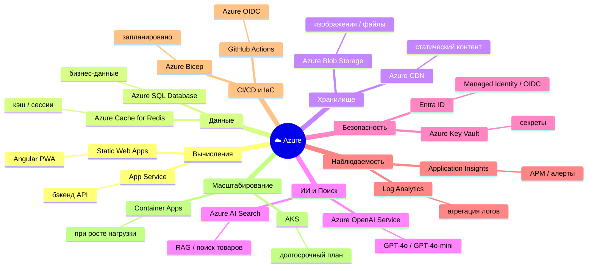
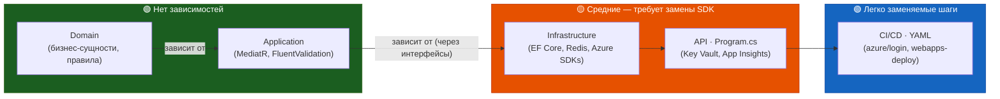
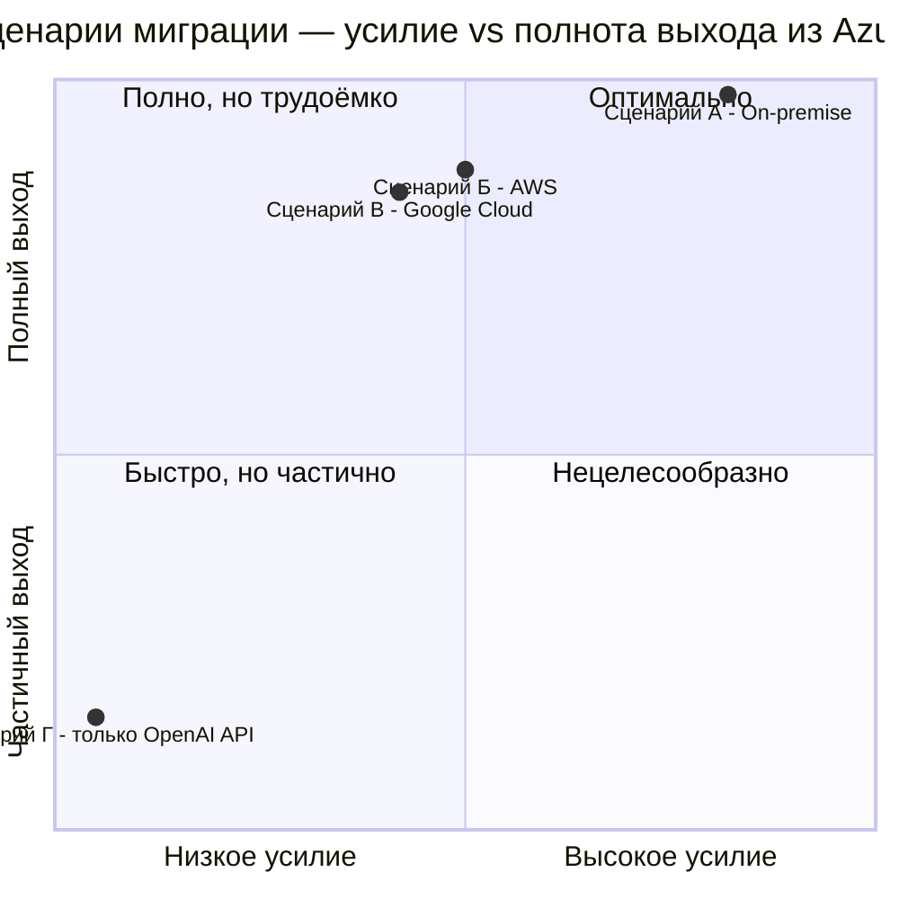
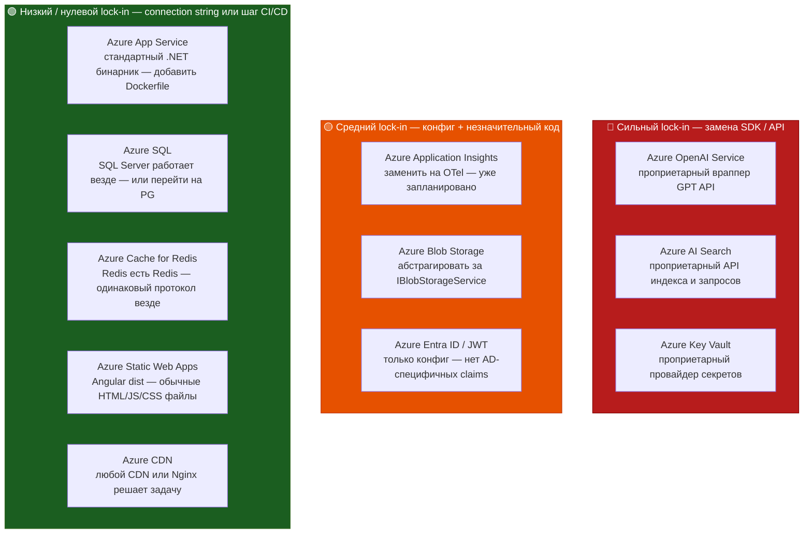

# Анализ зависимости от Azure (Provider Lock-In)

**Проект:** Dark Store — быстрая доставка продуктов  
**Локация:** Костанай, Казахстан  
**Дата:** Май 2026  
**Цель:** Оценка глубины зависимости от Azure и реалистичности миграции на альтернативный хостинг или собственные серверы

---

## Краткие выводы (TL;DR)

| Параметр | Оценка | Комментарий |
|----------|--------|-------------|
| **Общий уровень lock-in** | 🟡 **Средний** | Базовая архитектура портабельна; зависимость сосредоточена в AI-сервисах и мониторинге |
| **Миграция инфраструктуры** | 🟢 **Реально** | 2–3 недели работы |
| **Полная миграция SDK** | 🟡 **Умеренные усилия** | 4–8 недель для соло-разработчика |
| **Доменная / бизнес-логика** | 🟢 **Нет lock-in** | Ноль Azure-импортов в слоях Domain и Application |
| **Самый критичный блокер** | 🔴 **Azure OpenAI + AI Search** | Нет готовой замены с идентичным API |

---

## 1. Полная карта зависимостей от Azure

### 1.1 NuGet-пакеты с прямой привязкой к Azure

| Пакет | Проект | Уровень lock-in | Назначение |
|-------|--------|-----------------|-----------|
| `Azure.Extensions.AspNetCore.Configuration.Secrets` | API | 🔴 **Высокий** | Загрузка секретов из Azure Key Vault в `IConfiguration` |
| `Azure.Identity` | API | 🔴 **Высокий** | `DefaultAzureCredential` — Managed Identity + Azure AD аутентификация |
| `Microsoft.ApplicationInsights.AspNetCore` | API | 🟡 **Средний** | APM-телеметрия → Azure Application Insights |
| `Serilog.Sinks.ApplicationInsights` | API | 🟡 **Средний** | Структурированные логи → Azure Application Insights |
| `Azure.AI.OpenAI` | Infrastructure | 🔴 **Высокий** | SDK Azure OpenAI Service (вызовы GPT-4o) |
| `Azure.Search.Documents` | Infrastructure | 🔴 **Высокий** | Azure AI Search (RAG / поиск товаров) |
| `Azure.Storage.Blobs` | Infrastructure | 🟡 **Средний** | Azure Blob Storage (фото товаров, архивы аудита) |
| `Microsoft.EntityFrameworkCore.SqlServer` | Infrastructure | 🟡 **Средний** | EF Core провайдер для SQL Server (работает на любом SQL Server) |
| `Microsoft.Extensions.Caching.StackExchangeRedis` | Infrastructure | 🟢 **Низкий** | Redis — открытый протокол, Azure Cache for Redis — просто управляемый Redis |

**Не затронуты (нет Azure-импортов):**
- `DarkStore.Domain` — чистая доменная модель на C#
- `DarkStore.Application` — MediatR-обработчики, FluentValidation, без инфраструктурных импортов
- Все тестовые проекты

### 1.2 Используемые сервисы Azure (уровень инфраструктуры)



### 1.3 Что уже НЕ на Azure (существующая портабельность)

| Компонент | Хостинг | Примечание |
|-----------|---------|-----------|
| KZ Local DB (`PersonalDataDbContext`) | Beeline KZ VPS / KAZTELECOM | Обязательно по Закону РК №94-V, уже on-prem |
| Интеграция с 1С | Сервер клиента on-premise | Внешняя система |
| Kaspi Pay | Инфраструктура Kaspi | Внешний платёжный шлюз |
| SMS OTP (SMSC.kz / KazInfoTech) | KZ-провайдеры | Внешние |
| Google Maps | Google Cloud | Не Azure |
| Firebase FCM | Google Cloud | Не Azure |

---

## 2. Степень lock-in по компонентам

### 🔴 Высокий lock-in — требуется замена SDK / API

#### 2.1 Azure OpenAI Service

```csharp
// Infrastructure/DarkStore.Infrastructure.csproj
<PackageReference Include="Azure.AI.OpenAI" Version="2.1.0" />
<PackageReference Include="Azure.Search.Documents" Version="12.0.0" />
```

**Причины привязки:**
- `Azure.AI.OpenAI` оборачивает Azure-специфичные API-эндпоинты и аутентификацию
- Azure AI Search использует проприетарный DSL запросов и API индексации
- RAG-пайплайн (OpenAI + AI Search) построен как связанная пара Azure-сервисов

**Пути миграции:**
| Цель | Альтернатива | Усилие |
|------|-------------|--------|
| Собственный сервер / self-hosted | Ollama + llama.cpp (Llama 3.3, Mistral) + pgvector (PostgreSQL) | 🔴 3–5 недель, компромисс по качеству |
| AWS | Amazon Bedrock (Claude/Titan) + OpenSearch | 🟡 2–3 недели |
| Google Cloud | Vertex AI + Vertex AI Search | 🟡 2–3 недели |
| OpenAI API напрямую | Пакет `OpenAI` для .NET (те же модели, без Azure) | 🟢 2–3 дня — только смена SDK и эндпоинта |

> **Быстрый выход из Azure OpenAI:** переход на официальный OpenAI API. Пакет `Azure.AI.OpenAI` v2.x поддерживает оба эндпоинта через конфигурацию — изменения в коде минимальны.

#### 2.2 Azure Key Vault + Managed Identity

```csharp
// Program.cs
builder.Configuration.AddAzureKeyVault(new Uri(keyVaultUri), new DefaultAzureCredential());
```

**Причины привязки:**
- `DefaultAzureCredential` специфичен для Azure
- URI Key Vault привязан к Azure-ресурсу
- Пайплайн секретов зависит от Managed Identity Azure App Service

**Пути миграции:**
| Цель | Альтернатива | Усилие |
|------|-------------|--------|
| Собственные серверы | HashiCorp Vault (бесплатный, open-source) | 🟡 3–5 дней |
| Любой облачный провайдер | Переменные окружения + GitHub Secrets | 🟢 1 день |
| AWS | AWS Secrets Manager | 🟡 2–3 дня |
| Любой | `.env`-файлы + docker secrets (dev / небольшой prod) | 🟢 Несколько часов |

---

### 🟡 Средний lock-in — замена с умеренными усилиями

#### 2.3 Azure Application Insights

```csharp
// Program.cs
builder.Services.AddApplicationInsightsTelemetry(opts => { ... });

// DarkStore.API.csproj
<PackageReference Include="Microsoft.ApplicationInsights.AspNetCore" Version="2.23.0" />
<PackageReference Include="Serilog.Sinks.ApplicationInsights" Version="5.0.1" />
```

**Пути миграции:**
| Цель | Альтернатива | Усилие |
|------|-------------|--------|
| Собственные серверы | Prometheus + Grafana + Loki (open-source стек) | 🟡 1–2 недели (настройка инфраструктуры) |
| Любой облачный провайдер | Datadog / New Relic | 🟢 2–4 дня (замена SDK) |
| Self-hosted | OpenTelemetry (уже на роадмапе!) + Seq или Jaeger | 🟢 2–3 дня |

> **Важно:** интеграция OpenTelemetry OTLP уже спроектирована в коде (закомментирована — ожидает CVE-фикса в v1.15.3+). Переход с App Insights на любой OTLP-совместимый бэкенд (Grafana, Jaeger, self-hosted Seq) уже предусмотрен архитектурой.

#### 2.4 Azure SQL Database

```csharp
// DependencyInjection.cs
options.UseSqlServer(configuration.GetConnectionString("AzureConnection"), sql => { ... });
```

```
// appsettings.json
"AzureConnection": "Server=tcp:darkstore-azure.database.windows.net,1433;..."
```

**Причины частичной привязки:**
- `UseSqlServer()` — SQL Server-специфичный провайдер EF Core
- Quartz.NET использует `store.UseSqlServer()` для хранилища задач
- Тег health check `"azure"` — косметический, не функциональный
- SQL Server доступен на Docker, on-premise, AWS RDS, Google Cloud SQL — тот же провайдер работает везде

**Пути миграции:**
| Цель | Альтернатива | Усилие |
|------|-------------|--------|
| Собственный сервер | SQL Server на Linux (Docker) — изменений в коде ноль | 🟢 Несколько часов (только connection string) |
| Собственный сервер | PostgreSQL — заменить `UseSqlServer` → `UseNpgsql`, перегенерировать миграции | 🟡 1–2 дня |
| AWS | AWS RDS for SQL Server — изменений в коде ноль | 🟢 Несколько часов |
| Любой | PostgreSQL (Npgsql) — полная поддержка EF Core, open-source | 🟡 1–2 дня |

> **Quartz.NET:** имеет провайдер для PostgreSQL (`store.UsePostgres()`), миграция прямолинейна.

#### 2.5 Azure Blob Storage

```csharp
// DarkStore.Infrastructure.csproj
<PackageReference Include="Azure.Storage.Blobs" Version="12.27.0" />
```

**Пути миграции:**
| Цель | Альтернатива | Усилие |
|------|-------------|--------|
| Собственный сервер | MinIO (S3-совместимый, open-source, Docker) | 🟢 2–3 дня |
| AWS | AWS S3 (заменить `Azure.Storage.Blobs` → `AWSSDK.S3`) | 🟡 1–2 дня |
| Любой | Любое S3-совместимое хранилище через `AWSSDK.S3` | 🟡 1–2 дня |

> **Рекомендация для будущей портабельности:** абстрагировать все операции с блобами за интерфейсом `IBlobStorageService`. Сейчас такой абстракции нет — добавить до разрастания функциональности.

#### 2.6 Azure Static Web Apps (фронтенд)

**Почему только мягкая привязка:**
- Артефакт сборки Angular PWA — обычная папка со статическими файлами (`dist/`)
- Деплоится куда угодно: Nginx, Apache, AWS S3 + CloudFront, GitHub Pages, Cloudflare Pages, собственный Nginx
- Ни одна строка Angular-кода не зависит от Azure

**Миграция:** изменить шаг деплоя в CI/CD. Оценка: несколько часов.

---

### 🟢 Низкий / нулевой lock-in — уже портабельно

#### 2.7 Azure Cache for Redis

```
"Redis": "darkstore-redis.redis.cache.windows.net:6380,..."
```

**Почему реального lock-in нет:**
- Протокол Redis полностью открытый (RESP protocol)
- `StackExchange.Redis` (используется через `Microsoft.Extensions.Caching.StackExchangeRedis`) подключается к **любому** Redis-инстансу
- Локальная разработка уже использует обычный Redis через Docker (`redis:7-alpine` в `docker-compose.yml`)

**Миграция:** изменить connection string. Изменений в коде нет. Оценка: минуты.

#### 2.8 Azure App Service (вычисления)

**Почему только инфраструктурная привязка:**
- Приложение — стандартный ASP.NET Core бинарник под `net10.0`
- `Dockerfile` добавляется тривиально (базовый образ `mcr.microsoft.com/dotnet/aspnet:10.0`)
- В коде приложения нет ни одного вызова Azure App Service-специфичного API

**Пути миграции:**
| Цель | Усилие |
|------|--------|
| Docker на любом Linux VPS | 🟢 Добавить `Dockerfile` + обновить CI/CD: 1–2 дня |
| AWS ECS / Fargate | 🟢 Добавить `Dockerfile` + обновить CI/CD: 2–3 дня |
| Google Cloud Run | 🟢 Аналогично предыдущему |
| Kubernetes (любой) | 🟡 Добавить `Dockerfile` + Helm chart: 3–5 дней |
| Собственный сервер (bare metal) | 🟢 `dotnet publish` → systemd-сервис: 1 день |

#### 2.9 CI/CD (GitHub Actions)

**Azure-специфичные элементы:**
```yaml
- uses: azure/login@v2
- uses: azure/webapps-deploy@v3
```

**Портабельные элементы (не зависят от Azure):**
- Все шаги сборки, тестов, покрытия — стандартные shell-команды Linux
- `dotnet build`, `dotnet test`, `dotnet format` работают на любом CI

**Миграция:** заменить шаги `azure/login` и `azure/webapps-deploy` на аналоги другого провайдера. Оценка: 1–2 часа.

#### 2.10 JWT-аутентификация

```json
"Jwt": {
  "Authority": "https://login.microsoftonline.com/PLACEHOLDER-TENANT-ID/v2.0",
  "Audience": "api://PLACEHOLDER-CLIENT-ID"
}
```

**Важное разграничение:**
- При использовании **Azure Entra ID (Azure AD)** как identity provider → средний lock-in
- Сам middleware JWT Bearer (`Microsoft.AspNetCore.Authentication.JwtBearer`) не зависит от вендора
- Переключение authority на **Keycloak, Auth0, Okta или self-hosted** требует только изменения конфигурации

**Миграция:** изменить `Jwt:Authority` и `Jwt:Audience` в конфигурации. Изменений в коде нет.

---

## 3. Оценка lock-in по архитектурным слоям



| Слой | Azure-зависимости | Портабельность |
|------|-------------------|----------------|
| Domain | Нет | 🟢 100% портабелен |
| Application | Нет | 🟢 100% портабелен |
| Infrastructure | Высокие | 🟡 Требует замены SDK |
| API (Program.cs) | Средние | 🟡 Key Vault + ИИ |
| CI/CD (YAML) | Средние | 🟢 Шаги заменяемы |

**Архитектурные решения, снижающие lock-in:**
1. **Clean Architecture** — слои Domain и Application не имеют абсолютно никаких инфраструктурных импортов
2. **Интерфейсный подход** — `IAppDbContext`, `ISmsService`, `ICurrentUserService` изолируют реализации
3. **Конфигурационная абстракция** — все Azure-эндпоинты в `appsettings.json`, не в коде
4. **Docker Compose для локальной разработки** — доказывает, что инфраструктура уже сегодня работает вне Azure
5. **KZ Local DB уже on-prem** — гибридная модель независимо работает без Azure с первого дня

---

## 4. Сценарии миграции

> Обзор четырёх сценариев по осям «усилие соло-разработчика» и «полнота выхода из Azure»:



### Сценарий А: Переход на собственные серверы (полный on-premise)

**Подходит когда:** оптимизация затрат, полный контроль данных, регуляторные требования сверх Закона РК.

| Компонент | Сейчас | После миграции | Усилие |
|-----------|--------|----------------|--------|
| Вычисления | Azure App Service | Docker + Nginx на Linux VPS | 🟡 2–3 дня |
| Фронтенд | Azure Static Web Apps | Nginx (статический хостинг) | 🟢 Несколько часов |
| База данных | Azure SQL | SQL Server на Docker / PostgreSQL | 🟡 1–2 дня |
| Кэш | Azure Cache for Redis | Redis на Docker | 🟢 Несколько часов |
| Хранилище | Azure Blob Storage | MinIO (S3-совместимый) | 🟢 2–3 дня |
| Секреты | Azure Key Vault | HashiCorp Vault | 🟡 3–5 дней |
| Мониторинг | Application Insights | Prometheus + Grafana + Loki | 🟡 1–2 недели |
| ИИ / Поиск | Azure OpenAI + AI Search | Ollama + pgvector (компромисс по качеству) | 🔴 3–5 недель |
| CI/CD | GitHub Actions → Azure | GitHub Actions → Docker Hub + SSH | 🟢 2–4 часа |
| Identity | Azure Entra ID | Keycloak (self-hosted) | 🟡 1–2 дня |

**Итоговая оценка:** 5–9 недель (соло-разработчик), с сохранением всей бизнес-логики.

---

### Сценарий Б: Переход на AWS

| Компонент | Сейчас | Альтернатива AWS | Усилие |
|-----------|--------|------------------|--------|
| Вычисления | Azure App Service | AWS ECS Fargate / Elastic Beanstalk | 🟢 2–3 дня |
| Фронтенд | Azure Static Web Apps | AWS S3 + CloudFront | 🟢 Несколько часов |
| База данных | Azure SQL | AWS RDS for SQL Server | 🟢 Несколько часов (connection string) |
| Кэш | Azure Cache for Redis | AWS ElastiCache for Redis | 🟢 Несколько часов |
| Хранилище | Azure Blob Storage | AWS S3 (`AWSSDK.S3`) | 🟡 1–2 дня |
| Секреты | Azure Key Vault | AWS Secrets Manager | 🟡 2–3 дня |
| Мониторинг | Application Insights | AWS CloudWatch + X-Ray | 🟡 2–3 дня |
| ИИ / Поиск | Azure OpenAI + AI Search | Amazon Bedrock + OpenSearch | 🟡 2–3 недели |
| CI/CD OIDC | Azure OIDC | AWS OIDC для GitHub Actions | 🟢 Несколько часов |

**Итоговая оценка:** 3–6 недель (соло-разработчик).

---

### Сценарий В: Переход на Google Cloud

| Компонент | Сейчас | Альтернатива GCP | Усилие |
|-----------|--------|------------------|--------|
| Вычисления | Azure App Service | Cloud Run | 🟢 2–3 дня |
| База данных | Azure SQL | Cloud SQL for SQL Server | 🟢 Несколько часов |
| ИИ / Поиск | Azure OpenAI + AI Search | Vertex AI + Vertex AI Search | 🟡 2–3 недели |
| Мониторинг | Application Insights | Cloud Monitoring + Cloud Logging | 🟡 2–3 дня |

**Итоговая оценка:** 3–5 недель.

> **Примечание:** Firebase (запланирован на Q3) — это GCP-продукт. Миграция на Google Cloud была бы **проще** в части пайплайна уведомлений.

---

### Сценарий Г: Минимальное изменение (только выход из Azure OpenAI)

Если единственная цель — убрать зависимость от Azure OpenAI, оставаясь на Azure-инфраструктуре:

```csharp
// До (Azure OpenAI)
var client = new AzureOpenAIClient(new Uri(endpoint), new AzureKeyCredential(apiKey));

// После (OpenAI API напрямую — тот же SDK, другой конструктор)
var client = new OpenAIClient(new ApiKeyCredential(apiKey));
```

`Azure.AI.OpenAI` v2.x поддерживает оба варианта (Azure и прямой OpenAI) через один пакет.  
**Оценка: 2–3 часа.**

---

## 5. Реестр рисков lock-in

| Риск | Вероятность | Влияние | Митигация |
|------|-------------|---------|----------|
| Повышение цен Azure / прекращение плана | Низкая | Высокое | План портабельности задокументирован; контейнеризация инфраструктуры готова |
| Снятие с поддержки модели GPT-4o | Средняя | Среднее | Все AI-вызовы проходят через один сервисный класс; название модели в конфиге |
| Резкий рост цен Azure AI Search | Средняя | Среднее | Абстрагировать за `ISearchService`, переключиться на Elasticsearch / pgvector |
| Ограничение DTU Azure SQL тормозит приложение | Средняя | Высокое | EF Core поддерживает PostgreSQL (Npgsql) — миграция 1–2 дня |
| Простой региона Azure (Sweden Central) | Низкая | Критическое | KZ Local DB уже независима; HA бизнес-данных зависит от geo-backup Azure SQL |
| Требование регулятора убрать данные из Azure | Низкая→Средняя | Критическое | Архитектура это поддерживает: KZ Local DB уже не в Azure; бизнес-данные могут переехать на self-hosted SQL Server |

---

## 6. Рекомендации по снижению lock-in

### Приоритет 1 — Сделать сейчас (без затрат, архитектурные улучшения)

- [ ] **Ввести интерфейс `IBlobStorageService`** для всех операций с блобами. Зарегистрировать `AzureBlobStorageService` как реализацию. Переход на MinIO/S3 станет изменением одного класса.
- [ ] **Ввести интерфейс `ISearchService`** для вызовов Azure AI Search. Открывает возможность подмены на Elasticsearch, Typesense или pgvector.
- [ ] **Ввести интерфейс `IAiService`** для вызовов OpenAI. Изолирует AI SDK от логики приложения.

### Приоритет 2 — До Q2 (низкое усилие, высокое значение)

- [ ] **Добавить `Dockerfile`** — у приложения его нет. Это единственный шаг, который позволит деплоить на любой Docker-хост.
- [ ] **Заменить `Serilog.Sinks.ApplicationInsights` на OpenTelemetry** (уже в роадмапе). OTLP — вендор-нейтральный протокол, экспортируется в Grafana, Datadog, Jaeger, Seq, self-hosted стеки.
- [ ] **Сделать `OpenTelemetry:OtlpEndpoint`** основным путём наблюдаемости в `appsettings.json`, App Insights — вторичным.

### Приоритет 3 — До Q3 (среднее усилие)

- [ ] **Переключить JWT authority на Keycloak или self-hosted OIDC**, если нет жёсткого требования использовать Azure Entra ID. Keycloak работает на Docker, бесплатен, полностью OIDC-совместим.
- [ ] **Создать IaC-шаблон для non-Azure хостинга** (продакшн-версия Docker Compose) в дополнение к существующему Bicep-шаблону.

### Приоритет 4 — Резервное планирование

- [ ] **Задокументировать runbook для каждого сценария миграции** из раздела 4, чтобы любой разработчик мог выполнить его без участия автора.
- [ ] **Держать работающую ветку с миграциями PostgreSQL** — если цены Azure SQL вырастут, переход на Npgsql можно валидировать в CI без затрагивания продакшна.

---

## 7. Итоговая оценка



**Общий вывод:** текущая архитектура имеет **умеренный, а не критический** уровень зависимости от Azure. Clean Architecture гарантирует отсутствие Azure-импортов в бизнес-логике. Lock-in ограничен инфраструктурным слоем и сосредоточен в AI-сервисах и мониторинге.

Полная миграция на альтернативный хостинг (другое облако или собственные серверы) **реалистично достижима за 5–9 недель** для соло-разработчика, при этом AI/LLM-часть является наиболее сложной. Миграция только инфраструктуры (вычисления + БД + кэш + хранилище + CI/CD) занимает **2–3 недели** при сохранении Azure AI-сервисов или замене их облако-нейтральными альтернативами.

---

*Документ создан: Май 2026. Пересматривать ежеквартально или при оценке изменений инфраструктуры.*


