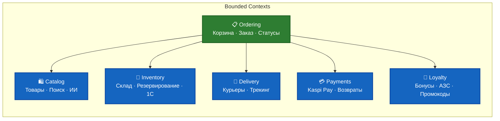
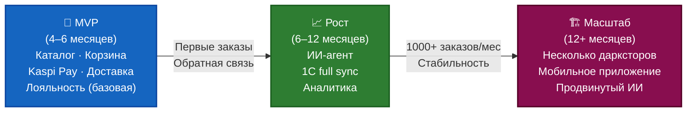

# Dark Store — Проект быстрой доставки продуктов

## 1. Общая идея проекта

**Название проекта:** Dark Store (временное)

**Цель:** Создать современный сервис быстрой доставки продуктов (15–30 минут) в Костанае, Казахстан (население города ~265 000, агломерация ~310 000 человек).

**УТП (Unique Selling Proposition):**
- Отсутствие сильных федеральных игроков в городе
- Собственный dark store с быстрой сборкой заказов
- Глубокая интеграция с сетью заправок инвестора (бонусная программа)
- ИИ-агент в приложении для помощи в выборе товаров
- Отличный мобильный опыт (в отличие от текущего локального игрока)

## 2. Ключевые особенности

- **Формат:** Dark Store + q-commerce
- **Целевая аудитория:** Семьи с детьми, офисные сотрудники, занятые жители (25–45 лет)
- **Основные модули:**
  - Каталог товаров + поиск + ИИ-рекомендации
  - Корзина и оформление заказа
  - Складская система (остатки, резервирование)
  - Доставка (свои курьеры)
  - Система лояльности + интеграция с АЗС
  - Интеграция с 1С и Kaspi Pay

## 3. Архитектура

**Рекомендуемая архитектура:**
- **Clean Architecture** (упрощённая)
- **MediatR** (лёгкий CQRS)
- **Модульный монолит** на старте
- **Bounded Contexts:** Catalog, Ordering, Inventory, Delivery, Loyalty, Payments

**Tech Stack:**
- **Backend:** .NET 10, ASP.NET Core Web API
- **Frontend:** Angular 20+
- **База данных:** Azure SQL / PostgreSQL
- **Хостинг:** Azure App Service → позже Azure Container Apps / AKS
- **CI/CD:** GitHub Actions
- **IDE:** JetBrains Rider
- **ИИ:** Azure OpenAI

## 4. Этапы реализации

| Этап | Срок | Цель | Ключевые фичи |
|------|------|------|---------------|
| MVP | 4–6 месяцев | Запуск минимального продукта | Каталог, корзина, оплата Kaspi, базовая доставка, простая лояльность |
| Рост | 6–12 месяцев | Стабильная работа | ИИ-агент, улучшенная складская логика, аналитика |
| Масштаб | 12+ месяцев | Расширение | Несколько дарксторов, мобильное приложение, продвинутый ИИ |

## 5. Основные интеграции

- **1С** — остатки, цены, заказы
- **Kaspi Pay** — оплата и рассрочка
- **Сеть АЗС** — бонусная программа
- **Служба доставки** — свой флот + GPS
- **Azure OpenAI** — ИИ-агент в приложении

## 6. Хостинг и CI/CD

- **Репозиторий:** GitHub (приватный)
- **CI/CD:** GitHub Actions
- **Хостинг на старте:** Azure App Service
- **Дальнейшее развитие:** Azure Container Apps → AKS (при необходимости)

## 7. Ключевые риски и как их снижать

- **Сложность интеграций** → Начинать с самых важных (1С + Kaspi)
- **Операционная нагрузка** → Не начинать сразу с Kubernetes
- **Конкуренция** → Фокус на UX и интеграции с АЗС
- **Соло-разработка** → Чёткий приоритет фич и использование MediatR

---

**Статус:** Разработка MVP — Месяц 1  
**Дата:** Май 2026
