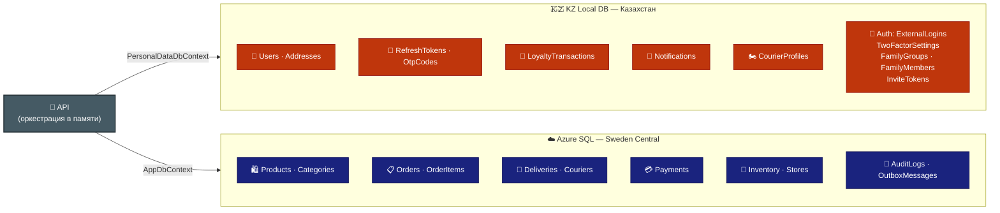
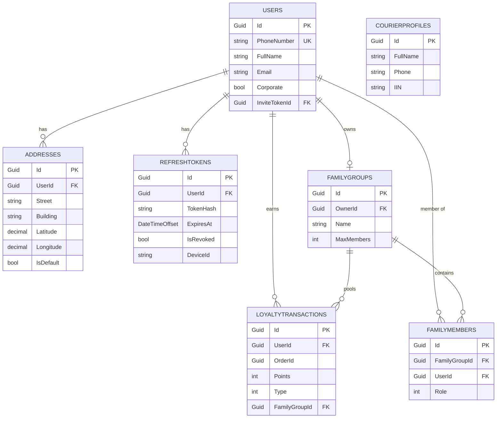
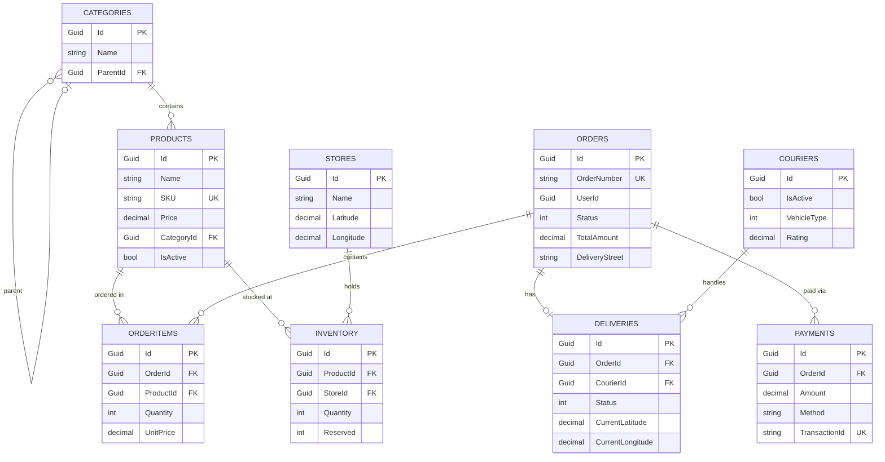

# Схема базы данных (Database Schema)

**Проект:** Dark Store — быстрая доставка продуктов  
**Технология:** Entity Framework Core + SQL Server / PostgreSQL  
**Дата:** Май 2026

---

## Гибридная архитектура БД (Закон РК №94-V)

Данные разделены на **два изолированных хранилища**:



| Хранилище | Где | DbContext | Таблицы |
|-----------|-----|-----------|---------|
| 🇰🇿 **KZ Local DB** | Сервер в Казахстане (Beeline KZ / KAZTELECOM) | `PersonalDataDbContext` | Users, Addresses, LoyaltyTransactions, Notifications, **CourierProfiles**, **RefreshTokens**, **OtpCodes**, **ExternalLogins**, **TwoFactorSettings**, **TwoFactorBackupCodes**, **FamilyGroups**, **FamilyMembers**, **InviteTokens** |
| ☁️ **Azure SQL** | Azure (Sweden Central) | `AppDbContext` | Products, Orders, Inventory, Deliveries, Couriers, Payments, Stores, PromoCodes, **AuditLogs**, **ProductPriceHistory**, **DeliveryLocations**, **InventoryAdjustments** |

**Правило:** В Azure SQL хранится только `UserId` / `CourierId` (GUID) — никаких ФИО, телефонов или адресов.  
API оркестрирует запросы к обеим БД и «склеивает» данные в памяти.

```csharp
// Два DbContext в DI-контейнере
services.AddDbContext<PersonalDataDbContext>(opt =>
    opt.UseSqlServer(config["ConnectionStrings__KzLocalConnection"])
       .EnableRetryOnFailure(maxRetryCount: 5, maxRetryDelay: TimeSpan.FromSeconds(30), errorNumbersToAdd: null));

services.AddDbContext<AppDbContext>(opt =>
    opt.UseSqlServer(config["ConnectionStrings__AzureConnection"])
       .EnableRetryOnFailure(maxRetryCount: 5, maxRetryDelay: TimeSpan.FromSeconds(30), errorNumbersToAdd: null));
```

> 🛡️ **Fault Tolerance — Гибридная архитектура:**
>
> **Сценарий: KZ Local DB недоступна**
> - `PersonalDataDbContext` операции падают → API возвращает `503 Service Unavailable` с `Retry-After: 60` заголовком для операций, требующих ПДн (регистрация, вход, профиль).
> - Просмотр каталога и создание заказа (уже аутентифицированным пользователем с valid JWT) продолжают работать — JWT проверяется локально без KZ DB.
> - Мониторинг: Health Check `/health/ready` включает ping к `PersonalDataDbContext`.
>
> **Сценарий: Azure SQL недоступна**
> - Создание заказов, просмотр каталога — невозможны.
> - Регистрация и вход — продолжают работать (только KZ Local DB).
> - API возвращает `503` с информативным сообщением (не stack trace).
>
> **Сценарий: Обе БД недоступны одновременно**
> - API полностью недоступен (`503`).
> - Static Page через Azure CDN: "Технические работы. Вернёмся через N минут."
>
> **Защита от частичного сбоя (partial failure):**
> ```csharp
> // При оркестрации двух DB — используй try-catch с fallback
> public async Task<OrderDto> Handle(GetOrderQuery query, CancellationToken ct)
> {
>     var order = await _appDb.Orders.FindAsync(query.OrderId, ct);
>     if (order is null) throw new NotFoundException();
>
>     // KZ DB недоступна — вернуть заказ без ПДн (graceful degradation)
>     UserInfo? user = null;
>     try
>     {
>         user = await _pdDb.Users
>             .Select(u => new UserInfo { Id = u.Id, FullName = u.FullName, Phone = u.PhoneNumber })
>             .FirstOrDefaultAsync(u => u.Id == order.UserId, ct);
>     }
>     catch (Exception ex)
>     {
>         _logger.LogWarning(ex, "KZ Local DB unavailable, returning order without personal data");
>         // Возвращаем заказ со скрытыми ПДн — лучше частичный ответ, чем 500
>     }
>
>     return new OrderDto { /* ... */ CustomerName = user?.FullName ?? "—" };
> }
> ```
>
> **Optimistic Concurrency для Orders и Inventory:**
> ```csharp
> // В EF Core конфигурации
> entity.Property<byte[]>("RowVersion").IsRowVersion();
> // При конфликте (2 пользователя одновременно) — DbUpdateConcurrencyException
> // Application layer: поймай, перечитай, повтори или верни 409 Conflict клиенту
> ```

---

## Общая информация

- **Идентификаторы:** Используем `Guid` (UUID) для всех основных сущностей (лучше для распределённых систем).
- **Аудит:** Все таблицы наследуют `BaseEntity` с полями `CreatedAt`, `UpdatedAt`, `CreatedBy`, `UpdatedBy`.
- **Soft Delete:** Большинство таблиц имеют поле `IsDeleted` (через `ISoftDelete`).
- **ORM:** Entity Framework Core 10
- **Миграции:** Code-First подход
- **Временные метки:** Все поля хранятся как `DateTimeOffset` (UTC). Конвертация в `Asia/Almaty` (UTC+5) только на уровне представления.

### Базовый абстрактный класс

```csharp
public abstract class BaseEntity
{
    public Guid Id { get; set; }
    public DateTimeOffset CreatedAt { get; set; }   // ✅ DateTimeOffset, не DateTime
    public DateTimeOffset UpdatedAt { get; set; }   // ✅ DateTimeOffset, не DateTime
    public string CreatedBy { get; set; }            // UserId или "system"
    public string UpdatedBy { get; set; }
    public bool IsDeleted { get; set; }
}
```

> ⚠️ **Важно:** Используйте `DateTimeOffset`, а не `DateTime`. Kazakhstan — UTC+5. `DateTime.UtcNow` без часового пояса приводит к ошибкам в ETA, истечении баллов и отчётах.

---

## Основные таблицы

> 🇰🇿 = хранится в **KZ Local DB** (PersonalDataDbContext) — персональные данные  
> ☁️ = хранится в **Azure SQL** (AppDbContext) — бизнес-данные

---

### 1. 🇰🇿 Users (Пользователи / Клиенты)

| Поле              | Тип          | Описание                        | Примечание |
|-------------------|--------------|----------------------------------|----------|
| Id                | Guid         | Уникальный идентификатор        | PK |
| PhoneNumber       | string       | Номер телефона                  | Уникальный, INDEX |
| FullName          | string       | ФИО                             | - |
| Email             | string       | Email                           | Опционально |
| ~~LoyaltyPoints~~ | ~~int~~      | ~~Баланс бонусных баллов~~      | ❌ **Удалено** — баланс вычисляется из `LoyaltyTransactions` (SUM earned – spent). Хранить дубль = расхождения данных |
| ReferralSource    | string?      | Откуда пришёл (UTM / AZS / ref) | Для маркетинговой аналитики |
| Corporate         | bool         | Корпоративный аккаунт (B2B)     | - |
| CompanyName       | string?      | Название компании (B2B)         | - |
| BIN               | string?      | БИН компании (B2B)              | Казахстанский налоговый номер |
| CreatedAt         | DateTimeOffset | Дата регистрации              | - |
| IsDeleted         | bool         | Мягкое удаление                 | - |

---

### 1а. 🇰🇿 RefreshTokens (Refresh-токены — KZ Local DB)

| Поле       | Тип            | Описание                              |
|------------|----------------|---------------------------------------|
| Id         | Guid           | PK                                    |
| UserId     | Guid           | FK → Users                            |
| TokenHash  | string         | SHA-256 хэш refresh-токена (не сам токен) |
| ExpiresAt  | DateTimeOffset | Срок действия                         |
| DeviceId   | string?        | Идентификатор устройства              |
| CreatedAt  | DateTimeOffset | -                                     |
| IsRevoked  | bool           | Отозван ли                            |

---

> 📖 **Полная система Auth/Identity:** таблицы OAuth-провайдеров, 2FA, семейных подписок и инвайтов описаны в **[AUTH_AND_IDENTITY.md](AUTH_AND_IDENTITY.md)**.

### 1б. 🇰🇿 OtpCodes (Одноразовые коды — KZ Local DB)

| Поле       | Тип            | Описание                |
|------------|----------------|-------------------------|
| Id         | Guid           | PK                      |
| Phone      | string         | Номер телефона          |
| CodeHash   | string         | SHA-256 хэш OTP-кода    |
| ExpiresAt  | DateTimeOffset | TTL (например, +5 минут)|
| Attempts   | int            | Количество попыток      |
| IsUsed     | bool           | Использован ли          |

> **Правила:** Максимум 5 попыток ввода кода. Максимум 3 OTP-запроса с одного телефона в час. После использования — пометить `IsUsed = true`.

---

### 2. 🇰🇿 Addresses (Адреса доставки)

| Поле           | Тип      | Описание                     |
|----------------|----------|------------------------------|
| Id             | Guid     | PK                           |
| UserId         | Guid     | FK → Users                   |
| City           | string   | Город                        |
| Street         | string   | Улица                        |
| Building       | string   | Дом                          |
| Apartment      | string   | Квартира/офис                |
| Latitude       | decimal(9,6) | Широта                   |
| Longitude      | decimal(9,6) | Долгота                  |
| IsDefault      | bool     | Адрес по умолчанию           |

---

### 3. ☁️ Categories (Категории товаров)

| Поле       | Тип      | Описание          |
|------------|----------|-------------------|
| Id         | Guid     | PK                |
| Name       | string   | Название категории|
| ParentId   | Guid?    | Родительская категория (FK) |
| ImageUrl   | string   | Ссылка на фото    |

---

### 4. ☁️ Products (Товары)

| Поле              | Тип         | Описание                        |
|-------------------|-------------|---------------------------------|
| Id                | Guid        | PK                              |
| Name              | string      | Название товара                 |
| Description       | string      | Описание                        |
| Price             | decimal     | Цена (текущая)                  |
| CategoryId        | Guid        | FK → Categories                 |
| Unit              | string      | Единица измерения (шт, кг, л)   |
| ImageUrl          | string      | Ссылка на фото                  |
| IsActive          | bool        | Доступен ли к продаже           |
| SKU               | string      | Артикул (уникальный), INDEX UNIQUE |
| Barcode           | string      | Штрих-код (EAN-13)              |
| ExternalId        | string      | ID товара в 1С                  |
| CreatedAt         | DateTimeOffset | -                            |

---

### 5. ☁️ Inventory (Складские остатки)

| Поле               | Тип      | Описание                            |
|--------------------|----------|-------------------------------------|
| Id                 | Guid     | PK                                  |
| ProductId          | Guid     | FK → Products, INDEX UNIQUE composite (ProductId, StoreId) |
| StoreId            | Guid     | FK → Stores                         |
| Quantity           | int      | Текущее количество                  |
| Reserved           | int      | Зарезервировано под заказы          |
| MinimumStock       | int      | Минимальный остаток для оповещения  |
| IsStaleInventory   | bool     | Флаг: данные устарели из-за недоступности 1С (видно только в Admin) |
| LastUpdated        | DateTimeOffset | Последнее обновление           |

---

### 6. ☁️ Orders (Заказы)

| Поле                      | Тип         | Описание                        |
|---------------------------|-------------|---------------------------------|
| Id                        | Guid        | PK                              |
| OrderNumber               | string      | Номер заказа — из DB sequence с префиксом (UNIQUE INDEX) |
| UserId                    | Guid        | FK (логический) → Users (KZ DB), INDEX |
| ~~AddressId~~             | ~~Guid~~    | ❌ **Удалено** — нельзя FK на KZ Local DB из Azure SQL |
| DeliveryStreet            | string      | ✅ Снапшот адреса на момент заказа |
| DeliveryBuilding          | string      | ✅ Снапшот адреса                |
| DeliveryApartment         | string?     | ✅ Снапшот адреса                |
| DeliveryLatitude          | decimal(9,6)| ✅ Снапшот геокоординат         |
| DeliveryLongitude         | decimal(9,6)| ✅ Снапшот геокоординат         |
| DeliveryDisplayLabel      | string      | ✅ Текстовое представление адреса|
| Status                    | int         | Статус (Pending, Preparing, OnTheWay, Delivered, Cancelled), INDEX |
| TotalAmount               | decimal     | Сумма заказа                    |
| CalculatedDeliveryFee     | decimal     | Рассчитанная стоимость доставки |
| ActualDeliveryFee         | decimal     | Итоговая стоимость (может отличаться при скидках) |
| LoyaltyPointsUsed         | int         | Списано баллов                  |
| CreatedAt                 | DateTimeOffset | Время создания заказа, INDEX |
| EstimatedDelivery         | DateTimeOffset? | Ожидаемое время доставки    |
| ActualDeliveryAt          | DateTimeOffset? | Реальное время доставки     |

> **OrderNumber:** Генерируется через SQL Server SEQUENCE с форматом `DS-{year}-{seq:D6}` (например, `DS-2026-000001`). Добавить UNIQUE INDEX. **Запрещено** использовать `Random.Next()`.

> **Снапшот адреса:** При создании заказа — скопировать актуальные поля из `Addresses` (KZ Local DB) в поля заказа. Это разрывает межбазовую зависимость и сохраняет адрес на момент заказа.

---

### 7. ☁️ OrderItems (Позиции заказа)

| Поле        | Тип      | Описание                  |
|-------------|----------|---------------------------|
| Id          | Guid     | PK                        |
| OrderId     | Guid     | FK → Orders               |
| ProductId   | Guid     | FK → Products             |
| Quantity    | int      | Количество                |
| UnitPrice   | decimal  | Цена за единицу (снапшот) |
| TotalPrice  | decimal  | Итоговая цена позиции     |

---

### 8. ☁️ Deliveries (Доставка)

| Поле                  | Тип      | Описание                            |
|-----------------------|----------|-------------------------------------|
| Id                    | Guid     | PK                                  |
| OrderId               | Guid     | FK → Orders                         |
| CourierId             | Guid?    | FK → Couriers, INDEX                |
| Status                | int      | Статус доставки                     |
| StartedAt             | DateTimeOffset? | Время начала доставки        |
| CompletedAt           | DateTimeOffset? | Время завершения             |
| CurrentLatitude       | decimal(9,6) | Текущая широта курьера (перезаписывается) |
| CurrentLongitude      | decimal(9,6) | Текущая долгота курьера (перезаписывается) |

> История перемещений хранится в `DeliveryLocations` (см. ниже).

---

### 9. ☁️ Couriers (Курьеры — бизнес-данные)

| Поле                  | Тип      | Описание                          |
|-----------------------|----------|-----------------------------------|
| Id                    | Guid     | PK                                |
| ~~FullName~~          | ~~string~~ | ❌ **Удалено** — ПДн, перенесено в `CourierProfiles` (KZ Local DB) |
| ~~Phone~~             | ~~string~~ | ❌ **Удалено** — ПДн, перенесено в `CourierProfiles` (KZ Local DB) |
| IsActive              | bool     | Работает ли сейчас                |
| VehicleType           | int      | Пешком / Велосипед / Мотоцикл / Авто |
| Rating                | decimal  | Средний рейтинг курьера           |
| CurrentLatitude       | decimal(9,6) | Текущая широта               |
| CurrentLongitude      | decimal(9,6) | Текущая долгота              |

---

### 9а. 🇰🇿 CourierProfiles (Персональные данные курьеров — KZ Local DB)

| Поле       | Тип    | Описание                     |
|------------|--------|------------------------------|
| Id         | Guid   | PK = CourierId из AppDbContext |
| FullName   | string | ФИО курьера                  |
| Phone      | string | Телефон                      |
| IIN        | string | ИИН (налоговый номер РК)     |

> `CourierProfiles.Id` совпадает с `Couriers.Id` — связь по GUID без FK.

---

### 10. 🇰🇿 LoyaltyTransactions (Операции с баллами)

| Поле           | Тип      | Описание                     |
|----------------|----------|------------------------------|
| Id             | Guid     | PK                           |
| UserId         | Guid     | FK → Users, INDEX            |
| OrderId        | Guid?    | FK (логический) → Orders     |
| Points         | int      | Количество баллов (+ начислено / - списано) |
| Type           | int      | Earned / Spent / Expired     |
| Description    | string   | Описание операции            |
| CreatedAt      | DateTimeOffset | -                      |

> **Баланс лояльности** = `SELECT SUM(Points) FROM LoyaltyTransactions WHERE UserId = @id AND NOT IsExpired`. Кэшировать в Redis с TTL 1 мин. **Нет дублирующего поля на `Users`.**

---

### 11. ☁️ Payments (Платежи)

| Поле           | Тип      | Описание                        |
|----------------|----------|---------------------------------|
| Id             | Guid     | PK                              |
| OrderId        | Guid     | FK → Orders                     |
| Amount         | decimal  | Сумма платежа                   |
| Method         | string   | Kaspi, Cash, Bonus              |
| Status         | int      | Pending, Success, Failed, Refunded |
| TransactionId  | string   | ID транзакции от Kaspi — UNIQUE INDEX (идемпотентность webhook) |
| PaidAt         | DateTimeOffset? | Время оплаты               |

---

## Дополнительные таблицы

### 12. ☁️ Stores (Дарксторы / Склады)

| Поле        | Тип      | Описание                   |
|-------------|----------|----------------------------|
| Id          | Guid     | PK                         |
| Name        | string   | Название (напр. "Костанай #1") |
| Address     | string   | Адрес склада               |
| Latitude    | decimal(9,6) | Широта                 |
| Longitude   | decimal(9,6) | Долгота                |
| IsActive    | bool     | Работает ли                |

---

### 13. ☁️ PromoCodes (Промо-коды)

| Поле            | Тип      | Описание                        |
|-----------------|----------|---------------------------------|
| Id              | Guid     | PK                              |
| Code            | string   | Код — UNIQUE INDEX              |
| DiscountType    | int      | Процент / Фиксированная сумма   |
| DiscountValue   | decimal  | Размер скидки                   |
| MinOrderAmount  | decimal  | Минимальная сумма заказа        |
| MaxUsages       | int      | Максимальное количество использований |
| PerUserLimit    | int      | Максимум использований на одного пользователя (anti-fraud) |
| UsedCount       | int      | Уже использовано                |
| ExpiresAt       | DateTimeOffset | Срок действия              |
| IsActive        | bool     | Активен ли                      |

---

### 14. 🇰🇿 Notifications (Уведомления)

| Поле        | Тип      | Описание                              |
|-------------|----------|---------------------------------------|
| Id          | Guid     | PK                                    |
| UserId      | Guid     | FK → Users                            |
| Type        | int      | OrderStatus / Promo / System           |
| Title       | string   | Заголовок                             |
| Body        | string   | Текст уведомления                     |
| IsRead      | bool     | Прочитано ли                          |
| CreatedAt   | DateTimeOffset | Время отправки                  |

---

### 15. ☁️ AuditLogs (Журнал аудита — Azure SQL)

| Поле        | Тип      | Описание                              |
|-------------|----------|---------------------------------------|
| Id          | Guid     | PK                                    |
| EntityName  | string   | Имя сущности (например, "Order")     |
| EntityId    | string   | ID изменённой записи                 |
| Action      | string   | Created / Updated / Deleted           |
| OldValue    | string?  | JSON старых значений                  |
| NewValue    | string?  | JSON новых значений                   |
| UserId      | string?  | Кто изменил                          |
| Timestamp   | DateTimeOffset | Время изменения               |

> Реализовать через EF Core `SaveChangesInterceptor`. Аудировать: смену статуса заказа, платёжные события, корректировки склада, применение промокодов.

---

### 16. ☁️ ProductPriceHistory (История цен)

| Поле        | Тип      | Описание              |
|-------------|----------|-----------------------|
| Id          | Guid     | PK                    |
| ProductId   | Guid     | FK → Products         |
| OldPrice    | decimal  | Цена до изменения     |
| NewPrice    | decimal  | Новая цена            |
| ChangedAt   | DateTimeOffset | Время изменения |
| ChangedBy   | string   | Кто изменил           |

> Заполнять через EF Core `SaveChangesInterceptor` при изменении `Product.Price`.

---

### 17. ☁️ DeliveryLocations (История перемещений курьера)

| Поле        | Тип          | Описание                           |
|-------------|--------------|------------------------------------|
| Id          | Guid         | PK                                 |
| DeliveryId  | Guid         | FK → Deliveries, INDEX             |
| Latitude    | decimal(9,6) | Широта                             |
| Longitude   | decimal(9,6) | Долгота                            |
| RecordedAt  | DateTimeOffset | Время записи                     |

> SignalR Hub обновляет `Deliveries.CurrentLatitude/Longitude` (текущее положение) и добавляет запись в `DeliveryLocations` через fire-and-forget Hangfire job. Хранить 48 часов, затем архивировать.

---

### 18. ☁️ InventoryAdjustments (Корректировки склада)

| Поле        | Тип      | Описание                                    |
|-------------|----------|---------------------------------------------|
| Id          | Guid     | PK                                          |
| ProductId   | Guid     | FK → Products                               |
| StoreId     | Guid     | FK → Stores                                 |
| Quantity    | int      | Изменение (отрицательное = списание/порча)  |
| Reason      | int      | Spoilage / Damage / StockCount / Return     |
| Notes       | string?  | Примечание                                  |
| AdjustedBy  | string   | Кто провёл корректировку                   |
| CreatedAt   | DateTimeOffset | Время                                 |

> Используется для учёта порчи, истёкших товаров и пересчёта остатков. Является источником данных для `FINANCIAL_MODEL.md` по реальной усушке.

---

### 19. ☁️ OutboxMessages (Outbox Pattern)

| Поле          | Тип      | Описание                              |
|---------------|----------|---------------------------------------|
| Id            | Guid     | PK                                    |
| Type          | string   | Тип события (например, "OrderPlaced") |
| Payload       | string   | JSON-сериализованное событие          |
| CreatedAt     | DateTimeOffset | Время создания                  |
| ProcessedAt   | DateTimeOffset? | Время обработки               |
| Error         | string?  | Ошибка при обработке                  |
| RetryCount    | int      | Количество попыток                    |

> Писать в той же транзакции, что и основная запись. Hangfire-джоб забирает необработанные записи и обрабатывает их. Обеспечивает at-least-once доставку для межбазовых операций и webhook.

---

## Обязательные индексы БД

Реализовать в `Infrastructure/Configurations/` (EF Core Fluent API):

| Таблица | Индекс | Тип |
|---------|--------|-----|
| `Orders` | `(UserId)` | IX |
| `Orders` | `(Status, CreatedAt DESC)` | IX composite |
| `Orders` | `(CreatedAt DESC)` | IX |
| `Orders` | `(OrderNumber)` | UNIQUE |
| `Products` | `(SKU)` | UNIQUE |
| `Products` | `(CategoryId, IsActive)` | IX composite |
| `Inventory` | `(ProductId, StoreId)` | UNIQUE composite |
| `Deliveries` | `(CourierId)` | IX |
| `Deliveries` | `(OrderId)` | UNIQUE |
| `Payments` | `(TransactionId)` | UNIQUE |
| `PromoCodes` | `(Code)` | UNIQUE |
| `DeliveryLocations` | `(DeliveryId, RecordedAt)` | IX |
| `OutboxMessages` | `(ProcessedAt, CreatedAt)` | IX (partial: WHERE ProcessedAt IS NULL) |
| `Users` | `(PhoneNumber)` | UNIQUE |
| `OtpCodes` | `(Phone, ExpiresAt)` | IX |
| `ExternalLogins` | `(Provider, ProviderUserId)` | UNIQUE composite |
| `ExternalLogins` | `(UserId)` | IX |
| `TwoFactorBackupCodes` | `(UserId)` | IX |
| `FamilyGroups` | `(OwnerId)` | IX |
| `FamilyMembers` | `(FamilyGroupId, UserId)` | UNIQUE composite |
| `FamilyMembers` | `(UserId)` | IX |
| `InviteTokens` | `(Token)` | UNIQUE |
| `InviteTokens` | `(CreatedByUserId)` | IX |
| `LoyaltyTransactions` | `(FamilyGroupId)` | IX (partial: WHERE FamilyGroupId IS NOT NULL) |

---

## Паттерн оркестрации в API (гибридный запрос)

Пример: получить заказ с информацией о клиенте.

```csharp
// OrderQueryHandler.cs
public class GetOrderHandler : IRequestHandler<GetOrderQuery, OrderDto>
{
    private readonly AppDbContext _appDb;            // Azure SQL
    private readonly PersonalDataDbContext _pdDb;    // KZ Local

    public async Task<OrderDto> Handle(GetOrderQuery query, CancellationToken ct)
    {
        // 1. Получаем бизнес-данные из Azure SQL
        var order = await _appDb.Orders
            .Include(o => o.Items)
            .Include(o => o.Delivery)
            .FirstOrDefaultAsync(o => o.Id == query.OrderId, ct);

        if (order is null) throw new NotFoundException();

        // 2. Получаем ПДн клиента из KZ Local DB (только UserId — никаких ПДн в Azure)
        var user = await _pdDb.Users
            .Select(u => new { u.Id, u.FullName, u.PhoneNumber })
            .FirstOrDefaultAsync(u => u.Id == order.UserId, ct);

        // 3. Склеиваем в DTO на уровне API
        return new OrderDto
        {
            OrderNumber = order.OrderNumber,
            Status = order.Status,
            TotalAmount = order.TotalAmount,
            CustomerName = user?.FullName,     // ПДн из KZ
            CustomerPhone = user?.PhoneNumber, // ПДн из KZ
            // Адрес — из снапшота в Azure SQL, без FK на KZ DB
            DeliveryAddress = $"{order.DeliveryStreet}, {order.DeliveryBuilding}"
        };
    }
}
```

> ⚠️ **Важно:** Никогда не сохранять `FullName`, `PhoneNumber`, `Email` или `Address` в `AppDbContext` (Azure SQL). Только `UserId` (GUID). Адрес доставки — только в виде снапшота (не живая ссылка).

---

## Связи между таблицами (Relationships)

### 🇰🇿 KZ Local DB



### ☁️ Azure SQL



---

## Пример сущности (C#)

```csharp
public class Order : BaseEntity
{
    private Order() { } // EF Core требует

    public string OrderNumber { get; private set; }
    public Guid UserId { get; private set; }

    // ✅ Снапшот адреса (не FK на KZ DB)
    public string DeliveryStreet { get; private set; }
    public string DeliveryBuilding { get; private set; }
    public string? DeliveryApartment { get; private set; }
    public decimal DeliveryLatitude { get; private set; }
    public decimal DeliveryLongitude { get; private set; }
    public string DeliveryDisplayLabel { get; private set; }

    public OrderStatus Status { get; private set; }
    public decimal TotalAmount { get; private set; }
    public decimal CalculatedDeliveryFee { get; private set; }
    public decimal ActualDeliveryFee { get; private set; }
    public int LoyaltyPointsUsed { get; private set; }
    public DateTimeOffset? EstimatedDelivery { get; private set; }
    public DateTimeOffset? ActualDeliveryAt { get; private set; }

    public IReadOnlyCollection<OrderItem> Items => _items.AsReadOnly();
    public Delivery? Delivery { get; private set; }
    public Payment? Payment { get; private set; }

    private readonly List<OrderItem> _items = new();

    // ✅ AddressSnapshot передаётся явно — никаких FK на KZ DB
    public static Order Create(
        Guid userId,
        Address addressSnapshot,     // объект прочитанный из KZ Local DB
        decimal deliveryFee,
        string createdBy)
    {
        return new Order
        {
            Id = Guid.NewGuid(),
            UserId = userId,
            // Снапшот адреса на момент создания заказа
            DeliveryStreet = addressSnapshot.Street,
            DeliveryBuilding = addressSnapshot.Building,
            DeliveryApartment = addressSnapshot.Apartment,
            DeliveryLatitude = addressSnapshot.Latitude,
            DeliveryLongitude = addressSnapshot.Longitude,
            DeliveryDisplayLabel = $"{addressSnapshot.Street}, {addressSnapshot.Building}",
            // ✅ OrderNumber — DB sequence (настраивается в EF Core HasSequence)
            // Значение присваивается после INSERT через SCOPE_IDENTITY или OUTPUT clause
            OrderNumber = "PENDING", // заменяется триггером или generated column
            Status = OrderStatus.Pending,
            CalculatedDeliveryFee = deliveryFee,
            ActualDeliveryFee = deliveryFee,
            CreatedAt = DateTimeOffset.UtcNow,
            UpdatedAt = DateTimeOffset.UtcNow,
            CreatedBy = createdBy,
            UpdatedBy = createdBy
        };
    }
}
```

```csharp
// EF Core конфигурация OrderNumber через SQL Server SEQUENCE
modelBuilder.HasSequence<int>("OrderNumberSeq", schema: "dbo")
    .StartsAt(1)
    .IncrementsBy(1);

modelBuilder.Entity<Order>()
    .Property(o => o.OrderNumber)
    .HasDefaultValueSql("'DS-' + CAST(YEAR(GETUTCDATE()) AS VARCHAR) + '-' + FORMAT(NEXT VALUE FOR dbo.OrderNumberSeq, 'D6')");
```
