# Интеграции проекта Dark Store

**Проект:** Dark Store — быстрая доставка продуктов  
**Дата:** Май 2026

---

## Обзор интеграций

```mermaid
graph TD
    DS["🛒 Dark Store API"]

    subgraph MVP["📋 MVP — Q1 (Месяцы 1–3)"]
        C1C["🏪 1С УТ\n(остатки · цены · заказы)"]
        KASPI["💳 Kaspi Pay\n(оплата · рассрочка · возвраты)"]
        SMS["📱 SMS Provider\n(OTP верификация — БЛОКЕР)"]
    end

    subgraph Q2["🚀 Q2 (Месяцы 4–6)"]
        AZS["⛽ Сеть АЗС\n(бонусная программа)"]
        GMAPS["🗺️ Google Maps\n(геокодинг · маршруты · ETA)"]
        AI["🤖 Azure OpenAI\n(ИИ-агент · рекомендации)"]
        COURIER["🏍 Courier System\n(GPS · SignalR · трекинг)"]
    end

    subgraph Q3["📈 Q3+ (Месяцы 7–12)"]
        FCM["🔔 Firebase FCM\n(Web Push уведомления)"]
    end

    DS <-->|"двусторонний\n(WebHook + REST)"| C1C
    DS <-->|"Merchant API\nHMAC-SHA256"| KASPI
    DS -->|"REST OTP\nRate-limited"| SMS
    DS <-->|"REST · OAuth 2.0\nOutbox at-least-once"| AZS
    DS -->|"Directions API\nGeocoding · Places"| GMAPS
    DS <-->|"Azure.AI.OpenAI\nSemantic Kernel"| AI
    DS <-->|"SignalR · Firebase"| COURIER
    DS -->|"FirebaseAdmin SDK\nfire-and-forget"| FCM

    classDef core fill:#1B5E20,color:#fff,stroke:#33691E,stroke-width:2px
    classDef mvpStyle fill:#1565C0,color:#fff,stroke:#0D47A1,stroke-width:2px
    classDef q2Style fill:#E65100,color:#fff,stroke:#BF360C,stroke-width:2px
    classDef q3Style fill:#880E4F,color:#fff,stroke:#560027,stroke-width:2px

    class DS core
    class C1C,KASPI,SMS mvpStyle
    class AZS,GMAPS,AI,COURIER q2Style
    class FCM q3Style
```



В проекте планируется несколько ключевых внешних интеграций. Ниже приведён полный список с приоритетами, описанием и техническими деталями.

| № | Интеграция                  | Приоритет | Статус на старте | Сложность |
|---|-----------------------------|-----------|------------------|---------|
| 1 | **1С** (Управление торговлей / Бухгалтерия) | Высокий   | MVP              | Средняя |
| 2 | **Kaspi Pay**               | Высокий   | MVP              | Низкая  |
| 3 | **SMS-провайдер (OTP)** — SMSC.kz / KazInfoTech / Beeline SMS | **Критический** | **MVP (блокер регистрации)** | Низкая |
| 4 | **Сеть АЗС инвестора** (Лояльность) | Высокий   | MVP / Q2         | Средняя |
| 5 | **Azure OpenAI**            | Высокий   | Q2               | Средняя |
| 6 | **Служба доставки** (свои курьеры) | Высокий   | Q2               | Средняя |
| 7 | **Google Maps API**         | Средний   | Q2               | Низкая  |
| 8 | **Firebase Cloud Messaging**| Средний   | Q2 (базовые push) | Низкая |

---

## 1. 1С (Управление торговлей / Бухгалтерия)

**Назначение:**  
Синхронизация остатков товаров, цен, заказов и клиентов между системой 1С и Dark Store.

**Что нужно синхронизировать:**
- Остатки товаров (реал-тайм / по расписанию)
- Цены и акции
- Создание заказов из Dark Store в 1С
- Статусы заказов (сборка → доставка → выполнен)

**Техническая реализация:**
- **Протокол:** OData / Web-сервисы 1С / HTTP
- **Направление:** Двустороннее (1С ↔ Dark Store)
- **Частота:** Реал-тайм (через webhook) или каждые 5–15 минут
- **Библиотека:** `1C.Enterprise` или кастомный HTTP-клиент

**Resilience (обязательно — 1С нестабильна):**
- Circuit breaker через `Microsoft.Extensions.Http.Resilience` (см. `TECH_STACK.md` § 2б)
- Retry: 3 попытки с экспоненциальным backoff
- Timeout на запрос: 10 секунд
- `MaxRetries` для Hangfire recurring job: не более 5 с backoff

**Fallback при открытом circuit breaker:**
- Продолжать использовать последний известный инвентарь (`Inventory.IsStaleInventory = true`, видимо только в Admin)
- При закрытии circuit — немедленный full sync вместо ожидания следующего cron (`RecurringJob.TriggerJob("1c-sync")`)

**Статус:** Обязательно на MVP

---

## 2. Kaspi Pay

**Назначение:**  
Приём платежей от клиентов (включая рассрочку Kaspi Red).

**Возможности:**
- Оплата картой Kaspi
- Оплата через Kaspi QR
- Рассрочка (Kaspi Red)
- Возвраты и частичные возвраты

**Техническая реализация:**
- **API:** Kaspi Pay Merchant API
- **Тип интеграции:** REST + Webhooks
- **Библиотека:** Кастомный клиент (или готовые библиотеки)
- **Безопасность:**  
  ⚠️ **Важно:** Kaspi Pay использует hosted payment page (redirect / QR-модель). Приложение **не обрабатывает** номера карт напрямую → применяется **PCI DSS SAQ-A** (минимальные обязательства). Если когда-либо потребуется обработка карт напрямую — потребуется SAQ-D (полный аудит). Утверждение "PCI DSS через хостинг на Azure" **некорректно** — Azure предоставляет PCI-compliant инфраструктуру, но не снимает приложенческие обязательства.

  **Обязательно реализовать:** HMAC-SHA256 верификацию webhook (`X-Kaspi-Signature` заголовок), UNIQUE INDEX на `Payments.TransactionId` для идемпотентности.

**Resilience (обязательно):**
- **Retry:** 3 попытки с exponential backoff (2s, 4s, 8s) для инициации платежа; webhook обрабатывается немедленно без retry (идемпотентность через `TransactionId`).
- **Timeout:** 15 секунд на HTTP-запрос к Kaspi API.
- **Circuit Breaker:** При 50% ошибок за 30 секунд → circuit открывается на 2 минуты. В этот период — отображать пользователю "Оплата временно недоступна, попробуйте через 2 минуты".
- **Webhook Idempotency:** Повторный webhook с тем же `TransactionId` → вернуть `200 OK` без повторной обработки (UNIQUE INDEX проверяется на уровне БД).
- **Webhook Queue:** Kaspi ожидает `200 OK` в течение 5 секунд. Реальная обработка — через Hangfire (Outbox Pattern). Ответить Kaspi немедленно, затем обрабатывать асинхронно.
- **Fallback при недоступности Kaspi Pay:** Отображать клиенту альтернативные методы оплаты (наличные при доставке, если предусмотрено).
- **Мониторинг:** Alert в Telegram при > 3 failed payment webhook за 5 минут.

**Статус:** Обязательно на MVP

---

## 2а. SMS-провайдер (OTP-верификация) ⚠️ КРИТИЧЕСКИЙ БЛОКЕР

**Назначение:**  
Отправка одноразовых кодов (OTP) для верификации номера телефона при регистрации и входе.

**Без этой интеграции регистрация пользователей невозможна.**

**Рекомендуемые провайдеры (KZ):**

| Провайдер | Ссылка | Особенности |
|-----------|--------|-------------|
| SMSC.kz | [smsc.kz](https://smsc.kz) | Популярен в РК, REST API, простой |
| KazInfoTech | [kazinfotech.kz](https://kazinfotech.kz) | KZ-only, дешевле на объёмах |
| Beeline Business SMS | beeline.kz/business | Актуален если KZ DB хостится у Beeline |

**Техническая реализация:**
- **Протокол:** REST API
- **Рейт-лимит:** 3 запроса с одного телефона / час, 5 попыток ввода / код
- **TTL:** 5 минут
- **Интерфейс:** `ISmsService.SendOtpAsync(phone, code)` — заменяемая реализация

**Resilience (обязательно — SMS-провайдеры ненадёжны):**
- **Два провайдера в конфигурации:** Primary = SMSC.kz, Secondary = KazInfoTech. При сбое primary — автоматическое переключение на secondary через стратегию `FallbackResilienceStrategy`.
- **Retry:** 2 попытки на одного провайдера с интервалом 3 секунды.
- **Timeout:** 5 секунд на запрос. SMS должна уйти быстро — длительное ожидание ухудшает UX при регистрации.
- **Circuit Breaker:** При 40% ошибок за 60 секунд → переключить на резервного провайдера.
- **OTP Delivery Confirmation:** Провайдеры возвращают статус доставки. Логировать: отправлено / доставлено / не доставлено. При "не доставлено" — разрешить повторный запрос OTP раньше таймаута.
- **Fallback** (если оба провайдера недоступны): Залогировать ошибку критического уровня в App Insights. Вернуть клиенту сообщение "Код временно недоступен, попробуйте через 5 минут". Алерт разработчику немедленно.
- **Rate Limiting**: `OtpCodes.Attempts` ≤ 5 на код, `OtpRateLimiter` в Redis: 3 запроса/час/телефон — защита от перебора.

**Статус:** **MVP — блокер. Подключить в Месяц 1.**

---

## 3. Сеть АЗС инвестора (Лояльность)

**Назначение:**  
Интеграция бонусной программы: начисление и списание баллов при заправке и покупке продуктов.

**Что нужно:**
- Получение баллов клиента при заправке
- Списание баллов при оплате заказа в Dark Store
- Начисление баллов за покупку в Dark Store
- Синхронизация баланса клиента

**Техническая реализация:**
- **API:** REST API от системы лояльности АЗС
- **Направление:** Двустороннее
- **Аутентификация:** OAuth 2.0 / API Key

**⚠️ Milestone gate (высокий delivery risk):**  
AZS API описан как "REST API / OAuth 2.0 от партнёра (инвестора)" — спецификация не верифицирована, sandbox неизвестен; это главный дифференциатор проекта. **До написания кода:**
1. Получить API-документацию от партнёра
2. Проверить наличие sandbox-среды
3. Если REST API на стороне АЗС ещё не готов — разработать контракт и построить mock-сервер на `WireMock.NET` для независимой разработки
4. Добавить явный milestone gate: интеграция с АЗС начинается только после подтверждения API spec

**Resilience (обязательно — партнёрские API нестабильны):**
- **Retry:** 3 попытки с exponential backoff для запросов к АЗС API.
- **Timeout:** 8 секунд. Операция с баллами не должна блокировать оформление заказа.
- **Circuit Breaker:** При сбоях АЗС API — заказ принимается БЕЗ списания баллов с лояльности. Баллы будут синхронизированы позже через Hangfire retry job.
- **Async Balance Update:** Начисление баллов за заказ — асинхронная операция через Outbox Pattern. Даже при долговременном сбое АЗС — баллы начислятся при восстановлении (at-least-once).
- **Stale Balance Fallback:** Кэшировать баланс баллов клиента в Redis (TTL 5 мин). При недоступности АЗС API — показывать кэшированное значение с меткой "(обновляется...)".
- **Idempotency:** Каждое начисление/списание должно иметь уникальный `ReferenceId` (OrderId), чтобы повторный вызов не создавал дубли транзакций.
- **Мониторинг:** Алерт при > 5 failed AZS API calls за 10 минут.

**Статус:** Высокий приоритет (ключевой дифференциатор проекта)

---

## 4. Azure OpenAI (ИИ-агент)

**Назначение:**  
Умный помощник в мобильном приложении для помощи в выборе товаров, рецептов и персональных рекомендаций.

**Возможности:**
- Чат с ИИ ("Что приготовить на ужин из того, что есть?")
- Персональные рекомендации на основе истории заказов
- Поиск товаров по описанию ("молоко без лактозы")

**Техническая реализация:**
- **Сервис:** Azure OpenAI Service
- **Модель:** GPT-4o / GPT-4o-mini
- **Техника:** RAG (Retrieval-Augmented Generation) на базе каталога товаров
- **Библиотека:** `Azure.AI.OpenAI` + `Semantic Kernel` (рекомендуется)

**Resilience:**
- **Retry с jitter:** 2 попытки с случайной задержкой 1–3 с (jitter предотвращает thundering herd при временных сбоях Azure OpenAI).
- **Timeout:** 20 секунд на один запрос к GPT. Если ответ не получен — вернуть пользователю "Попробуйте ещё раз" вместо бесконечного ожидания.
- **Circuit Breaker:** При недоступности OpenAI — ИИ-функционал отключается (деградация без полного падения). Обычный поиск и каталог работают.
- **Token Budget Guard:** Ограничь `MaxTokens` в запросе (1000) и добавь guard на длину истории диалога (последние 10 сообщений). Защита от неожиданных дорогостоящих запросов.
- **Cost Spike Alert:** Настрой Azure Cost Alert при достижении $50/месяц на OpenAI ресурс — защита от runaway costs при зацикленных запросах.
- **Fallback Response:** При сбое ИИ — показать предзаполненные популярные категории товаров вместо "Ошибка сервиса".

**Статус:** Планируется на Q2

---

## 5. Служба доставки (свои курьеры)

**Назначение:**  
Управление доставкой заказов: назначение курьеров, трекинг, расчёт времени доставки.

**Что нужно:**
- Назначение заказа курьеру
- Отслеживание местоположения курьера
- Расчёт ETA (ожидаемое время доставки)
- Статусы доставки (в пути, доставлен, проблема)

**Техническая реализация:**
- **Внутренняя система** (создаётся в проекте)
- **GPS:** Google Maps API / Yandex Maps
- **Push-уведомления** курьерам (Firebase / OneSignal)

**Resilience:**
- **GPS потерян:** Приложение курьера кэширует последние координаты локально (5 мин) и продолжает показывать клиенту последнее известное положение с меткой "Обновляется...".
- **Курьер не отвечает на заказ:** Автоматическое переназначение через 3 минуты на следующего доступного курьера (Hangfire delayed job). Менеджер получает уведомление.
- **Курьер недоступен (все заняты):** Клиент получает обновлённый ETA. Если задержка > 15 мин — клиент получает предложение отменить заказ или подождать с промокодом -10%.
- **SignalR отключился (клиент):** Angular PWA автоматически переподключается (`withAutomaticReconnect([0, 2000, 10000, 30000])`). До переподключения — polling каждые 5 секунд как fallback.
- **Отслеживание периодически недоступно:** `DeliveryLocations` записи хранятся 48 часов — история маршрута не теряется. Клиент видит карту маршрута после восстановления.

**Статус:** Обязательно на Q2

---

## 6. Google Maps API

**Назначение:**  
Геолокация, построение маршрутов, расчёт расстояния и времени доставки.

**Использование:**
- Определение зоны доставки
- Расчёт стоимости доставки
- Построение оптимального маршрута для курьера
- Автозаполнение адреса

**Техническая реализация:**
- **API:** Google Maps Platform (Directions API + Geocoding API + Places API)
- **Библиотека:** `Google.Maps` или HTTP-клиент

**Resilience:**
- **Результаты геокодинга кэшируются в Redis** (TTL 24 часа, ключ `geocode:{lat}:{lng}`) — защита от исчерпания квоты и замедления.
- **Distance Matrix кэшируется** (TTL 30 мин) — расстояние склад → адрес клиента не меняется за 30 минут.
- **Timeout:** 5 секунд. Если ответ не получен — использовать кэшированное значение или approximation (прямое расстояние × 1.4 коэффициент).
- **Quota Guard:** Настрой Alert в Google Cloud Console при достижении 80% лимита запросов/день. При исчерпании квоты — переключиться на Yandex.Maps / 2GIS API (Казахстан хорошо покрыт).
- **Fallback без карт:** Если Google Maps полностью недоступен — ввод адреса вручную без автозаполнения. Стоимость доставки рассчитывается по зонам (фиксированные тарифы по микрорайонам).
- **API Key Restriction:** Ограничь ключ по HTTP Referrer (для Angular) и по IP (для backend) — защита от кражи ключа.

**Статус:** Средний приоритет (Q2)

---

## 7. Firebase Cloud Messaging (Push-уведомления)

**Назначение:**  
Отправка push-уведомлений клиентам и курьерам.

**Сценарии использования:**
- Уведомление о статусе заказа
- Напоминание о готовности заказа
- Уведомления курьеру о новом заказе
- Акции и персональные предложения

**Стратегия: Angular PWA + Firebase Web Push**

Проект использует **веб-приложение (Angular PWA)** без отдельного нативного мобильного приложения.  
Firebase Web Push покрывает 95%+ целевой аудитории:
- ✅ Android Chrome — полная поддержка
- ✅ iOS Safari 16.4+ — поддержка Web Push с 2023 года
- ✅ Desktop Chrome / Edge — поддержка

**Техническая реализация:**

| Компонент | Технология |
|-----------|-----------|
| Frontend (подписка) | `firebase/messaging` Web SDK + `@angular/pwa` Service Worker |
| Backend (отправка) | `FirebaseAdmin` (.NET) — серверная отправка по FCM token |
| Хранение токенов | Таблица `Notifications` (FCM token → UserId) |

```bash
# Frontend
ng add @angular/pwa
npm install firebase @angular/fire
```

```csharp
// Backend — NuGet
dotnet add package FirebaseAdmin
```

**Resilience:**
- **Staleness токенов:** FCM токены меняются. Обновляй токен при каждом запуске PWA. При получении ошибки `registration-token-not-registered` — удаляй токен из `Notifications` таблицы автоматически.
- **Batch отправка через Hangfire:** Не отправляй push синхронно во время обработки заказа. Enqueue в Hangfire fire-and-forget → Firebase Admin SDK отправляет асинхронно.
- **Retry for Firebase errors:** При transient ошибке Firebase (5xx) — 2 retry с 5-секундным интервалом (Hangfire job retry).
- **Graceful Degradation:** Push-уведомления — необязательный сервис. Сбой Firebase НЕ должен ломать основной флоу заказа. Always использовать `try-catch` вокруг push-отправки.
- **Rollback FCM Token:** При удалении аккаунта пользователем — удалить все FCM токены немедленно (GDPR / Закон РК).
- **Мониторинг доставки:** Логировать успешную/неуспешную отправку в AuditLogs. Если delivery rate < 70% — свидетельство проблемы с токенами.

**⚠️ Нативное мобильное приложение (Year 2+):**  
Если пользователи потребуют нативных фич — рассматривать **Flutter** (единая кодовая база iOS + Android). Не React Native (другой стек для соло-разработчика) и не .NET MAUI (незрелый consumer ecosystem).

**Статус:** Планируется на Q3

---

## Дополнительные интеграции (будущее)

| Интеграция              | Описание                              | Приоритет |
|-------------------------|---------------------------------------|---------|
| **Яндекс.Карты**        | Альтернатива Google Maps (для Казахстана) | Низкий  |
| **Halyk Bank**          | Дополнительный эквайринг              | Низкий  |
| **Telegram Bot**        | Уведомления администраторам           | Низкий  |
| **Power BI**            | Продвинутая аналитика                 | Низкий  |

---

## Приоритеты интеграций по этапам

| Этап     | Обязательные интеграции              | Желательные интеграции          |
|----------|--------------------------------------|---------------------------------|
| **MVP**  | 1С, Kaspi Pay                        | —                               |
| **Q2**   | АЗС (лояльность), Доставка, ИИ-агент | Google Maps                     |
| **Q3+**  | Push-уведомления                     | Дополнительные банки, аналитика |

---

**Примечание:**  
Все интеграции будут реализовываться постепенно. На старте фокус только на самых критичных (1С + Kaspi Pay).
