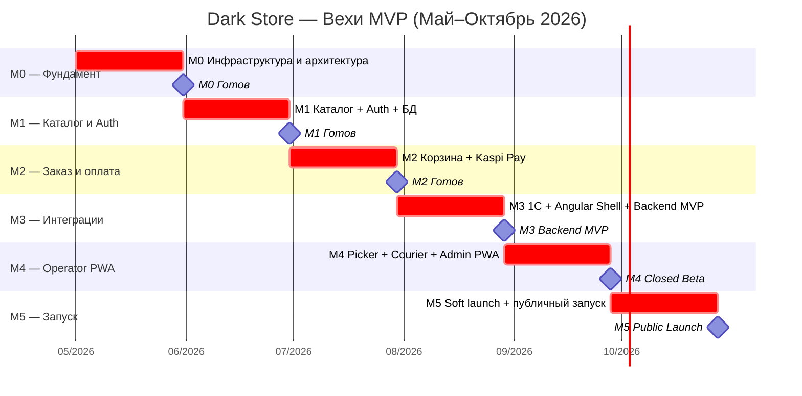
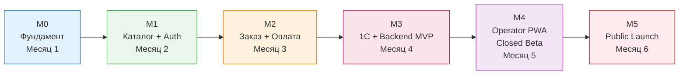
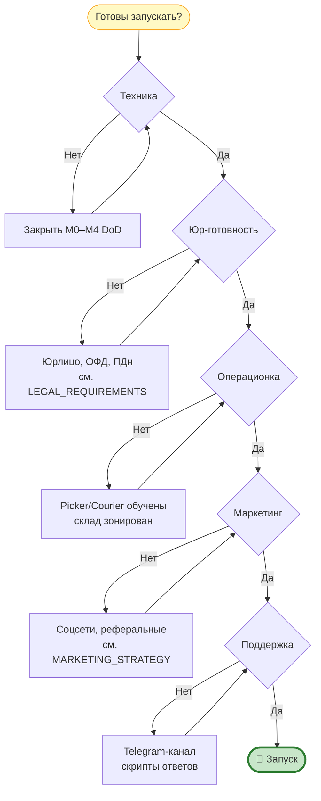

# План реализации MVP по вехам — Dark Store

**Проект:** Dark Store (быстрая доставка продуктов, 15–30 минут)
**Локация:** Костанай, Казахстан
**Период MVP:** Май 2026 — Октябрь 2026 (6 месяцев)
**Статус:** Утверждено к реализации
**Дата документа:** Май 2026

---

## 📌 Назначение документа

Этот документ — **операционная декомпозиция** [`ROADMAP_12_MONTHS.md`](./ROADMAP_12_MONTHS.md) на конкретные вехи MVP с чёткими критериями приёмки (Definition of Done), KPI и зависимостями. Если roadmap отвечает на вопрос «что и когда», то этот план отвечает на вопрос **«как понять, что веха закрыта»**.

**Связанные документы:**

- [`ROADMAP_12_MONTHS.md`](./ROADMAP_12_MONTHS.md) — стратегический план Q1–Q4
- [`IMPROVEMENT_PLAN.md`](./IMPROVEMENT_PLAN.md) — технический бэклог по 9 разделам
- [`MANUAL_ACTIONS.md`](./MANUAL_ACTIONS.md) — чеклист ручных действий
- [`ANALYSIS_AND_CHANGES.md`](./ANALYSIS_AND_CHANGES.md) — лог изменений и блокеры
- [`TESTING_STRATEGY.md`](./TESTING_STRATEGY.md) — стратегия тестов и Quality Gates

---

## 🎯 Определение MVP

**MVP считается готовым, если:**

1. Клиент может зарегистрироваться, найти товар, оформить заказ и оплатить через Kaspi Pay.
2. Сборщик (picker) собирает заказ через PWA, курьер доставляет с GPS-маршрутом.
3. Администратор управляет каталогом и видит статус заказов.
4. Backend выдерживает 100 RPS и 50 одновременных заказов.
5. Закрытое тестирование на 50+ реальных пользователях прошло без блокирующих дефектов.
6. Соблюдены требования Закона РК №94-V (ПДн в KZ Local DB) и фискализации (ОФД/ККМ или Kaspi Pay фискальный модуль).

**Что НЕ входит в MVP:**

- ИИ-агент персональных рекомендаций (Q3)
- Полная система лояльности с уровнями и реферальной программой (Q4)
- Расширенная аналитика и BI-дашборды (Q3–Q4)
- Второй даркстор / расширение на другие города (Q4+)
- Azure Container Apps / AKS (остаёмся на App Service до Q3)

---

## 🗓️ Обзор вех

| Веха | Срок | Главный итог |
|------|------|--------------|
| **M0 — Фундамент** | Конец месяца 1 | Деплой пустого API в Azure через CI/CD |
| **M1 — Каталог и Auth** | Конец месяца 2 | Пользователь регистрируется и видит каталог |
| **M2 — Заказ и оплата** | Конец месяца 3 | Заказ оплачен через Kaspi Pay (тестовый стенд) |
| **M3 — Backend MVP** | Конец месяца 4 | 1С интеграция + минимальный Angular shell |
| **M4 — Closed Beta** | Конец месяца 5 | 50+ тестировщиков делают реальные заказы |
| **M5 — Public Launch** | Конец месяца 6 | Soft launch, первый платный оборот |

---

## 🧱 Веха M0 — Фундамент (Месяц 1, май 2026)

> **Цель:** заложить каркас репозитория, инфраструктуру Azure, CI/CD, наблюдаемость. Никакого бизнес-функционала.

### Входит в скоуп

| # | Задача | Артефакт | Связь с документом |
|---|--------|----------|--------------------|
| 0.1 | Создать репозиторий, добавить `Directory.Build.props`, `global.json`, `.editorconfig`, `.cspell.json` | `DarkStore.slnx` собирается | [`PROJECT_CREATION_STEPS.md`](./PROJECT_CREATION_STEPS.md) |
| 0.2 | Развернуть Clean Architecture (Domain, Application, Infrastructure, API) + MediatR pipeline | `LoggingBehavior → ValidationBehavior → AuditBehavior` работают | [`TECH_STACK.md`](./TECH_STACK.md) |
| 0.3 | Подключить два DbContext (`AppDbContext` Azure SQL Sweden Central + `PersonalDataDbContext` KZ Local) | Миграции применяются на старте | [`DATABASE_SCHEMA.md`](./DATABASE_SCHEMA.md) |
| 0.4 | Настроить Azure: App Service, Azure SQL, Key Vault, Application Insights | `DefaultAzureCredential` подключается без хардкода | [`CONFIGURATION_GUIDE.md`](./CONFIGURATION_GUIDE.md) |
| 0.5 | CI/CD: `deploy-azure1.yml` (PR check) + `deploy-azure2.yml` (build → staging → prod) + `rollback.yml` | PR не сливается без зелёного CI | [`INDEX_TECHNICAL.md`](./INDEX_TECHNICAL.md) §5 |
| 0.6 | NetArchTest архитектурные тесты (Domain без зависимостей; Application только от Domain) | Тесты падают при нарушении границ | [`TESTING_STRATEGY.md`](./TESTING_STRATEGY.md) |
| 0.7 | **Application Insights + 3 базовых alert** (5xx > 5/мин, /health/ready fail, DTU > 80%) — **критично, с первого дня** | Алерты приходят в Telegram | [`LOGGING_AND_AUDIT_STRATEGY.md`](./LOGGING_AND_AUDIT_STRATEGY.md) |
| 0.8 | **AZS API Gate:** запросить документацию у партнёра, подтвердить sandbox или поднять WireMock.NET | Решение задокументировано | [`INTEGRATIONS.md`](./INTEGRATIONS.md) |
| 0.9 | Quartz.NET с persistent store на Azure SQL (тот же connection, что и `AppDbContext`) | Одна тестовая job запускается по cron | [`TECH_STACK.md`](./TECH_STACK.md) |
| 0.10 | Quality gate: `dotnet format --verify-no-changes`, `dotnet list package --vulnerable`, cspell English-only | Все три гейта зелёные на main | [`INDEX_TECHNICAL.md`](./INDEX_TECHNICAL.md) |

### Definition of Done

- [ ] Пустой `GET /health/ready` отвечает 200 в production через CI/CD без ручных действий
- [ ] `/scalar/v1` показывает OpenAPI без endpoints
- [ ] Миграции обоих DbContext применяются автоматически на старте API
- [ ] Application Insights собирает запросы и алерт работает (имитация 5xx подтверждает)
- [ ] Все 3 архитектурных теста NetArchTest зелёные
- [ ] Coverage gate ≥ 70% включён в `deploy-azure1.yml` (порог не нарушен — проектов почти нет)
- [ ] Rollback workflow проверен на staging (откат на предыдущий SHA)
- [ ] Решение по AZS API Gate зафиксировано в [`ANALYSIS_AND_CHANGES.md`](./ANALYSIS_AND_CHANGES.md)

### KPI вехи

| Метрика | Цель |
|---------|------|
| Время холодного деплоя из main | < 12 минут |
| Coverage backend (на новом коде) | ≥ 70% |
| Vulnerable packages (high/critical) | 0 |
| Время отклика `/health/ready` | < 200 мс |

### Риски и блокеры

- **🚨 AZS API Gate** — если партнёр не предоставит документацию к концу M0, поднимаем WireMock.NET и фиксируем срок ответа в риск-реестре. Не блокирует M0, но создаёт долг к M3.
- **OIDC от GitHub в Azure** — права на Azure subscription нужно получить заранее (см. [`MANUAL_ACTIONS.md`](./MANUAL_ACTIONS.md)).
- **KZ Local SQL Server** — на старте допустим dev-инстанс в РК; HA standby обязателен только к M4.

---

## 🛒 Веха M1 — Каталог и Auth (Месяц 2, июнь 2026)

> **Цель:** пользователь регистрируется по телефону, видит товары и категории. Backend для каталога готов и покрыт тестами.

### Входит в скоуп

| # | Задача | Bounded Context | Документ |
|---|--------|-----------------|----------|
| 1.1 | `Users`, `Addresses`, `CourierProfiles` в **PersonalDataDbContext** (KZ Local) | Identity | [`DATABASE_SCHEMA.md`](./DATABASE_SCHEMA.md) |
| 1.2 | `Products`, `Categories`, `Inventory` в **AppDbContext** (Azure SQL) | Catalog | [`DATABASE_SCHEMA.md`](./DATABASE_SCHEMA.md) |
| 1.3 | Phone OTP + JWT (rate limit `"otp"` 3 запр/час) | Identity | [`AUTH_AND_IDENTITY.md`](./AUTH_AND_IDENTITY.md) |
| 1.4 | `GET /api/v1/products` (пагинация, фильтр по категории, поиск по имени) | Catalog | [`INDEX_TECHNICAL.md`](./INDEX_TECHNICAL.md) |
| 1.5 | `GET /api/v1/categories` (дерево категорий) | Catalog | — |
| 1.6 | Output Cache на каталог (TTL 60 сек) | Catalog | [`TECH_STACK.md`](./TECH_STACK.md) |
| 1.7 | SMS OTP провайдер интегрирован (см. [`CONFIGURATION_GUIDE.md`](./CONFIGURATION_GUIDE.md)) | Identity | — |
| 1.8 | Destructurama + `[NotLogged]` / `[LogMasked]` на полях с PII | Cross-cutting | [`LOGGING_AND_AUDIT_STRATEGY.md`](./LOGGING_AND_AUDIT_STRATEGY.md) |
| 1.9 | Seed-данные каталога (50–100 товаров) для dev/staging | Catalog | — |
| 1.10 | Integration tests с Testcontainers.MsSql + Respawn | Cross-cutting | [`TESTING_STRATEGY.md`](./TESTING_STRATEGY.md) |

### Definition of Done

- [ ] Анонимный пользователь получает каталог за < 300 мс (P95) при 50 RPS
- [ ] Регистрация по OTP проходит за ≤ 60 секунд (отправка SMS → код → JWT)
- [ ] PII-поля не попадают в логи (тест с Destructurama проверяет это)
- [ ] PersonalDataDbContext **не содержит** ни одной бизнес-сущности (ревью + NetArchTest)
- [ ] Backend покрыт unit + integration тестами на 70%+
- [ ] Rate limit `"otp"` подтверждён E2E-тестом (4-й запрос в час → 429)

### KPI вехи

| Метрика | Цель |
|---------|------|
| P95 `GET /api/v1/products` | < 300 мс |
| Доля успешных OTP (отправка → ввод) | ≥ 90% (на тестовом стенде) |
| Backend coverage | ≥ 70% |

### Риски

- **SMS-провайдер** — если выбранный провайдер не работает в РК или превышает бюджет, заранее иметь альтернативу (см. [`CONFIGURATION_GUIDE.md`](./CONFIGURATION_GUIDE.md)).
- **PII в логах** — самый частый дефект. Обязательно ручной аудит логов после первого деплоя M1.

---

## 💳 Веха M2 — Заказ и оплата (Месяц 3, июль 2026)

> **Цель:** аутентифицированный пользователь оформляет заказ, оплачивает через Kaspi Pay, получает подтверждение.

### Входит в скоуп

| # | Задача | Bounded Context | Документ |
|---|--------|-----------------|----------|
| 2.1 | `Orders`, `OrderItems` в **AppDbContext** (только GUID-ссылки на пользователя/курьера, без PII) | Orders | [`DATABASE_SCHEMA.md`](./DATABASE_SCHEMA.md) |
| 2.2 | Команды: `PlaceOrderCommand`, `CancelOrderCommand`; запросы: `GetOrderByIdQuery`, `GetMyOrdersQuery` | Orders | [`INDEX_TECHNICAL.md`](./INDEX_TECHNICAL.md) §2 |
| 2.3 | Резервирование товаров на складе (transactional, оптимистическая блокировка) | Inventory | [`OPERATIONS_MANUAL.md`](./OPERATIONS_MANUAL.md) |
| 2.4 | Расчёт `DeliveryFee` (формула из [`FINANCIAL_MODEL.md`](./FINANCIAL_MODEL.md)) | Orders | [`FINANCIAL_MODEL.md`](./FINANCIAL_MODEL.md) |
| 2.5 | **Kaspi Pay интеграция:** инициация платежа + HMAC-верификация webhook + idempotency key | Payments | [`INTEGRATIONS.md`](./INTEGRATIONS.md) |
| 2.6 | Защита webhook: rate limit, IP allowlist (если Kaspi предоставит), повтор обработки идемпотентен | Payments | [`RISKS_AND_MITIGATION.md`](./RISKS_AND_MITIGATION.md) |
| 2.7 | Audit-лог всех изменений статуса заказа и платежа в `AuditLogs` | Cross-cutting | [`LOGGING_AND_AUDIT_STRATEGY.md`](./LOGGING_AND_AUDIT_STRATEGY.md) |
| 2.8 | Quartz job: автоотмена неоплаченных заказов через 15 минут | Orders | — |

### Definition of Done

- [ ] Заказ переходит `Pending → Paid → Reserved` атомарно (тест с конкурентными запросами)
- [ ] Kaspi webhook идемпотентен (повторный POST с тем же payload не дублирует начисления)
- [ ] HMAC-подпись webhook проверяется, при несовпадении — 401 + audit-запись
- [ ] Все изменения статуса заказа записаны в `AuditLogs` (3 года retention)
- [ ] Тест нагрузки: 50 одновременных заказов проходят без deadlock
- [ ] Coverage по `Application/Orders/**` ≥ 80%

### KPI вехи

| Метрика | Цель |
|---------|------|
| P95 `POST /api/v1/orders` | < 800 мс |
| Доля успешной оплаты (на sandbox Kaspi) | ≥ 95% |
| Расхождение между статусом заказа и платежом | 0 за 1000 транзакций |

### Риски

- **🚨 Kaspi Pay sandbox** — доступ к тестовому стенду нужен заранее. Если задерживается — поднять WireMock.NET stub для разработки, реальный sandbox блокирует только финальный gate M2.
- **Гонка резервирования** — обязательно integration tests с реальным SQL Server (не моки).
- **Фискализация (ОФД/ККМ)** — решение должно быть подтверждено к концу M2: либо Kaspi Pay фискальный модуль, либо отдельный ОФД ([`LEGAL_REQUIREMENTS.md`](./LEGAL_REQUIREMENTS.md)).

---

## 🔌 Веха M3 — Backend MVP (Месяц 4, август 2026)

> **Цель:** интеграция с 1С работает с circuit breaker, Angular shell позволяет провести E2E-тест без Postman, backend объявлен MVP-ready.

### Входит в скоуп

| # | Задача | Документ |
|---|--------|----------|
| 3.1 | **1С интеграция (REST):** синхронизация остатков и цен, scheduled Quartz job каждые 5 минут | [`INTEGRATIONS.md`](./INTEGRATIONS.md) |
| 3.2 | Circuit breaker (Polly) на 1С-клиенте: 3 сбоя → размыкание на 30 сек | [`RISKS_AND_MITIGATION.md`](./RISKS_AND_MITIGATION.md) |
| 3.3 | Кэш остатков с TTL 60 сек (Redis) для деградации при недоступности 1С | [`TECH_STACK.md`](./TECH_STACK.md) |
| 3.4 | **Минимальный Angular shell:** auth, каталог, корзина, оформление, мои заказы (без стилизации) | [`ROADMAP_12_MONTHS.md`](./ROADMAP_12_MONTHS.md) Q1 |
| 3.5 | SignalR хаб: обновления статуса заказа в реальном времени | [`TECH_STACK.md`](./TECH_STACK.md) |
| 3.6 | E2E smoke-тест на staging: регистрация → заказ → оплата → отмена | [`TESTING_STRATEGY.md`](./TESTING_STRATEGY.md) |
| 3.7 | Простая система лояльности: накопление бонусов 1% от заказа | [`FINANCIAL_MODEL.md`](./FINANCIAL_MODEL.md) |

### Definition of Done

- [ ] 1С недоступна 30 секунд → каталог продолжает работать на кэше Redis
- [ ] Angular shell выполняет полный путь: регистрация → каталог → корзина → оплата → доставка
- [ ] SignalR push-обновление приходит в shell за < 1 сек после смены статуса
- [ ] E2E smoke-тест зелёный 5 запусков подряд
- [ ] **Backend MVP объявлен готовым** — это **главный milestone M3**

### KPI вехи

| Метрика | Цель |
|---------|------|
| Доступность каталога при сбое 1С | 100% (5 минут на кэше) |
| P95 синхронизации с 1С | < 30 сек |
| E2E smoke-тест flake rate | < 5% |

### Риски

- **🚨 1С API нестабилен** — самый частый случай в РК. Circuit breaker + Redis кэш — защитный контур, но мониторинг расхождения цен/остатков обязателен.
- **Angular shell задержка** — при риске сорвать срок нанять Angular-подрядчика на месяц 2 (раньше, чем M3), как указано в [`ROADMAP_12_MONTHS.md`](./ROADMAP_12_MONTHS.md).

---

## 📱 Веха M4 — Operator PWA + Closed Beta (Месяц 5, сентябрь 2026)

> **Цель:** сборщик и курьер работают через PWA, администратор управляет каталогом, 50+ тестировщиков делают реальные заказы.

### Входит в скоуп

| # | Задача | Документ |
|---|--------|----------|
| 4.1 | **Picker PWA** (`/picker`): очередь заказов, сборка по зонам склада, сканирование штрих-кода через Web APIs | [`OPERATIONS_MANUAL.md`](./OPERATIONS_MANUAL.md) |
| 4.2 | **Courier PWA** (`/courier`): очередь, GPS-маршрут (Google Maps), подтверждение доставки фото + подпись | [`OPERATIONS_MANUAL.md`](./OPERATIONS_MANUAL.md) |
| 4.3 | **Admin Panel PWA** (`/admin`): CRUD продуктов, заказы, инвентарь, базовые отчёты | — |
| 4.4 | Web Push уведомления (Firebase): «Готовится → В пути → Доставлен» | [`INTEGRATIONS.md`](./INTEGRATIONS.md) |
| 4.5 | Назначение курьеров на заказы (Quartz job + ручное назначение из Admin) | — |
| 4.6 | **KZ Local DB HA standby-реплика** настроена и проверена | [`RISKS_AND_MITIGATION.md`](./RISKS_AND_MITIGATION.md) |
| 4.7 | АЗС интеграция: начисление бонусов за заказ (партнёрская программа) | [`INTEGRATIONS.md`](./INTEGRATIONS.md) |
| 4.8 | Запуск **Closed Beta** для 50+ человек: внутренние сотрудники + друзья + партнёры | [`GROWTH_HACKS.md`](./GROWTH_HACKS.md) |
| 4.9 | Сбор обратной связи: форма в PWA + Telegram-бот для багов | [`CUSTOMER_SUPPORT_GUIDE.md`](./CUSTOMER_SUPPORT_GUIDE.md) |

### Definition of Done

- [ ] Picker и Courier PWA протестированы с **реальными** операторами на складе (минимум 2 смены)
- [ ] Admin Panel позволяет создать новый товар без захода в БД
- [ ] Web Push приходят на iOS Safari и Android Chrome
- [ ] KZ Local HA standby протестирован: failover за < 60 сек без потери данных
- [ ] 50+ пользователей сделали ≥ 100 заказов суммарно
- [ ] Все блокирующие дефекты из Closed Beta закрыты или перенесены с обоснованием

### KPI вехи

| Метрика | Цель |
|---------|------|
| Среднее время сборки заказа (picker) | < 10 минут |
| Среднее время доставки (от готовности) | < 25 минут |
| Doorstep success rate | ≥ 95% (попытка доставки → успех) |
| Bug rate Closed Beta (P0/P1 на 100 заказов) | < 5 |
| NPS Closed Beta | ≥ 30 |

### Риски

- **🚨 Реальные операторы найдут UX-проблемы PWA** — закладываем 1 неделю на быстрые правки.
- **iOS Safari Web Push** — поддерживается с iOS 16.4+, для старших устройств fallback на SMS.
- **GPS-точность курьерского трекинга** — тестировать в реальных условиях Костаная, не только в офисе.

---

## 🚀 Веха M5 — Public Launch (Месяц 6, октябрь 2026)

> **Цель:** soft launch в Костанае, первый платный оборот, базовая маркетинговая воронка работает.

### Обязательные условия перед запуском

Это **жёсткий gate** — без всех галочек запуск откладывается:

- [ ] **KZ Local DB HA standby-реплика** настроена и протестирована (см. M4)
- [ ] **ОФД/ККМ зарегистрированы** или Kaspi Pay фискальный модуль активен в production
- [ ] **SMS OTP провайдер** работает в production (договор подписан, оплата прошла)
- [ ] **Picker и Courier PWA** прошли минимум 2 смены с реальными операторами
- [ ] **Application Insights алерты** настроены и тестово проверены (см. M0)
- [ ] **Юридическое лицо** оформлено (ИП или ТОО), договоры с курьерами заключены ([`LEGAL_REQUIREMENTS.md`](./LEGAL_REQUIREMENTS.md))
- [ ] **Политика обработки ПДн** опубликована на сайте, согласие пользователя интегрировано в регистрацию
- [ ] **Чеклист `MANUAL_ACTIONS.md`** закрыт по всем пунктам критического пути

### Входит в скоуп

| # | Задача | Документ |
|---|--------|----------|
| 5.1 | Soft launch: открыть регистрацию для всех в выбранных районах Костаная | [`MARKETING_STRATEGY.md`](./MARKETING_STRATEGY.md) |
| 5.2 | Маркетинговая воронка: реферальный код, промо первой покупки, Instagram | [`GROWTH_HACKS.md`](./GROWTH_HACKS.md) |
| 5.3 | Поддержка клиентов: Telegram-канал + горячая линия + скрипты ответов | [`CUSTOMER_SUPPORT_GUIDE.md`](./CUSTOMER_SUPPORT_GUIDE.md) |
| 5.4 | Operations dashboard: суточные KPI на стене склада (телевизор) | [`OPERATIONS_MANUAL.md`](./OPERATIONS_MANUAL.md) |
| 5.5 | Backup и DR-проверка: тест восстановления Azure SQL и KZ Local на staging | [`OPERATIONS_MANUAL.md`](./OPERATIONS_MANUAL.md) |
| 5.6 | Feedback loop: еженедельный приоритетный backlog на основе отзывов | [`IMPROVEMENT_PLAN.md`](./IMPROVEMENT_PLAN.md) |

### Definition of Done

- [ ] **Первый реальный платный заказ** доставлен и закрыт без ручного вмешательства разработчика
- [ ] Минимум 100 заказов за первый месяц soft launch
- [ ] Среднее время доставки **30 минут или меньше** (P95)
- [ ] Доля успешно доставленных заказов ≥ 90%
- [ ] Refund rate < 5%
- [ ] Ни одной критической ошибки в production за неделю до и после запуска

### KPI вехи (первый месяц после запуска)

| Метрика | Цель |
|---------|------|
| Заказов в день | ≥ 5 (на старте) → 30 (к концу месяца) |
| AOV (средний чек) | соответствует [`FINANCIAL_MODEL.md`](./FINANCIAL_MODEL.md) |
| P95 время доставки | ≤ 30 минут |
| App crash-free rate (Angular PWA) | ≥ 99% |
| Customer support response time | < 5 минут (рабочее время) |

### Риски

- **🚨 Низкий первичный спрос** — закладываем маркетинговый бюджет на месяц 6 заранее, см. [`MARKETING_STRATEGY.md`](./MARKETING_STRATEGY.md).
- **Перегрузка склада** — soft launch в одном районе, расширение поэтапное.
- **PR-инциденты** — первый плохой отзыв в соцсетях должен быть отработан за < 2 часа (скрипт в [`CUSTOMER_SUPPORT_GUIDE.md`](./CUSTOMER_SUPPORT_GUIDE.md)).

---

## 🧭 Сквозные требования (применяются к каждой вехе)

| Требование | Как проверяем |
|------------|---------------|
| **Coverage backend ≥ 70%** | Quality gate в `deploy-azure1.yml` блокирует PR |
| **Vulnerable packages = 0 (high/critical)** | `dotnet list package --vulnerable` в CI |
| **Архитектурные тесты NetArchTest зелёные** | `dotnet test` в CI |
| **`dotnet format --verify-no-changes`** | CI gate |
| **English-only комментарии** | cspell English-only check в CI |
| **PII только в `PersonalDataDbContext`** | Code review + NetArchTest |
| **Все Command/Query именуются по конвенции** | Code review (см. [`INDEX_TECHNICAL.md`](./INDEX_TECHNICAL.md) §CQRS) |
| **AuditBehavior пишет все Command** | Integration test проверяет |
| **Secrets только из Azure Key Vault в non-Dev** | `appsettings.json` содержит только `PLACEHOLDER` |

---

## 🔄 Управление изменениями плана

- План пересматривается **в конце каждой вехи** на ретроспективе.
- Если веха срывается на > 2 недели — обновляем roadmap и информируем заказчика.
- Любое изменение скоупа MVP документируется в [`ANALYSIS_AND_CHANGES.md`](./ANALYSIS_AND_CHANGES.md) с обоснованием.
- Решение «выкинуть из MVP» принимает заказчик, решение «добавить в MVP» — только при отсутствии срыва вехи.

---

## ✅ Контрольный чеклист готовности к публичному запуску (M5)

---

**Статус:** Утверждено к реализации
**Владелец:** Solo-разработчик (с поддержкой партнёров по операционке)
**Следующий пересмотр:** в конце вехи M0 (конец мая 2026)
