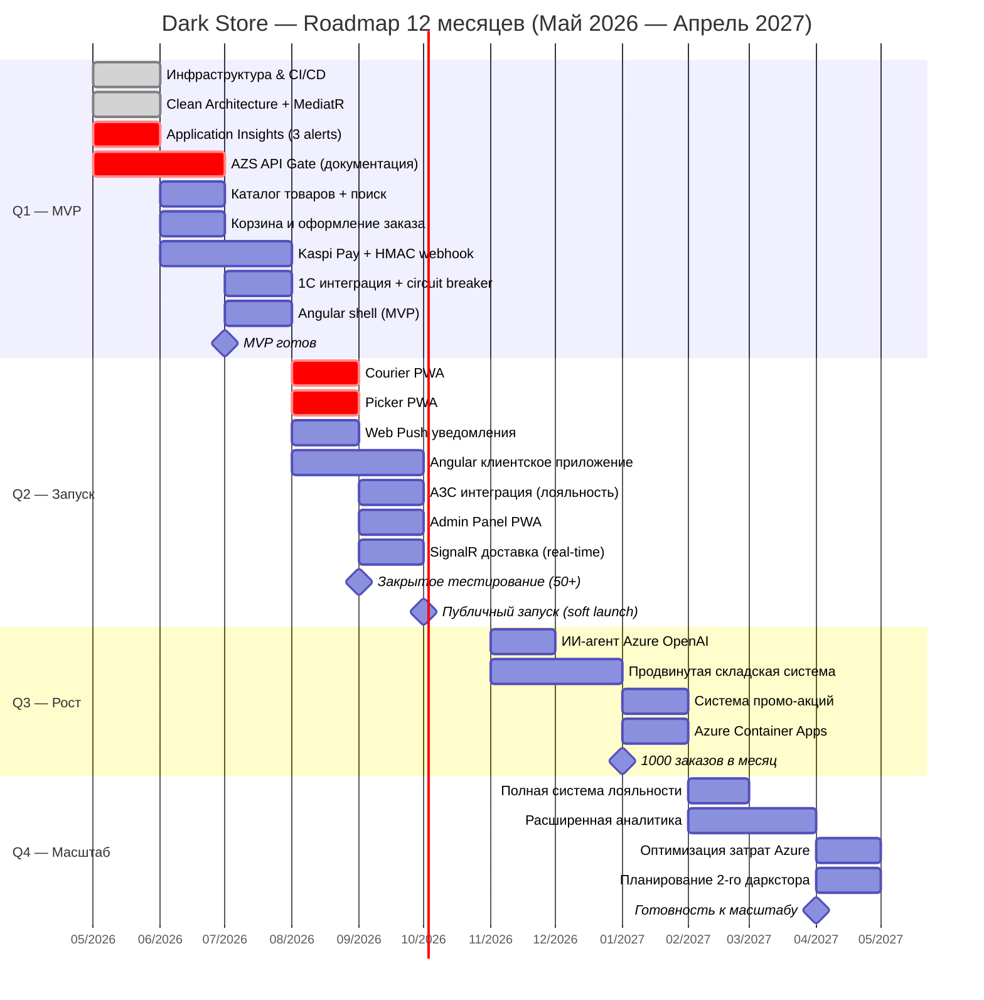

# Roadmap развития проекта Dark Store — 12 месяцев

**Проект:** Dark Store (быстрая доставка продуктов)  
**Локация:** Костанай, Казахстан  
**Команда:** Соло-разработчик (с поддержкой партнёров по операционке)  
**Дата создания:** Май 2026

---

## Общая стратегия

Проект развивается по принципу **"Сначала продукт, потом масштабирование"**.

- **Первые 6 месяцев** — фокус на быстром запуске MVP и получении первых реальных заказов.
- **Следующие 6 месяцев** — улучшение продукта, автоматизация и подготовка к росту.
- **Ключевой принцип:** Не усложнять архитектуру раньше времени.

---

## Квартальная дорожная карта

### **Q1 (Месяцы 1–3): Подготовка и MVP**

**Цель:** Создать рабочую версию продукта, готовую к внутреннему тестированию.

**Ключевые задачи:**

| № | Задача | Приоритет | Срок |
|---|--------|---------|------|
| 1 | Настройка инфраструктуры (GitHub, Azure, CI/CD) | Высокий | Месяц 1 |
| 2 | Базовая архитектура (Clean Architecture + MediatR) | Высокий | Месяц 1 |
| 3 | **Application Insights + 3 базовых alert (5xx, health, DTU)** — с первого дня деплоя | **Критический** | Месяц 1 |
| 4 | Каталог товаров + поиск | Высокий | Месяц 2 |
| 5 | Корзина и оформление заказа | Высокий | Месяц 2 |
| 6 | Интеграция с Kaspi Pay + HMAC-верификация webhook | Высокий | Месяц 2–3 |
| 7 | Базовая интеграция с 1С (остатки и цены) + circuit breaker | Высокий | Месяц 3 |
| 8 | Простая система лояльности | Средний | Месяц 3 |
| 9 | Развёртывание на Azure App Service | Высокий | Месяц 3 |
| 10 | **Минимальный Angular shell** (auth, каталог, корзина, оформление заказа — без стилизации) | **Высокий** | Месяц 3 |
| 11 | **⚠️ AZS API Gate:** получить документацию API от партнёра, подтвердить наличие sandbox. При отсутствии — поднять WireMock.NET mock-сервер | **Критический** | Месяц 1–2 |

**Результат Q1:**  
Работающий backend + минимальный Angular shell. Можно провести внутреннее тестирование без Postman.

> ⚡ **Найм:** Если Angular shell вызывает задержку — нанять Angular-разработчика (contract) в Месяц 2, не ждать Месяца 6.

---

### **Q2 (Месяцы 4–6): Запуск и первые пользователи**

**Цель:** Запустить продукт для реальных пользователей и получить обратную связь.

**Ключевые задачи:**

| № | Задача | Приоритет | Срок |
|---|--------|---------|------|
| 1 | **Courier PWA** (Angular `/courier`: очередь заказов, GPS-маршрут, подтверждение доставки) | **Критический** | Месяц 4 |
| 2 | **Picker PWA** (Angular `/picker`: сборка заказа по зонам, сканирование штрих-кода) | **Критический** | Месяц 4 |
| 3 | **Базовые Web Push уведомления** (Готовится → В пути → Доставлен) | **Высокий** | Месяц 4 |
| 4 | Разработка Angular-приложения для клиента (полный UX) | Высокий | Месяц 4–5 |
| 5 | Базовая складская логика (резервирование товаров) | Высокий | Месяц 4–5 |
| 6 | Интеграция с сетью АЗС (бонусная программа) | Высокий | Месяц 5 |
| 7 | **Admin Panel PWA** (Angular `/admin`: CRUD продуктов, заказы, инвентарь) | Высокий | Месяц 5 |
| 8 | Система доставки (назначение курьеров) + SignalR real-time | Высокий | Месяц 5 |
| 9 | Закрытое тестирование (50–100 пользователей) | Высокий | Месяц 5 |
| 10 | Публичный запуск (soft launch) | Высокий | Месяц 6 |
| 11 | Сбор обратной связи и приоритизация фич | Высокий | Месяц 6 |

**Обязательные условия перед публичным запуском (Месяц 6):**
- [ ] KZ Local DB HA (standby-реплика) настроена
- [ ] ОФД/ККМ зарегистрированы (или Kaspi Pay фискальный модуль активен)
- [ ] SMS OTP провайдер работает в production
- [ ] Courier PWA и Picker PWA протестированы с реальными операторами
- [ ] Application Insights алерты настроены

**Результат Q2:**  
Работающий продукт с первыми реальными заказами.

---

### **Q3 (Месяцы 7–9): Рост и оптимизация**

**Цель:** Улучшить продукт, повысить стабильность и конверсию.

**Ключевые задачи:**

| № | Задача | Приоритет | Срок |
|---|--------|---------|------|
| 1 | Улучшение ИИ-агента (персональные рекомендации) | Высокий | Месяц 7 |
| 2 | Продвинутая складская система (pick-list, инвентаризация) | Высокий | Месяц 7–8 |
| 3 | Аналитика и дашборды (для партнёров) | Средний | Месяц 8 |
| 4 | Оптимизация производительности (кэширование, запросы) | Высокий | Месяц 8 |
| 5 | Улучшение UX адаптивного веб-приложения (PWA) | Высокий | Месяц 8–9 |
| 6 | Система промо-акций и скидок | Средний | Месяц 9 |
| 7 | Переход на **Azure Container Apps** (если нагрузка выросла) | Средний | Месяц 9 |
| 8 | ~~Внедрение мониторинга (Application Insights + alerts)~~ → **Перенесено в Месяц 1** | ~~Высокий~~ | ~~Месяц 9~~ |

**Результат Q3:**  
Стабильный продукт с растущим количеством заказов.

---

### **Q4 (Месяцы 10–12): Стабилизация и подготовка к масштабу**

**Цель:** Подготовить продукт к росту и возможному расширению на другие города.

**Ключевые задачи:**

| № | Задача | Приоритет | Срок |
|---|--------|---------|------|
| 1 | Полноценная система лояльности (уровни, бонусы, реферальная программа) | Высокий | Месяц 10 |
| 2 | Расширенная аналитика и отчёты | Средний | Месяц 10–11 |
| 3 | Подготовка к переходу на **AKS** (при необходимости) | Средний | Месяц 11 |
| 4 | Документация и внутренние процессы | Средний | Месяц 11 |
| 5 | Планирование второго даркстора | Низкий | Месяц 12 |
| 6 | Оптимизация затрат на Azure | Высокий | Месяц 12 |
| 7 | Оценка возможности выхода на другие города | Низкий | Месяц 12 |
| 8 | Рефакторинг и технический долг | Средний | Месяц 12 |

**Результат Q4:**  
Зрелый продукт, готовый к масштабированию.

---

## Ключевые вехи (Milestones)

| Веха | Срок | Описание |
|------|------|---------|
| **MVP готов** | Конец месяца 3 | Возможность оформить заказ и оплатить |
| **Закрытое тестирование** | Конец месяца 5 | 50+ активных пользователей |
| **Публичный запуск** | Конец месяца 6 | Первый реальный оборот |
| **1000 заказов в месяц** | Конец месяца 9 | Стабильная работа |
| **Готовность к масштабу** | Конец месяца 12 | Продукт может выдержать рост |

---

## Приоритеты по направлениям

| Направление       | Приоритет в первые 6 месяцев | Приоритет во вторые 6 месяцев |
|-------------------|------------------------------|-------------------------------|
| **Продукт**       | Высокий                      | Высокий                       |
| **Техническая база** | Высокий                   | Средний                       |
| **ИИ и рекомендации** | Средний                    | Высокий                       |
| **Операционка**   | Средний                      | Высокий                       |
| **Аналитика**     | Низкий                       | Высокий                       |
| **Масштабирование** | Низкий                     | Средний                       |

---

## Заключение

**Главное правило roadmap:**
> Делать только то, что приносит реальную ценность пользователям и бизнесу прямо сейчас.

**Гибкость:**  
Roadmap может корректироваться каждые 2 месяца в зависимости от обратной связи от пользователей и партнёров.

---

**Статус:** Утверждено  
**Следующее обновление:** Через 3 месяца после запуска MVP
