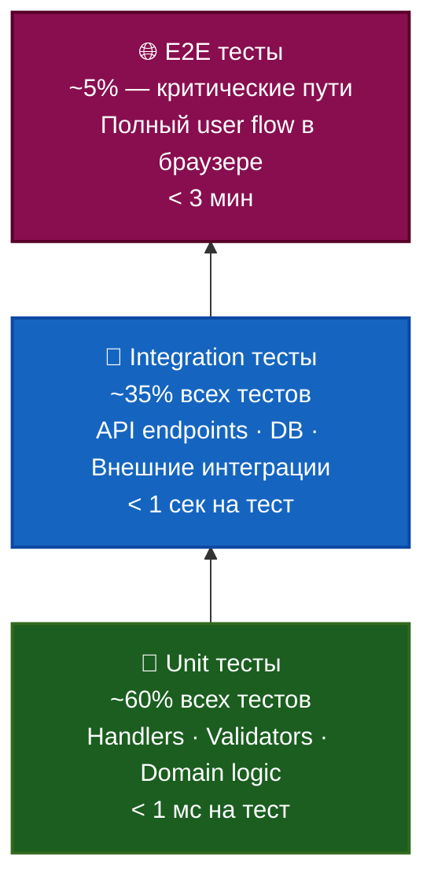
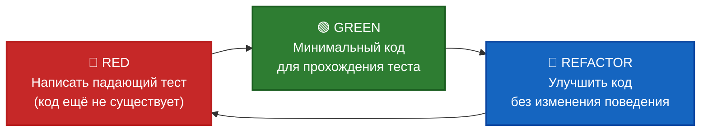

# 🧪 DarkStore — Стратегия тестирования

**Проект:** Dark Store — быстрая доставка продуктов  
**Создан:** 4 мая 2026  
**Применимо к:** Backend (.NET 10 / ASP.NET Core), Frontend (Angular 20 PWA), CI/CD (GitHub Actions)

---

## Содержание

1. [Принципы и пирамида тестирования](#принципы)
2. [TDD — разработка через тестирование](#tdd)
3. [Backend — Unit тесты](#backend-unit)
4. [Backend — Integration тесты](#backend-integration)
5. [Backend — Architecture тесты](#backend-architecture)
6. [Frontend — Unit тесты](#frontend-unit)
7. [Frontend — E2E тесты](#frontend-e2e)
8. [Структура проекта](#структура-проекта)
9. [Пакеты и зависимости](#пакеты)
10. [CI/CD интеграция](#cicd)
11. [Покрытие кода и Quality Gates](#quality-gates)
12. [Тестовые паттерны и соглашения](#паттерны)
13. [Тестирование специфичных компонентов](#специфика)

---

## Принципы и пирамида тестирования <a name="принципы"></a>



| Уровень | Скорость | Уверенность | Обслуживание | Цель по количеству |
|---------|----------|-------------|--------------|-------------------|
| Unit | < 1 мс | Низкая (изоляция) | Лёгкое | ~60% всех тестов |
| Integration | < 1 сек | Высокая | Среднее | ~35% всех тестов |
| E2E | < 3 мин | Максимальная | Тяжёлое | ~5% (критические пути) |

**Целевое покрытие кода:**
- Backend: **≥ 70%** на PR, **≥ 80%** к публичному запуску
- Frontend: **≥ 65%** на PR
- Обязательное 100% покрытие: бизнес-правила доменного слоя

---

## TDD — разработка через тестирование <a name="tdd"></a>

> **TDD (Test-Driven Development)** — практика, при которой тест пишется **до** производственного кода.  
> Цель — не покрытие ради метрик, а **проектирование через поведение**: интерфейс и контракт модуля формируются требованиями теста.

### Цикл Red → Green → Refactor



| Фаза | Правило | Типичная ошибка |
|------|---------|----------------|
| 🔴 RED | Тест **должен упасть** по правильной причине — `NotImplementedException`, а не компиляция | Пропустить фазу, сразу написать код |
| 🟢 GREEN | Только самый простой код, который заставляет тест пройти | Писать «умный» код — он скрывает баги в логике |
| 🔵 REFACTOR | Убрать дублирование, улучшить имена — **тесты не меняются** | Менять поведение и «подгонять» тест под код |

---

### Когда применять TDD в DarkStore

| Область | Применять TDD | Причина |
|---------|--------------|---------|
| Domain-объекты (`Order`, `Delivery`, `LoyaltyAccount`) | ✅ Всегда | Бизнес-правила — ядро продукта; сложны в отладке без тестов |
| Application Command/Query Handlers | ✅ Всегда | Чёткие входы/выходы, зависимости мокируются легко |
| FluentValidation Validators | ✅ Всегда | Граничные случаи хорошо выражаются в `[InlineData]` |
| Domain Services (`DeliveryFeeCalculator`, `LoyaltyCalculator`) | ✅ Всегда | Формулы — идеальный кандидат для параметрических тестов |
| Infrastructure (EF Configurations, Repositories) | 🔶 Integration-first | Зависят от БД; TDD замедляет, лучше Integration тест с Testcontainers |
| API Controllers / Minimal API Endpoints | 🔶 Integration-first | Поведение проверяется через HTTP — Integration тест надёжнее |
| Angular Services / NgRx Store | ✅ Рекомендуется | Чистые функции и Observables хорошо поддаются TDD |
| E2E / UI | ❌ Не применять | Слишком медленный цикл обратной связи |

---

### Пример TDD — шаг за шагом: `DeliveryFeeCalculator`

#### 🔴 Шаг 1 — RED: написать первый падающий тест

```csharp
// tests/DarkStore.UnitTests/Domain/Services/DeliveryFeeCalculatorTests.cs
public class DeliveryFeeCalculatorTests
{
    [Fact]
    public void Calculate_WhenOrderBelowThresholdAndBaseDistance_ShouldReturnBaseFee()
    {
        // Arrange
        var sut = new DeliveryFeeCalculator(); // ← класс ещё не существует → RED

        // Act
        var fee = sut.Calculate(orderTotal: 5000m, distanceKm: 2.0);

        // Assert
        fee.Should().Be(800m);
    }
}
```

> **Запустить тест → упадёт:** `CS0246 — 'DeliveryFeeCalculator' не найден` ✅ Это ожидаемо.

#### 🟢 Шаг 2 — GREEN: минимальная реализация

```csharp
// src/DarkStore.Domain/Services/DeliveryFeeCalculator.cs
public class DeliveryFeeCalculator
{
    public decimal Calculate(decimal orderTotal, double distanceKm) => 800m; // хардкод — пока OK
}
```

> Тест проходит. Теперь добавляем следующее требование.

#### 🔴 Шаг 3 — RED: добавить требование «бесплатная доставка ≥ 10 000 ₸»

```csharp
[Fact]
public void Calculate_WhenOrderMeetsThreshold_ShouldReturnZeroFee()
{
    var sut = new DeliveryFeeCalculator();
    var fee = sut.Calculate(orderTotal: 10_000m, distanceKm: 2.0);
    fee.Should().Be(0m); // ← упадёт, потому что возвращаем 800 хардкодом
}
```

#### 🟢 Шаг 4 — GREEN: реализовать порог

```csharp
public decimal Calculate(decimal orderTotal, double distanceKm)
{
    if (orderTotal >= 10_000m) return 0m;
    return 800m;
}
```

#### 🔴 Шаг 5 — RED: добавить требование «+200 ₸ за каждый км сверх 3 км»

```csharp
[Theory]
[InlineData(9999, 2.0, 800)]
[InlineData(9999, 3.0, 800)]
[InlineData(9999, 4.0, 1000)]  // 800 + 1*200
[InlineData(9999, 5.0, 1200)]  // 800 + 2*200
public void Calculate_ShouldApplyDistanceSurcharge(
    decimal orderTotal, double distanceKm, decimal expectedFee)
{
    var fee = new DeliveryFeeCalculator().Calculate(orderTotal, distanceKm);
    fee.Should().Be(expectedFee);
}
```

#### 🔵 Шаг 6 — GREEN + REFACTOR: финальная реализация

```csharp
// src/DarkStore.Domain/Services/DeliveryFeeCalculator.cs
public class DeliveryFeeCalculator : IDeliveryFeeCalculator
{
    private const decimal FreeDeliveryThreshold = 10_000m;
    private const decimal BaseFee = 800m;
    private const decimal SurchargePerKm = 200m;
    private const double BaseDistanceKm = 3.0;

    public decimal Calculate(decimal orderTotal, double distanceKm)
    {
        if (orderTotal >= FreeDeliveryThreshold)
            return 0m;

        var distanceSurcharge = distanceKm > BaseDistanceKm
            ? (decimal)(distanceKm - BaseDistanceKm) * SurchargePerKm
            : 0m;

        return BaseFee + distanceSurcharge;
    }
}
```

> Все 6 тестов — зелёные. Константы вынесены, читаемость улучшена — **рефакторинг не сломал поведение**.

---

### Пример TDD — Domain Entity: `Order.Cancel()`

```csharp
// Шаг 1 🔴 — Формализуем бизнес-правила через тесты ДО написания Order.Cancel()

public class OrderCancellationTests
{
    // Правило 1: можно отменить заказ в статусе Pending
    [Fact]
    public void Cancel_WhenPending_ShouldSetStatusToCancelled()
    {
        var order = OrderFaker.CreatePendingOrder();
        order.Cancel(reason: "Customer request");
        order.Status.Should().Be(OrderStatus.Cancelled);
        order.CancellationReason.Should().Be("Customer request");
    }

    // Правило 2: нельзя отменить доставленный заказ
    [Fact]
    public void Cancel_WhenDelivered_ShouldThrowDomainException()
    {
        var order = OrderFaker.CreateDeliveredOrder();
        var act = () => order.Cancel("Changed my mind");
        act.Should().Throw<DomainException>()
           .WithMessage("*delivered*");
    }

    // Правило 3: нельзя отменить уже отменённый заказ
    [Fact]
    public void Cancel_WhenAlreadyCancelled_ShouldThrowDomainException()
    {
        var order = OrderFaker.CreatePendingOrder();
        order.Cancel("First reason");
        var act = () => order.Cancel("Second reason");
        act.Should().Throw<DomainException>()
           .WithMessage("*already cancelled*");
    }

    // Правило 4: причина отмены обязательна
    [Theory]
    [InlineData(null)]
    [InlineData("")]
    [InlineData("   ")]
    public void Cancel_WhenNoReason_ShouldThrowArgumentException(string? reason)
    {
        var order = OrderFaker.CreatePendingOrder();
        var act = () => order.Cancel(reason!);
        act.Should().Throw<ArgumentException>();
    }
}
```

> Все 4 теста написаны ДО реализации метода. IDE показывает красные волнистые линии.  
> Только после написания этих тестов — реализовать `Order.Cancel()`.

---

### Пример TDD — MediatR Command Handler: `PlaceOrderCommandHandler`

```csharp
// Шаг 1 🔴 — Определить ожидаемое поведение

public class PlaceOrderCommandHandlerTddTests
{
    private readonly IAppDbContext _db = Substitute.For<IAppDbContext>();
    private readonly IDeliveryFeeCalculator _feeCalc = Substitute.For<IDeliveryFeeCalculator>();
    private readonly IDateTimeProvider _clock = Substitute.For<IDateTimeProvider>();

    // Требование 1: успешное размещение возвращает непустой OrderId
    [Fact]
    public async Task Handle_WhenValid_ShouldReturnNewOrderId()
    {
        _feeCalc.Calculate(Arg.Any<decimal>(), Arg.Any<double>()).Returns(800m);
        _clock.UtcNow.Returns(DateTimeOffset.UtcNow);

        var handler = new PlaceOrderCommandHandler(_db, _feeCalc, _clock);
        var command = PlaceOrderCommandFaker.Valid();

        var result = await handler.Handle(command, CancellationToken.None);

        result.Should().NotBeEmpty();
    }

    // Требование 2: SaveChanges вызывается ровно один раз
    [Fact]
    public async Task Handle_WhenValid_ShouldPersistExactlyOnce()
    {
        _feeCalc.Calculate(Arg.Any<decimal>(), Arg.Any<double>()).Returns(800m);
        var handler = new PlaceOrderCommandHandler(_db, _feeCalc, _clock);

        await handler.Handle(PlaceOrderCommandFaker.Valid(), CancellationToken.None);

        await _db.Received(1).SaveChangesAsync(Arg.Any<CancellationToken>());
    }

    // Требование 3: доставка рассчитывается с правильными параметрами
    [Fact]
    public async Task Handle_WhenValid_ShouldCallFeeCalculatorWithOrderTotalAndDistance()
    {
        var command = PlaceOrderCommandFaker.ValidWithTotal(9500m, distanceKm: 4.0);
        _feeCalc.Calculate(9500m, 4.0).Returns(1000m);

        var handler = new PlaceOrderCommandHandler(_db, _feeCalc, _clock);
        await handler.Handle(command, CancellationToken.None);

        _feeCalc.Received(1).Calculate(9500m, 4.0);
    }

    // Требование 4: пустой список товаров бросает исключение (до валидатора)
    [Fact]
    public async Task Handle_WhenNoItems_ShouldThrowDomainException()
    {
        var command = PlaceOrderCommandFaker.WithEmptyItems();
        var handler = new PlaceOrderCommandHandler(_db, _feeCalc, _clock);

        var act = () => handler.Handle(command, CancellationToken.None);

        await act.Should().ThrowAsync<DomainException>();
    }
}
```

---

### Пример TDD — Angular Service (TypeScript)

```typescript
// src/app/features/cart/cart.service.spec.ts
// Шаг 1 🔴 — написать спецификацию CartService.applyPromoCode() до реализации

describe('CartService.applyPromoCode()', () => {
  let service: CartService;

  beforeEach(() => {
    TestBed.configureTestingModule({ providers: [CartService] });
    service = TestBed.inject(CartService);
    // Добавить товары для работы с корзиной
    service.addItem({ id: '1', name: 'Молоко', price: 1000, stock: 5 }, 1);
  });

  // Требование 1: скидка 10% применяется к итоговой сумме
  it('should apply percentage discount to total', () => {
    service.applyPromoCode({ code: 'SAVE10', discountPercent: 10 });
    expect(service.discountAmount()).toBe(100); // 1000 * 10%
    expect(service.totalWithDiscount()).toBe(900);
  });

  // Требование 2: повторное применение промокода заменяет предыдущий
  it('should replace existing promo code', () => {
    service.applyPromoCode({ code: 'SAVE10', discountPercent: 10 });
    service.applyPromoCode({ code: 'SAVE20', discountPercent: 20 });
    expect(service.appliedPromoCode()).toBe('SAVE20');
    expect(service.discountAmount()).toBe(200); // только последняя скидка
  });

  // Требование 3: промокод нельзя применить к пустой корзине
  it('should throw when cart is empty', () => {
    service.clearCart();
    expect(() => service.applyPromoCode({ code: 'SAVE10', discountPercent: 10 }))
      .toThrowError('Cannot apply promo code to empty cart');
  });
});
```

---

### TDD-чеклист для code review

При ревью PR, затрагивающего доменную логику или командные/запросные хэндлеры, проверить:

- [ ] Тест написан **до** реализации (или одновременно, но тест не подогнан под уже написанный код)
- [ ] Тест падает по **правильной причине** на пустой реализации (`throw new NotImplementedException()`)
- [ ] Название теста читается как **требование**: `{Метод}_{Условие}_{ОжидаемыйРезультат}`
- [ ] Для граничных значений используется `[Theory] + [InlineData]`
- [ ] Тест проверяет **одно поведение** (не несколько `Assert` без логической связи)
- [ ] После рефакторинга тесты **не изменились** (если изменились — рефакторинг затронул поведение)
- [ ] Нет тестов, которые **всегда зелёные** (mock возвращает ожидаемое, assert проверяет то же самое)

---

### Интеграция TDD в рабочий процесс

```
Задача из ROADMAP / IMPROVEMENT_PLAN
         │
         ▼
  1. Прочитать acceptance criteria
         │
         ▼
  2. Написать Unit-тесты (🔴 RED)
  ┌──────────────────────────────┐
  │  - Domain тесты              │
  │  - Handler тесты             │
  │  - Validator тесты           │
  └──────────────────────────────┘
         │
         ▼
  3. Реализовать минимальный код (🟢 GREEN)
         │
         ▼
  4. Рефакторинг (🔵 REFACTOR)
         │
         ▼
  5. Написать Integration тест для API endpoint
         │
         ▼
  6. `dotnet test --collect:"XPlat Code Coverage"`
     Убедиться: Domain 100%, Handlers ≥ 70%
         │
         ▼
  7. PR → CI автоматически прогоняет все тесты
```

> **Правило команды:** PR на изменение доменной логики без тестов — **не принимается** (блокируется Quality Gate в `deploy-azure1.yml`).

---

## Backend — Unit тесты <a name="backend-unit"></a>

### Технологический стек

| Пакет | Версия | Назначение |
|-------|--------|-----------|
| `xunit` | 2.9.x | Test runner |
| `xunit.runner.visualstudio` | 2.8.x | IDE интеграция |
| `FluentAssertions` | 7.x | Читаемые assertions |
| `NSubstitute` | 5.x | Мокирование зависимостей |
| `Bogus` | 35.x | Генерация тестовых данных |
| `coverlet.collector` | 6.x | Code coverage |

### Что тестировать в Unit тестах

```
src/
├── Domain/                     ← 100% покрытие
│   ├── Entities/               ← бизнес-методы (PlaceOrder, ApplyPromo...)
│   ├── ValueObjects/           ← OrderDeliverySnapshot, Money...
│   └── Services/               ← DeliveryFeeCalculator, LoyaltyCalculator
├── Application/                ← 70%+ покрытие
│   ├── Commands/               ← Command Handlers (через мок DbContext)
│   ├── Queries/                ← Query Handlers
│   ├── Validators/             ← FluentValidation validators (все правила)
│   └── Behaviors/              ← ValidationBehavior, LoggingBehavior
```

### Пример: Domain Entity Unit тест

```csharp
// tests/DarkStore.UnitTests/Domain/OrderTests.cs
public class OrderTests
{
    [Fact]
    public void PlaceOrder_WhenValidItems_ShouldCalculateTotalCorrectly()
    {
        // Arrange
        var order = Order.Create(userId: Guid.NewGuid(), storeId: Guid.NewGuid());
        order.AddItem(productId: Guid.NewGuid(), productName: "Молоко", price: 450m, quantity: 2);
        order.AddItem(productId: Guid.NewGuid(), productName: "Хлеб", price: 200m, quantity: 1);

        // Act
        var total = order.TotalAmount;

        // Assert
        total.Should().Be(1100m);
    }

    [Fact]
    public void ApplyPromoCode_WhenValidCode_ShouldApplyDiscount()
    {
        // Arrange  
        var order = OrderFaker.CreatePendingOrder();
        var promoCode = new PromoCode { Code = "SAVE10", DiscountPercent = 10, IsActive = true };

        // Act
        order.ApplyPromoCode(promoCode);

        // Assert
        order.DiscountAmount.Should().Be(order.SubTotal * 0.10m);
        order.AppliedPromoCode.Should().Be("SAVE10");
    }

    [Fact]
    public void CancelOrder_WhenAlreadyDelivered_ShouldThrowDomainException()
    {
        // Arrange
        var order = OrderFaker.CreateDeliveredOrder();

        // Act
        var act = () => order.Cancel("Customer request");

        // Assert
        act.Should().Throw<DomainException>()
           .WithMessage("*delivered*");
    }
}
```

### Пример: MediatR Command Handler Unit тест

```csharp
// tests/DarkStore.UnitTests/Application/Commands/PlaceOrderCommandHandlerTests.cs
public class PlaceOrderCommandHandlerTests
{
    private readonly IAppDbContext _dbContext = Substitute.For<IAppDbContext>();
    private readonly IPersonalDataDbContext _pdDbContext = Substitute.For<IPersonalDataDbContext>();
    private readonly IDeliveryFeeCalculator _feeCalc = Substitute.For<IDeliveryFeeCalculator>();
    private readonly PlaceOrderCommandHandler _sut;

    public PlaceOrderCommandHandlerTests()
    {
        _sut = new PlaceOrderCommandHandler(_dbContext, _pdDbContext, _feeCalc);
    }

    [Fact]
    public async Task Handle_WhenValidCommand_ShouldCreateOrderAndReturnId()
    {
        // Arrange
        var command = new PlaceOrderCommand
        {
            UserId = Guid.NewGuid(),
            Items = [new OrderItemDto { ProductId = Guid.NewGuid(), Quantity = 2 }],
            DeliveryAddressSnapshot = AddressSnapshotFaker.Create()
        };
        _feeCalc.Calculate(Arg.Any<decimal>(), Arg.Any<double>())
                .Returns(800m);

        // Act
        var orderId = await _sut.Handle(command, CancellationToken.None);

        // Assert
        orderId.Should().NotBeEmpty();
        await _dbContext.Received(1).SaveChangesAsync(Arg.Any<CancellationToken>());
    }
}
```

### Пример: FluentValidation Validator тест

```csharp
// tests/DarkStore.UnitTests/Application/Validators/PlaceOrderCommandValidatorTests.cs
public class PlaceOrderCommandValidatorTests
{
    private readonly PlaceOrderCommandValidator _validator = new();

    [Theory]
    [InlineData(0)]
    [InlineData(-1)]
    [InlineData(101)]
    public async Task Validate_WhenItemQuantityInvalid_ShouldFail(int quantity)
    {
        var command = new PlaceOrderCommand
        {
            UserId = Guid.NewGuid(),
            Items = [new OrderItemDto { ProductId = Guid.NewGuid(), Quantity = quantity }]
        };

        var result = await _validator.ValidateAsync(command);

        result.IsValid.Should().BeFalse();
        result.Errors.Should().Contain(e => e.PropertyName.Contains("Quantity"));
    }

    [Fact]
    public async Task Validate_WhenEmptyItems_ShouldFail()
    {
        var command = new PlaceOrderCommand { UserId = Guid.NewGuid(), Items = [] };
        var result = await _validator.ValidateAsync(command);
        result.IsValid.Should().BeFalse();
    }
}
```

### Пример: DeliveryFeeCalculator Unit тест

```csharp
// tests/DarkStore.UnitTests/Domain/Services/DeliveryFeeCalculatorTests.cs
public class DeliveryFeeCalculatorTests
{
    private readonly DeliveryFeeCalculator _sut = new();

    [Theory]
    [InlineData(9999, 2.0, 800)]   // ниже минимума для бесплатной доставки, 2 км
    [InlineData(10000, 2.0, 0)]    // ровно порог — бесплатно
    [InlineData(10001, 2.0, 0)]    // выше порога — бесплатно
    [InlineData(9999, 5.0, 1200)]  // 800 + (5-3)*200 = 1200
    public void Calculate_ShouldReturnCorrectFee(decimal orderTotal, double distanceKm, decimal expectedFee)
    {
        var fee = _sut.Calculate(orderTotal, distanceKm);
        fee.Should().Be(expectedFee);
    }
}
```

---

## Backend — Integration тесты <a name="backend-integration"></a>

### Технологический стек

| Пакет | Версия | Назначение |
|-------|--------|-----------|
| `Microsoft.AspNetCore.Mvc.Testing` | 10.x | `WebApplicationFactory` — реальный HTTP клиент |
| `Testcontainers.MsSql` | 3.x | SQL Server в Docker для тестов |
| `Testcontainers.Redis` | 3.x | Redis в Docker |
| `Respawn` | 6.x | Сброс БД между тестами (быстрее Truncate) |
| `WireMock.Net` | 1.x | Mock внешних API (1С, Kaspi, AZS, SMS) |

### Архитектура Integration тестов

```csharp
// tests/DarkStore.IntegrationTests/Fixtures/IntegrationTestBase.cs
public abstract class IntegrationTestBase : IAsyncLifetime
{
    protected static readonly DarkStoreWebApplicationFactory Factory =
        new DarkStoreWebApplicationFactory();

    protected HttpClient Client { get; private set; } = null!;

    public async Task InitializeAsync()
    {
        Client = Factory.CreateClient();
        // Сброс БД перед каждым тестом через Respawn
        await Factory.ResetDatabaseAsync();
    }

    public Task DisposeAsync() => Task.CompletedTask;
}

// tests/DarkStore.IntegrationTests/Fixtures/DarkStoreWebApplicationFactory.cs
public class DarkStoreWebApplicationFactory : WebApplicationFactory<Program>, IAsyncLifetime
{
    // SQL Server Testcontainer (Azure SQL)
    private readonly MsSqlContainer _azureSqlContainer = new MsSqlBuilder()
        .WithImage("mcr.microsoft.com/mssql/server:2022-latest")
        .Build();

    // SQL Server Testcontainer (KZ Local DB)
    private readonly MsSqlContainer _kzLocalContainer = new MsSqlBuilder()
        .WithImage("mcr.microsoft.com/mssql/server:2022-latest")
        .Build();

    // Redis Testcontainer
    private readonly RedisContainer _redisContainer = new RedisBuilder().Build();

    // WireMock для внешних API
    private WireMockServer _wireMockServer = null!;

    protected override void ConfigureWebHost(IWebHostBuilder builder)
    {
        builder.ConfigureTestServices(services =>
        {
            // Заменить connection strings на Testcontainers
            services.RemoveDbContext<AppDbContext>();
            services.RemoveDbContext<PersonalDataDbContext>();

            services.AddDbContext<AppDbContext>(opt =>
                opt.UseSqlServer(_azureSqlContainer.GetConnectionString()));
            services.AddDbContext<PersonalDataDbContext>(opt =>
                opt.UseSqlServer(_kzLocalContainer.GetConnectionString()));

            // Заменить Redis
            services.AddStackExchangeRedisCache(opt =>
                opt.Configuration = _redisContainer.GetConnectionString());

            // Заменить внешние HTTP сервисы на WireMock
            services.AddHttpClient<IOneCService>(client =>
                client.BaseAddress = new Uri(_wireMockServer.Url!));
            services.AddHttpClient<ISmsService>(client =>
                client.BaseAddress = new Uri(_wireMockServer.Url!));
        });
    }

    public async Task InitializeAsync()
    {
        await Task.WhenAll(
            _azureSqlContainer.StartAsync(),
            _kzLocalContainer.StartAsync(),
            _redisContainer.StartAsync()
        );
        _wireMockServer = WireMockServer.Start();

        // Применить EF миграции
        using var scope = Services.CreateScope();
        await scope.ServiceProvider.GetRequiredService<AppDbContext>()
            .Database.MigrateAsync();
        await scope.ServiceProvider.GetRequiredService<PersonalDataDbContext>()
            .Database.MigrateAsync();
    }

    public new async Task DisposeAsync()
    {
        _wireMockServer.Stop();
        await Task.WhenAll(
            _azureSqlContainer.DisposeAsync().AsTask(),
            _kzLocalContainer.DisposeAsync().AsTask(),
            _redisContainer.DisposeAsync().AsTask()
        );
    }

    public async Task ResetDatabaseAsync()
    {
        // Respawn очищает все таблицы быстрее, чем DROP/CREATE
        await _respawner.ResetAsync(_azureSqlContainer.GetConnectionString());
        await _pdRespawner.ResetAsync(_kzLocalContainer.GetConnectionString());
    }
}
```

### Пример: API Integration тест (Catalog)

```csharp
// tests/DarkStore.IntegrationTests/Api/ProductsApiTests.cs
public class ProductsApiTests(DarkStoreWebApplicationFactory factory)
    : IntegrationTestBase(factory)
{
    [Fact]
    public async Task GetProducts_WhenCategoryExists_ShouldReturnActiveProducts()
    {
        // Arrange — seed database
        var category = await Seeder.CreateCategoryAsync(factory.Services);
        var product1 = await Seeder.CreateProductAsync(factory.Services, category.Id, isActive: true);
        var product2 = await Seeder.CreateProductAsync(factory.Services, category.Id, isActive: false);

        // Act
        var response = await Client.GetAsync($"/api/v1/products?categoryId={category.Id}");

        // Assert
        response.StatusCode.Should().Be(HttpStatusCode.OK);
        var products = await response.Content.ReadFromJsonAsync<List<ProductDto>>();
        products.Should()
            .HaveCount(1)
            .And.Contain(p => p.Id == product1.Id);
    }

    [Fact]
    public async Task GetProducts_WhenCachedInRedis_ShouldReturnCachedResult()
    {
        // Тест cache-aside паттерна
        await Seeder.CreateCategoryWithProductsAsync(factory.Services, count: 5);

        var response1 = await Client.GetAsync("/api/v1/products?categoryId=...");
        var response2 = await Client.GetAsync("/api/v1/products?categoryId=...");

        response1.StatusCode.Should().Be(HttpStatusCode.OK);
        response2.StatusCode.Should().Be(HttpStatusCode.OK);
        // Второй ответ должен прийти из Redis (~10x быстрее)
    }
}
```

### Пример: API Integration тест (Order Placement)

```csharp
// tests/DarkStore.IntegrationTests/Api/OrdersApiTests.cs
public class OrdersApiTests : IntegrationTestBase
{
    [Fact]
    public async Task PlaceOrder_WhenAuthenticatedAndValidItems_ShouldCreateOrder()
    {
        // Arrange
        var user = await Seeder.CreateUserAsync(factory.Services);
        Client.AddJwtToken(user.Id); // helper extension
        var product = await Seeder.CreateProductWithInventoryAsync(factory.Services, stock: 10);

        var command = new PlaceOrderRequest
        {
            Items = [new { ProductId = product.Id, Quantity = 2 }],
            DeliveryAddress = AddressFaker.Create()
        };

        // Act
        var response = await Client.PostAsJsonAsync("/api/v1/orders", command);

        // Assert
        response.StatusCode.Should().Be(HttpStatusCode.Created);
        var result = await response.Content.ReadFromJsonAsync<PlaceOrderResponse>();
        result!.OrderId.Should().NotBeEmpty();
        result.OrderNumber.Should().MatchRegex(@"^\d{16,20}$"); // задача 1.4
    }

    [Fact]
    public async Task PlaceOrder_WhenUnauthenticated_ShouldReturn401()
    {
        var response = await Client.PostAsJsonAsync("/api/v1/orders", new PlaceOrderRequest());
        response.StatusCode.Should().Be(HttpStatusCode.Unauthorized);
    }

    [Fact]
    public async Task PlaceOrder_WhenInsufficientStock_ShouldReturn409()
    {
        var user = await Seeder.CreateUserAsync(factory.Services);
        Client.AddJwtToken(user.Id);
        var product = await Seeder.CreateProductWithInventoryAsync(factory.Services, stock: 1);

        var response = await Client.PostAsJsonAsync("/api/v1/orders", new PlaceOrderRequest
        {
            Items = [new { ProductId = product.Id, Quantity = 5 }]
        });

        response.StatusCode.Should().Be(HttpStatusCode.Conflict);
    }
}
```

### Пример: Kaspi Pay Webhook Integration тест

```csharp
// tests/DarkStore.IntegrationTests/Api/KaspiWebhookTests.cs
public class KaspiWebhookTests : IntegrationTestBase
{
    [Fact]
    public async Task KaspiWebhook_WhenValidSignature_ShouldProcessPayment()
    {
        // Arrange
        var order = await Seeder.CreatePendingOrderAsync(factory.Services);
        var payload = JsonSerializer.Serialize(new KaspiPaymentEvent
        {
            OrderId = order.Id,
            TransactionId = Guid.NewGuid().ToString(),
            Amount = order.TotalAmount,
            Status = "SUCCESS"
        });
        var signature = HmacHelper.Sign(payload, testApiKey: "test-kaspi-key");

        // Act
        var request = new HttpRequestMessage(HttpMethod.Post, "/webhooks/kaspi");
        request.Content = new StringContent(payload, Encoding.UTF8, "application/json");
        request.Headers.Add("X-Kaspi-Signature", signature);
        var response = await Client.SendAsync(request);

        // Assert
        response.StatusCode.Should().Be(HttpStatusCode.OK);
        var updatedOrder = await factory.GetOrderAsync(order.Id);
        updatedOrder.Status.Should().Be(OrderStatus.Paid);
    }

    [Fact]
    public async Task KaspiWebhook_WhenInvalidSignature_ShouldReturn403()
    {
        var request = new HttpRequestMessage(HttpMethod.Post, "/webhooks/kaspi");
        request.Content = new StringContent("{}", Encoding.UTF8, "application/json");
        request.Headers.Add("X-Kaspi-Signature", "invalid-signature");

        var response = await Client.SendAsync(request);
        response.StatusCode.Should().Be(HttpStatusCode.Forbidden);
    }

    [Fact]
    public async Task KaspiWebhook_WhenDuplicateTransactionId_ShouldReturn200Idempotent()
    {
        // Идемпотентность: повторный webhook с тем же TransactionId не создаёт дубль
        var transactionId = Guid.NewGuid().ToString();
        var order = await Seeder.CreatePaidOrderAsync(factory.Services, transactionId);

        var payload = /* повторный webhook */ JsonSerializer.Serialize(new { TransactionId = transactionId });
        var sig = HmacHelper.Sign(payload, "test-kaspi-key");

        var request = new HttpRequestMessage(HttpMethod.Post, "/webhooks/kaspi")
            { Content = new StringContent(payload, Encoding.UTF8, "application/json") };
        request.Headers.Add("X-Kaspi-Signature", sig);

        var response = await Client.SendAsync(request);
        response.StatusCode.Should().Be(HttpStatusCode.OK); // не 409, не 500
    }
}
```

### Пример: OTP Auth Flow Integration тест

```csharp
// tests/DarkStore.IntegrationTests/Api/AuthApiTests.cs
public class AuthApiTests : IntegrationTestBase
{
    [Fact]
    public async Task RegisterWithOtp_FullFlow_ShouldReturnJwtTokens()
    {
        // Шаг 1: Запросить OTP
        var sendOtpResp = await Client.PostAsJsonAsync("/api/v1/auth/send-otp",
            new { PhoneNumber = "+77771234567" });
        sendOtpResp.StatusCode.Should().Be(HttpStatusCode.OK);

        // Шаг 2: Получить OTP из тестовой БД (WireMock перехватил SMS)
        var otp = await factory.GetLatestOtpAsync("+77771234567");

        // Шаг 3: Верифицировать OTP
        var verifyResp = await Client.PostAsJsonAsync("/api/v1/auth/verify-otp",
            new { PhoneNumber = "+77771234567", OtpCode = otp });
        verifyResp.StatusCode.Should().Be(HttpStatusCode.OK);

        var tokens = await verifyResp.Content.ReadFromJsonAsync<AuthTokensResponse>();
        tokens!.AccessToken.Should().NotBeNullOrEmpty();
        tokens.RefreshToken.Should().NotBeNullOrEmpty();
        tokens.ExpiresIn.Should().BeGreaterThan(0);
    }

    [Fact]
    public async Task SendOtp_WhenRateLimitExceeded_ShouldReturn429()
    {
        // 5 попыток — ОК, 6-я — 429 (защита от брутфорса)
        for (int i = 0; i < 5; i++)
        {
            await Client.PostAsJsonAsync("/api/v1/auth/send-otp",
                new { PhoneNumber = "+77779999999" });
        }

        var response = await Client.PostAsJsonAsync("/api/v1/auth/send-otp",
            new { PhoneNumber = "+77779999999" });

        response.StatusCode.Should().Be(HttpStatusCode.TooManyRequests);
    }
}
```

---

## Backend — Architecture тесты <a name="backend-architecture"></a>

### Технологический стек

| Пакет | Версия | Назначение |
|-------|--------|-----------|
| `NetArchTest.Rules` | 1.3.x | Clean Architecture enforcement |

```csharp
// tests/DarkStore.ArchitectureTests/ArchitectureTests.cs
public class ArchitectureTests
{
    private const string DomainNamespace = "DarkStore.Domain";
    private const string ApplicationNamespace = "DarkStore.Application";
    private const string InfrastructureNamespace = "DarkStore.Infrastructure";
    private const string ApiNamespace = "DarkStore.API";

    [Fact]
    public void Domain_ShouldNotDependOn_Application()
    {
        var result = Types.InAssembly(DomainAssembly)
            .ShouldNot()
            .HaveDependencyOn(ApplicationNamespace)
            .GetResult();

        result.IsSuccessful.Should().BeTrue(
            because: "Domain layer must not depend on Application layer (Clean Architecture)");
    }

    [Fact]
    public void Domain_ShouldNotDependOn_Infrastructure()
    {
        var result = Types.InAssembly(DomainAssembly)
            .ShouldNot()
            .HaveDependencyOn(InfrastructureNamespace)
            .GetResult();

        result.IsSuccessful.Should().BeTrue();
    }

    [Fact]
    public void Application_ShouldNotDependOn_Infrastructure()
    {
        var result = Types.InAssembly(ApplicationAssembly)
            .ShouldNot()
            .HaveDependencyOn(InfrastructureNamespace)
            .GetResult();

        result.IsSuccessful.Should().BeTrue();
    }

    [Fact]
    public void CommandHandlers_ShouldBeInApplicationLayer()
    {
        var result = Types.InAssembly(ApplicationAssembly)
            .That().ImplementInterface(typeof(IRequestHandler<,>))
            .Should().ResideInNamespace($"{ApplicationNamespace}.Commands")
            .Or().ResideInNamespace($"{ApplicationNamespace}.Queries")
            .GetResult();

        result.IsSuccessful.Should().BeTrue();
    }

    [Fact]
    public void Entities_ShouldInheritBaseEntity()
    {
        var result = Types.InAssembly(DomainAssembly)
            .That().ResideInNamespace($"{DomainNamespace}.Entities")
            .Should().Inherit(typeof(BaseEntity))
            .GetResult();

        result.IsSuccessful.Should().BeTrue();
    }

    [Fact]
    public void PersonalData_ShouldOnlyBeIn_PersonalDataDbContext()
    {
        // Проверить, что таблицы ПДн НЕ настроены в AppDbContext
        var appDbContextTypes = Types.InAssembly(InfrastructureAssembly)
            .That().ResideInNamespace($"{InfrastructureNamespace}.Persistence.Configurations.Azure")
            .GetTypes();

        var personalDataTypes = new[] { "UsersConfiguration", "AddressesConfiguration",
            "LoyaltyTransactionsConfiguration", "CourierProfilesConfiguration" };

        appDbContextTypes.Select(t => t.Name)
            .Should().NotContain(personalDataTypes,
                because: "Personal data entities must only be configured in PersonalDataDbContext");
    }
}
```

---

## Frontend — Unit тесты <a name="frontend-unit"></a>

### Технологический стек

| Пакет | Версия | Назначение |
|-------|--------|-----------|
| `Jest` | 29.x | Test runner (быстрее Karma для Angular) |
| `jest-preset-angular` | 14.x | Angular + Jest интеграция |
| `@testing-library/angular` | 17.x | DOM-ориентированное тестирование компонентов |
| `@testing-library/user-event` | 14.x | Симуляция пользовательских действий |
| `msw` (Mock Service Worker) | 2.x | Мокирование HTTP запросов в тестах |

### Настройка Jest для Angular

```json
// jest.config.ts (корень Angular проекта)
{
  "preset": "jest-preset-angular",
  "setupFilesAfterFramework": ["<rootDir>/setup-jest.ts"],
  "testPathPattern": "src/.*\\.spec\\.ts$",
  "coverageDirectory": "coverage/frontend",
  "coverageReporters": ["lcov", "text-summary"],
  "collectCoverageFrom": [
    "src/app/**/*.ts",
    "!src/app/**/*.module.ts",
    "!src/app/**/*.routes.ts",
    "!src/app/app.config.ts",
    "!src/main.ts"
  ],
  "coverageThresholds": {
    "global": {
      "branches": 65,
      "functions": 65,
      "lines": 65,
      "statements": 65
    }
  }
}
```

### Что тестировать в Frontend Unit тестах

```
src/app/
├── features/
│   ├── catalog/
│   │   ├── catalog.component.spec.ts     ← рендер, фильтрация, пагинация
│   │   └── product-card.component.spec.ts
│   ├── cart/
│   │   ├── cart.service.spec.ts          ← add/remove/calculate total
│   │   └── cart.component.spec.ts
│   ├── checkout/
│   │   ├── checkout.component.spec.ts    ← форма, валидация, submit
│   │   └── delivery-fee.pipe.spec.ts
│   └── order-tracking/
│       └── order-status.component.spec.ts ← SignalR обновления
├── core/
│   ├── auth/
│   │   ├── auth.service.spec.ts          ← login, OTP, refresh token
│   │   └── auth.guard.spec.ts
│   ├── interceptors/
│   │   └── auth.interceptor.spec.ts      ← JWT добавляется к запросам
│   └── services/
│       └── order.service.spec.ts
└── store/ (NgRx)
    ├── cart/
    │   ├── cart.effects.spec.ts
    │   └── cart.reducer.spec.ts
    └── orders/
        └── orders.effects.spec.ts
```

### Пример: Service Unit тест (CartService)

```typescript
// src/app/features/cart/cart.service.spec.ts
describe('CartService', () => {
  let service: CartService;

  beforeEach(() => {
    TestBed.configureTestingModule({ providers: [CartService] });
    service = TestBed.inject(CartService);
  });

  it('should add product to cart', () => {
    const product: Product = { id: '1', name: 'Молоко', price: 450, stock: 10 };
    service.addItem(product, 2);
    expect(service.items().length).toBe(1);
    expect(service.items()[0].quantity).toBe(2);
  });

  it('should increment quantity when adding existing product', () => {
    const product: Product = { id: '1', name: 'Молоко', price: 450, stock: 10 };
    service.addItem(product, 1);
    service.addItem(product, 2);
    expect(service.items().length).toBe(1);
    expect(service.items()[0].quantity).toBe(3);
  });

  it('should calculate total correctly', () => {
    service.addItem({ id: '1', name: 'Молоко', price: 450, stock: 10 }, 2);
    service.addItem({ id: '2', name: 'Хлеб', price: 200, stock: 5 }, 1);
    expect(service.totalAmount()).toBe(1100);
  });

  it('should not add more than stock allows', () => {
    const product: Product = { id: '1', name: 'Ред Булл', price: 900, stock: 3 };
    service.addItem(product, 5);
    expect(service.items()[0].quantity).toBe(3); // truncated to stock
  });
});
```

### Пример: Component Unit тест

```typescript
// src/app/features/catalog/product-card.component.spec.ts
describe('ProductCardComponent', () => {
  let component: ProductCardComponent;
  let fixture: ComponentFixture<ProductCardComponent>;

  const mockProduct: Product = {
    id: '1', name: 'Молоко 3.2%', price: 450,
    imageUrl: '/img/milk.jpg', isAvailable: true
  };

  beforeEach(async () => {
    await TestBed.configureTestingModule({
      imports: [ProductCardComponent],
      providers: [{ provide: CartService, useValue: { addItem: jest.fn() } }]
    }).compileComponents();
    fixture = TestBed.createComponent(ProductCardComponent);
    component = fixture.componentInstance;
    component.product = mockProduct;
    fixture.detectChanges();
  });

  it('should display product name and price', () => {
    const compiled = fixture.nativeElement as HTMLElement;
    expect(compiled.querySelector('[data-testid="product-name"]')?.textContent)
      .toContain('Молоко 3.2%');
    expect(compiled.querySelector('[data-testid="product-price"]')?.textContent)
      .toContain('450');
  });

  it('should emit addToCart event when button clicked', () => {
    const cartService = TestBed.inject(CartService) as jest.Mocked<CartService>;
    const button = fixture.nativeElement.querySelector('[data-testid="add-to-cart"]');
    button.click();
    expect(cartService.addItem).toHaveBeenCalledWith(mockProduct, 1);
  });

  it('should show out-of-stock badge when unavailable', () => {
    component.product = { ...mockProduct, isAvailable: false };
    fixture.detectChanges();
    const badge = fixture.nativeElement.querySelector('[data-testid="out-of-stock"]');
    expect(badge).not.toBeNull();
  });
});
```

### Пример: NgRx Effects тест

```typescript
// src/app/store/cart/cart.effects.spec.ts
describe('CartEffects', () => {
  let actions$: Observable<Action>;
  let effects: CartEffects;
  let orderService: jest.Mocked<OrderService>;

  beforeEach(() => {
    TestBed.configureTestingModule({
      providers: [
        CartEffects,
        provideMockActions(() => actions$),
        { provide: OrderService, useValue: { placeOrder: jest.fn() } }
      ]
    });
    effects = TestBed.inject(CartEffects);
    orderService = TestBed.inject(OrderService) as jest.Mocked<OrderService>;
  });

  it('should dispatch placeOrderSuccess on successful order', () => {
    const orderId = 'order-123';
    orderService.placeOrder.mockReturnValue(of({ orderId }));
    actions$ = of(CartActions.checkout({ items: [], addressSnapshot: {} as any }));

    effects.checkout$.subscribe(action => {
      expect(action).toEqual(CartActions.checkoutSuccess({ orderId }));
    });
  });

  it('should dispatch placeOrderFailure on error', () => {
    orderService.placeOrder.mockReturnValue(throwError(() => new Error('Network error')));
    actions$ = of(CartActions.checkout({ items: [], addressSnapshot: {} as any }));

    effects.checkout$.subscribe(action => {
      expect(action.type).toBe(CartActions.checkoutFailure.type);
    });
  });
});
```

---

## Frontend — E2E тесты <a name="frontend-e2e"></a>

### Технологический стек

| Пакет | Версия | Назначение |
|-------|--------|-----------|
| `@playwright/test` | 1.44.x | E2E тест-фреймворк (быстрее Cypress для Angular) |
| `@playwright/test` chromium | - | Основной браузер (Chrome) |
| `@playwright/test` webkit | - | Safari (iPhone) — критично для KZ рынка |

### Критические E2E сценарии (минимум для запуска)

```
e2e/
├── critical/
│   ├── auth.spec.ts            ← Регистрация по OTP, вход
│   ├── catalog-to-cart.spec.ts ← Поиск товара, добавление в корзину
│   ├── checkout.spec.ts        ← Полный флоу оформления заказа
│   ├── order-tracking.spec.ts  ← Статус заказа в реал-тайм (SignalR)
│   └── payment-redirect.spec.ts ← Редирект на Kaspi Pay
└── smoke/
    ├── health.spec.ts          ← Страницы не падают с 500
    └── pwa.spec.ts             ← PWA installability, offline fallback
```

### Пример: E2E Checkout Flow

```typescript
// e2e/critical/checkout.spec.ts
import { test, expect } from '@playwright/test';
import { AuthHelper, CartHelper, CheckoutHelper } from '../helpers';

test.describe('Checkout Flow', () => {
  test.beforeEach(async ({ page }) => {
    await AuthHelper.loginWithTestUser(page);
  });

  test('full checkout: catalog → cart → payment redirect', async ({ page }) => {
    // Шаг 1: Перейти в каталог
    await page.goto('/catalog');
    await expect(page.getByTestId('product-list')).toBeVisible();

    // Шаг 2: Добавить товар в корзину
    await page.getByTestId('product-card').first().getByTestId('add-to-cart').click();
    await expect(page.getByTestId('cart-badge')).toContainText('1');

    // Шаг 3: Перейти в корзину
    await page.getByTestId('cart-icon').click();
    await expect(page.getByTestId('cart-total')).toBeVisible();

    // Шаг 4: Оформить заказ
    await page.getByTestId('checkout-btn').click();
    await expect(page.getByTestId('checkout-form')).toBeVisible();

    // Шаг 5: Заполнить адрес доставки
    await page.getByTestId('delivery-address').fill('ул. Азаттык, 12');
    await page.getByTestId('delivery-notes').fill('Домофон 47');

    // Шаг 6: Выбрать оплату
    await page.getByTestId('payment-kaspi').click();

    // Шаг 7: Разместить заказ
    await page.getByTestId('place-order-btn').click();

    // Шаг 8: Ожидать редирект на Kaspi или страницу трекинга
    await expect(page).toHaveURL(/\/(order-tracking|kaspi-redirect)/);
  });

  test('should show delivery fee for orders under 10,000 ₸', async ({ page }) => {
    await CartHelper.addProductWithPrice(page, 8000);
    await page.goto('/cart');
    await expect(page.getByTestId('delivery-fee')).toContainText('800');
  });

  test('should show free delivery for orders over 10,000 ₸', async ({ page }) => {
    await CartHelper.addProductWithPrice(page, 12000);
    await page.goto('/cart');
    await expect(page.getByTestId('delivery-fee')).toContainText('Бесплатно');
  });
});
```

### Playwright конфигурация

```typescript
// playwright.config.ts
import { defineConfig, devices } from '@playwright/test';

export default defineConfig({
  testDir: './e2e',
  fullyParallel: true,
  forbidOnly: !!process.env['CI'],
  retries: process.env['CI'] ? 2 : 0,
  workers: process.env['CI'] ? 2 : undefined,
  reporter: [
    ['html', { outputFolder: 'playwright-report' }],
    ['junit', { outputFile: 'playwright-results.xml' }],
    ['github'] // аннотации в GitHub Actions
  ],
  use: {
    baseURL: process.env['PLAYWRIGHT_BASE_URL'] || 'http://localhost:4200',
    trace: 'on-first-retry',
    screenshot: 'only-on-failure',
    video: 'retain-on-failure'
  },
  projects: [
    // Desktop Chrome (основной)
    { name: 'chromium', use: { ...devices['Desktop Chrome'] } },
    // Mobile Chrome (Android — основная платформа в KZ)
    { name: 'mobile-chrome', use: { ...devices['Pixel 7'] } },
    // Mobile Safari (iPhone)
    { name: 'mobile-safari', use: { ...devices['iPhone 14'] } }
  ],
  webServer: process.env['CI'] ? undefined : {
    command: 'ng serve',
    url: 'http://localhost:4200',
    reuseExistingServer: true,
    timeout: 120_000
  }
});
```

---

## Структура проекта <a name="структура-проекта"></a>

```
DarkStore/
├── src/
│   ├── DarkStore.Domain/
│   ├── DarkStore.Application/
│   ├── DarkStore.Infrastructure/
│   └── DarkStore.API/
├── tests/
│   ├── DarkStore.UnitTests/                   ← xUnit, NSubstitute, Bogus
│   │   ├── Domain/
│   │   │   ├── Entities/
│   │   │   ├── ValueObjects/
│   │   │   └── Services/
│   │   ├── Application/
│   │   │   ├── Commands/
│   │   │   ├── Queries/
│   │   │   └── Validators/
│   │   └── Fakers/                            ← Bogus данные
│   │       ├── OrderFaker.cs
│   │       ├── ProductFaker.cs
│   │       └── AddressSnapshotFaker.cs
│   ├── DarkStore.IntegrationTests/            ← xUnit, Testcontainers, WireMock
│   │   ├── Fixtures/
│   │   │   ├── DarkStoreWebApplicationFactory.cs
│   │   │   └── IntegrationTestBase.cs
│   │   ├── Api/
│   │   │   ├── ProductsApiTests.cs
│   │   │   ├── OrdersApiTests.cs
│   │   │   ├── AuthApiTests.cs
│   │   │   ├── KaspiWebhookTests.cs
│   │   │   └── DeliveryApiTests.cs
│   │   ├── Repositories/
│   │   └── Seeders/
│   │       └── DatabaseSeeder.cs
│   └── DarkStore.ArchitectureTests/           ← NetArchTest.Rules
│       └── ArchitectureTests.cs
├── frontend/                                  ← Angular PWA
│   ├── src/app/
│   ├── e2e/                                   ← Playwright E2E
│   │   ├── critical/
│   │   ├── smoke/
│   │   ├── helpers/
│   │   └── fixtures/
│   ├── jest.config.ts
│   └── playwright.config.ts
└── .github/workflows/
    ├── test.yml                               ← Основной тест пайплайн (PR + push)
    ├── deploy-azure1.yml                      ← PR check (быстрый)
    ├── deploy-azure2.yml                      ← Deploy pipeline
    └── e2e-staging.yml                        ← E2E на Staging после деплоя
```

---

## Пакеты и зависимости <a name="пакеты"></a>

### Backend — NuGet пакеты (добавить в test проекты)

```xml
<!-- tests/DarkStore.UnitTests/DarkStore.UnitTests.csproj -->
<Project Sdk="Microsoft.NET.Sdk">
  <PropertyGroup>
    <TargetFramework>net10.0</TargetFramework>
    <IsPackable>false</IsPackable>
    <Nullable>enable</Nullable>
  </PropertyGroup>
  <ItemGroup>
    <PackageReference Include="Microsoft.NET.Test.Sdk" Version="17.10.0" />
    <PackageReference Include="xunit" Version="2.9.0" />
    <PackageReference Include="xunit.runner.visualstudio" Version="2.8.2" />
    <PackageReference Include="FluentAssertions" Version="7.0.0" />
    <PackageReference Include="NSubstitute" Version="5.1.0" />
    <PackageReference Include="NSubstitute.Analyzers.CSharp" Version="1.0.17" />
    <PackageReference Include="Bogus" Version="35.5.0" />
    <PackageReference Include="coverlet.collector" Version="6.0.2" />
  </ItemGroup>
  <ItemGroup>
    <ProjectReference Include="..\..\src\DarkStore.Domain\DarkStore.Domain.csproj" />
    <ProjectReference Include="..\..\src\DarkStore.Application\DarkStore.Application.csproj" />
  </ItemGroup>
</Project>
```

```xml
<!-- tests/DarkStore.IntegrationTests/DarkStore.IntegrationTests.csproj -->
<Project Sdk="Microsoft.NET.Sdk">
  <PropertyGroup>
    <TargetFramework>net10.0</TargetFramework>
    <IsPackable>false</IsPackable>
    <Nullable>enable</Nullable>
  </PropertyGroup>
  <ItemGroup>
    <PackageReference Include="Microsoft.NET.Test.Sdk" Version="17.10.0" />
    <PackageReference Include="xunit" Version="2.9.0" />
    <PackageReference Include="xunit.runner.visualstudio" Version="2.8.2" />
    <PackageReference Include="FluentAssertions" Version="7.0.0" />
    <PackageReference Include="Bogus" Version="35.5.0" />
    <PackageReference Include="coverlet.collector" Version="6.0.2" />
    <PackageReference Include="Microsoft.AspNetCore.Mvc.Testing" Version="10.0.0" />
    <PackageReference Include="Testcontainers.MsSql" Version="3.9.0" />
    <PackageReference Include="Testcontainers.Redis" Version="3.9.0" />
    <PackageReference Include="Respawn" Version="6.2.1" />
    <PackageReference Include="WireMock.Net" Version="1.5.60" />
  </ItemGroup>
  <ItemGroup>
    <ProjectReference Include="..\..\src\DarkStore.API\DarkStore.API.csproj" />
  </ItemGroup>
</Project>
```

```xml
<!-- tests/DarkStore.ArchitectureTests/DarkStore.ArchitectureTests.csproj -->
<Project Sdk="Microsoft.NET.Sdk">
  <PropertyGroup>
    <TargetFramework>net10.0</TargetFramework>
    <IsPackable>false</IsPackable>
  </PropertyGroup>
  <ItemGroup>
    <PackageReference Include="Microsoft.NET.Test.Sdk" Version="17.10.0" />
    <PackageReference Include="xunit" Version="2.9.0" />
    <PackageReference Include="xunit.runner.visualstudio" Version="2.8.2" />
    <PackageReference Include="FluentAssertions" Version="7.0.0" />
    <PackageReference Include="NetArchTest.Rules" Version="1.3.2" />
  </ItemGroup>
  <ItemGroup>
    <ProjectReference Include="..\..\src\DarkStore.Domain\DarkStore.Domain.csproj" />
    <ProjectReference Include="..\..\src\DarkStore.Application\DarkStore.Application.csproj" />
    <ProjectReference Include="..\..\src\DarkStore.Infrastructure\DarkStore.Infrastructure.csproj" />
  </ItemGroup>
</Project>
```

### Frontend — npm пакеты

```bash
# Unit тесты
npm install -D jest jest-preset-angular @types/jest
npm install -D @testing-library/angular @testing-library/user-event @testing-library/jest-dom
npm install -D msw

# E2E тесты
npm install -D @playwright/test
npx playwright install chromium webkit
```

---

## CI/CD интеграция <a name="cicd"></a>

### Тест пайплайны

| Workflow | Триггер | Содержит |
|----------|---------|---------- |
| `deploy-azure1.yml` | PR → main | Unit + Architecture тесты, coverage ≥ 70%, vuln scan |
| `test.yml` | PR → main, push → main | Полный тест пайплайн (Unit + Integration + Architecture + Frontend Unit) |
| `e2e-staging.yml` | После `deploy-staging` | Playwright E2E на Staging |
| `deploy-azure2.yml` | push → main | Build + тесты + деплой |

> Подробная конфигурация — см. `.github/workflows/test.yml` и `.github/workflows/e2e-staging.yml`

---

## Покрытие кода и Quality Gates <a name="quality-gates"></a>

### Backend Coverage Gates (блокируют PR)

| Метрика | Порог на PR | Порог к запуску |
|---------|------------|-----------------|
| Line coverage | ≥ 70% | ≥ 80% |
| Branch coverage | ≥ 65% | ≥ 75% |
| Domain layer (обязательное) | 100% | 100% |
| Validators | 95% | 95% |

### Frontend Coverage Gates

| Метрика | Порог |
|---------|-------|
| Lines | ≥ 65% |
| Branches | ≥ 60% |
| Functions | ≥ 65% |

### Исключения из coverage (не тестируем в виде unit)

```xml
<!-- Добавить в Directory.Build.props -->
<ExcludeFromCodeCoverage>
  <!-- Программный код -->
  **/Migrations/**         <!-- EF Core миграции -->
  **/Program.cs            <!-- Composition root -->
  **/Configurations/**     <!-- EF Fluent API конфигурации — тестируются через Integration -->
  **/*Exception.cs         <!-- Кастомные исключения без логики -->
  **/*Dto.cs               <!-- Data transfer objects -->
  **/*Request.cs
  **/*Response.cs
</ExcludeFromCodeCoverage>
```

---

## Тестовые паттерны и соглашения <a name="паттерны"></a>

### Именование тестов

```
{Метод}_{Условие}_{ОжидаемыйРезультат}

Примеры:
PlaceOrder_WhenValidItems_ShouldCalculateTotalCorrectly   ✅
PlaceOrder_InvalidUser_ThrowsDomainException              ✅
PlaceOrder()                                               ❌ (не понятно что и когда)
```

### Test Data Builders (Bogus Fakers)

```csharp
// tests/DarkStore.UnitTests/Fakers/OrderFaker.cs
public static class OrderFaker
{
    public static Order CreatePendingOrder(Guid? userId = null) =>
        Order.Create(
            userId: userId ?? Guid.NewGuid(),
            storeId: Guid.NewGuid()
        );

    public static Order CreateDeliveredOrder()
    {
        var order = CreatePendingOrder();
        order.MarkAsPaid("txn-123");
        order.MarkAsAssembled();
        order.MarkAsPickedUp(Guid.NewGuid());
        order.MarkAsDelivered();
        return order;
    }

    public static Order CreateOrderWithItems(int itemCount = 3)
    {
        var faker = new Faker<Order>();
        var order = CreatePendingOrder();
        for (int i = 0; i < itemCount; i++)
        {
            order.AddItem(
                productId: Guid.NewGuid(),
                productName: new Faker().Commerce.ProductName(),
                price: new Faker().Finance.Amount(100, 5000),
                quantity: new Faker().Random.Int(1, 5)
            );
        }
        return order;
    }
}
```

### Мокирование времени (DateTimeOffset)

```csharp
// Для тестов с временными зависимостями (TTL баллов, истечение OTP)
public interface IDateTimeProvider
{
    DateTimeOffset UtcNow { get; }
}

// В тестах:
var mockTime = Substitute.For<IDateTimeProvider>();
mockTime.UtcNow.Returns(new DateTimeOffset(2026, 5, 4, 10, 0, 0, TimeSpan.Zero));
```

---

## Тестирование специфичных компонентов <a name="специфика"></a>

### Тестирование SignalR Real-time обновлений

```csharp
// tests/DarkStore.IntegrationTests/Api/SignalRTests.cs
public class SignalROrderTrackingTests : IntegrationTestBase
{
    [Fact]
    public async Task OrderStatusChanged_ShouldBroadcastToConnectedClients()
    {
        // Arrange
        var order = await Seeder.CreatePaidOrderAsync(factory.Services);
        var connection = new HubConnectionBuilder()
            .WithUrl($"{Client.BaseAddress}hubs/order",
                opts => opts.HttpMessageHandlerFactory = _ => factory.Server.CreateHandler())
            .Build();

        StatusChangedEvent? receivedEvent = null;
        connection.On<StatusChangedEvent>("StatusChanged", e => receivedEvent = e);
        await connection.StartAsync();
        await connection.InvokeAsync("JoinOrderGroup", order.Id.ToString());

        // Act — изменить статус заказа
        await Client.PatchAsync($"/api/v1/orders/{order.Id}/status",
            JsonContent.Create(new { Status = "InDelivery" }));

        // Assert — ждать SignalR события (max 5 сек)
        await Task.Delay(500);
        receivedEvent.Should().NotBeNull();
        receivedEvent!.Status.Should().Be("InDelivery");

        await connection.StopAsync();
    }
}
```

### Тестирование Hangfire Background Jobs

```csharp
// tests/DarkStore.IntegrationTests/BackgroundJobs/OrderTimeoutJobTests.cs
public class OrderTimeoutJobTests : IntegrationTestBase
{
    [Fact]
    public async Task CancelIfUnpaid_WhenOrderOlderThan15Min_ShouldCancelOrder()
    {
        // Arrange — создать "старый" неоплаченный заказ
        var order = await Seeder.CreateUnpaidOrderAsync(factory.Services,
            createdAt: DateTimeOffset.UtcNow.AddMinutes(-16));

        // Act
        var jobService = factory.Services.GetRequiredService<IOrderService>();
        await jobService.CancelIfUnpaidAsync(order.Id);

        // Assert
        var updatedOrder = await factory.GetOrderAsync(order.Id);
        updatedOrder.Status.Should().Be(OrderStatus.Cancelled);
        updatedOrder.CancellationReason.Should().Be("Payment timeout");
    }
}
```

### Тестирование HMAC Kaspi Webhook Middleware

```csharp
// tests/DarkStore.UnitTests/Infrastructure/KaspiSignatureMiddlewareTests.cs
public class KaspiSignatureMiddlewareTests
{
    private readonly IOptions<KaspiOptions> _options = Options.Create(
        new KaspiOptions { ApiKey = "secret-test-key" });

    [Fact]
    public async Task Invoke_WhenValidSignature_ShouldCallNext()
    {
        var nextCalled = false;
        RequestDelegate next = _ => { nextCalled = true; return Task.CompletedTask; };

        var middleware = new KaspiSignatureMiddleware(next, _options);
        var context = CreateContextWithSignature(body: """{"status":"SUCCESS"}""", key: "secret-test-key");

        await middleware.InvokeAsync(context);

        nextCalled.Should().BeTrue();
        context.Response.StatusCode.Should().NotBe(403);
    }

    [Fact]
    public async Task Invoke_WhenInvalidSignature_ShouldReturn403AndNotCallNext()
    {
        var nextCalled = false;
        RequestDelegate next = _ => { nextCalled = true; return Task.CompletedTask; };

        var middleware = new KaspiSignatureMiddleware(next, _options);
        var context = CreateContextWithSignature(body: """{"status":"SUCCESS"}""", key: "wrong-key");

        await middleware.InvokeAsync(context);

        nextCalled.Should().BeFalse();
        context.Response.StatusCode.Should().Be(403);
    }
}
```

### Тестирование Outbox Pattern

```csharp
// tests/DarkStore.IntegrationTests/Infrastructure/OutboxTests.cs
public class OutboxPatternTests : IntegrationTestBase
{
    [Fact]
    public async Task WhenOrderPlaced_OutboxMessageShouldBeCreated_AndProcessed()
    {
        // Act — разместить заказ
        var response = await Client.PostAsJsonAsync("/api/v1/orders", validPlaceOrderRequest);
        response.EnsureSuccessStatusCode();

        // Assert — OutboxMessage создан в той же транзакции
        var outboxMessages = await factory.GetOutboxMessagesAsync();
        outboxMessages.Should().ContainSingle(m => m.EventType == "OrderPlacedDomainEvent");

        // Симулировать Hangfire job обработку
        var processor = factory.Services.GetRequiredService<IOutboxProcessor>();
        await processor.ProcessPendingMessagesAsync();

        // Assert — сообщение обработано (уведомление отправлено)
        var processedMessages = await factory.GetOutboxMessagesAsync();
        processedMessages.Should().AllSatisfy(m => m.ProcessedAt.Should().NotBeNull());
    }
}
```

---

## Интеграция с IMPROVEMENT_PLAN.md

Данная стратегия покрывает следующие задачи из плана улучшений:

| Задача в IMPROVEMENT_PLAN | Покрытие тестами |
|--------------------------|-----------------|
| 1.4 OrderNumber коллизия | Unit тест в `OrderTests` — UNIQUE constraint через Integration тест |
| 1.6 Kaspi webhook подпись | Unit тест middleware + Integration тест `/webhooks/kaspi` |
| 1.7 Hangfire без auth | Integration тест — `/hangfire` возвращает 401 без Admin роли |
| 1.8 Outbox Pattern | Integration тест `OutboxPatternTests` |
| 1.10 LoyaltyPoints расхождение | Unit тест `LoyaltyCalculatorTests` + Integration тест SUM |
| 3.1 KZ Local DB HA | Chaos тест — `IntegrationTestBase` симулирует падение KZ DB |
| 4.1 1С circuit breaker | Integration тест с WireMock — 1С возвращает 503, Polly делает retry |

---

## Fault Tolerance & Chaos Testing <a name="fault-tolerance"></a>

Тесты устойчивости к сбоям — обязательный уровень перед публичным запуском.

### Chaos Testing с WireMock.Net

```csharp
// tests/DarkStore.IntegrationTests/Chaos/ChaosTests.cs

/// <summary>
/// Тест: KZ Local DB недоступна — API возвращает заказ без ПДн (graceful degradation)
/// </summary>
[Fact]
public async Task GetOrder_WhenKzLocalDbUnavailable_ShouldReturnOrderWithoutPersonalData()
{
    // Arrange — создать заказ, затем симулировать недоступность KZ DB
    var order = await Seeder.CreatePaidOrderAsync(factory.Services);
    Client.AddJwtToken(order.UserId);

    // Симулировать недоступность KZ DB через WebApplicationFactory override
    factory.SimulateKzDbFailure(); // возвращает SqlException при запросе к PersonalDataDbContext

    // Act
    var response = await Client.GetAsync($"/api/v1/orders/{order.Id}");

    // Assert — 200 OK с частичными данными, не 500
    response.StatusCode.Should().Be(HttpStatusCode.OK);
    var result = await response.Content.ReadFromJsonAsync<OrderDto>();
    result!.OrderId.Should().Be(order.Id);
    result.CustomerName.Should().Be("—"); // не null, не exception
}

/// <summary>
/// Тест: 1С недоступна — заказ создаётся, инвентарь помечается как устаревший
/// </summary>
[Fact]
public async Task PlaceOrder_When1CUnavailable_ShouldSucceedWithStaleInventoryFlag()
{
    // Arrange — WireMock симулирует 503 от 1С
    factory.WireMockServer
        .Given(Request.Create().WithPath("/1c/*").UsingAnyMethod())
        .RespondWith(Response.Create().WithStatusCode(503));

    var user = await Seeder.CreateUserAsync(factory.Services);
    Client.AddJwtToken(user.Id);
    var product = await Seeder.CreateProductWithInventoryAsync(factory.Services, stock: 10);

    // Act
    var response = await Client.PostAsJsonAsync("/api/v1/orders", new PlaceOrderRequest
    {
        Items = [new { ProductId = product.Id, Quantity = 2 }],
        DeliveryAddress = AddressFaker.Create()
    });

    // Assert — заказ создан несмотря на недоступность 1С
    response.StatusCode.Should().Be(HttpStatusCode.Created);
    var inventory = await factory.GetInventoryAsync(product.Id);
    inventory.IsStaleInventory.Should().BeTrue();
}

/// <summary>
/// Тест: Redis недоступен — каталог возвращается напрямую из БД (деградация производительности, не падение)
/// </summary>
[Fact]
public async Task GetProducts_WhenRedisUnavailable_ShouldReturnFromDatabase()
{
    await Seeder.CreateCategoryWithProductsAsync(factory.Services, count: 3);

    // Симулировать недоступность Redis
    factory.SimulateRedisFailure();

    var response = await Client.GetAsync("/api/v1/products");

    // Assert — работает без Redis (медленнее, но не 500)
    response.StatusCode.Should().Be(HttpStatusCode.OK);
    var products = await response.Content.ReadFromJsonAsync<List<ProductDto>>();
    products.Should().HaveCount(3);
}

/// <summary>
/// Тест: Kaspi Pay webhook дублируется — идемпотентность
/// </summary>
[Fact]
public async Task KaspiWebhook_WhenDuplicated_ShouldReturn200WithoutDoubleCharge()
{
    var transactionId = Guid.NewGuid().ToString();
    var order = await Seeder.CreatePendingOrderAsync(factory.Services);
    var payload = JsonSerializer.Serialize(new { TransactionId = transactionId, OrderId = order.Id, Status = "SUCCESS", Amount = order.TotalAmount });
    var sig = HmacHelper.Sign(payload, "test-kaspi-key");

    // Первый webhook
    var req1 = new HttpRequestMessage(HttpMethod.Post, "/webhooks/kaspi")
        { Content = new StringContent(payload, Encoding.UTF8, "application/json") };
    req1.Headers.Add("X-Kaspi-Signature", sig);
    var r1 = await Client.SendAsync(req1);
    r1.StatusCode.Should().Be(HttpStatusCode.OK);

    // Дублированный webhook — тот же TransactionId
    var req2 = new HttpRequestMessage(HttpMethod.Post, "/webhooks/kaspi")
        { Content = new StringContent(payload, Encoding.UTF8, "application/json") };
    req2.Headers.Add("X-Kaspi-Signature", sig);
    var r2 = await Client.SendAsync(req2);
    r2.StatusCode.Should().Be(HttpStatusCode.OK); // 200, не 409 или 500

    // Убедиться, что создан только один платёж
    var payments = await factory.GetPaymentsForOrderAsync(order.Id);
    payments.Should().HaveCount(1);
}

/// <summary>
/// Тест: Circuit Breaker открывается при серийных ошибках 1С
/// </summary>
[Fact]
public async Task OneCSync_WhenRepeatedFailures_CircuitBreakerShouldOpen()
{
    // Arrange — WireMock возвращает 503 на всё
    factory.WireMockServer
        .Given(Request.Create().WithPath("/1c/*").UsingAnyMethod())
        .RespondWith(Response.Create().WithStatusCode(503).WithDelay(100));

    var syncService = factory.Services.GetRequiredService<IOneCSyncService>();

    // Act — несколько попыток синхронизации
    for (int i = 0; i < 5; i++)
    {
        await syncService.TrySyncInventoryAsync();
    }

    // Assert — circuit открыт, синхронизация больше не пытается дёргать 1С
    var circuitState = factory.Services.GetRequiredService<IOneCCircuitBreakerState>();
    circuitState.IsOpen.Should().BeTrue();

    // И все товары помечены как устаревшие
    var staleCount = await factory.CountStaleInventoryAsync();
    staleCount.Should().BeGreaterThan(0);
}

/// <summary>
/// Тест: Optimistic Concurrency — одновременное списание одного товара двумя заказами
/// </summary>
[Fact]
public async Task PlaceOrder_WhenConcurrentOrdersForLastItem_ShouldRejectSecond()
{
    var product = await Seeder.CreateProductWithInventoryAsync(factory.Services, stock: 1);
    var user1 = await Seeder.CreateUserAsync(factory.Services);
    var user2 = await Seeder.CreateUserAsync(factory.Services);

    var request = new PlaceOrderRequest { Items = [new { ProductId = product.Id, Quantity = 1 }], DeliveryAddress = AddressFaker.Create() };

    // Оба запроса параллельно
    var client1 = factory.CreateClient();
    client1.AddJwtToken(user1.Id);
    var client2 = factory.CreateClient();
    client2.AddJwtToken(user2.Id);

    var task1 = client1.PostAsJsonAsync("/api/v1/orders", request);
    var task2 = client2.PostAsJsonAsync("/api/v1/orders", request);
    await Task.WhenAll(task1, task2);

    var statuses = new[] { task1.Result.StatusCode, task2.Result.StatusCode };
    statuses.Should().Contain(HttpStatusCode.Created);
    statuses.Should().Contain(HttpStatusCode.Conflict); // 409 для второго
}
```

### Fault Tolerance Quality Gates (блокируют PR)

| Тест | Условие провала |
|------|----------------|
| KZ DB Unavailable — Graceful Degradation | API возвращает 500 вместо частичного ответа |
| Redis Unavailable — DB Fallback | API недоступен при падении Redis |
| Kaspi Webhook Idempotency | Повторный webhook создаёт дубль заказа/платежа |
| 1С Circuit Breaker | Заказы блокируются при сбое 1С |
| Concurrent Stock Depletion | Продан товар которого нет (overselling) |
| SMS Fallback Provider | Регистрация невозможна при сбое первого провайдера |

---

*Документ актуален: Май 2026. Ревизия — при изменении стека или архитектуры*

